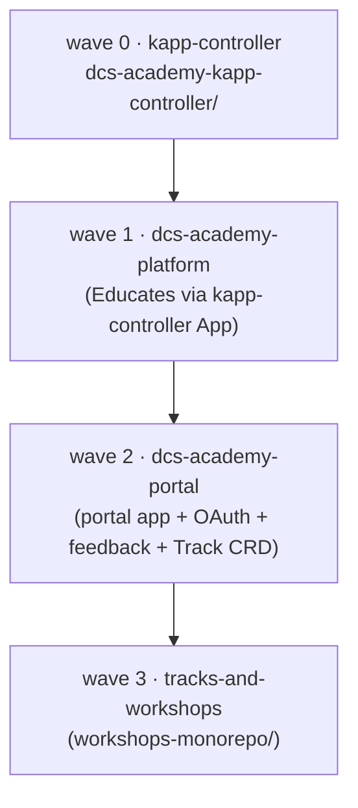
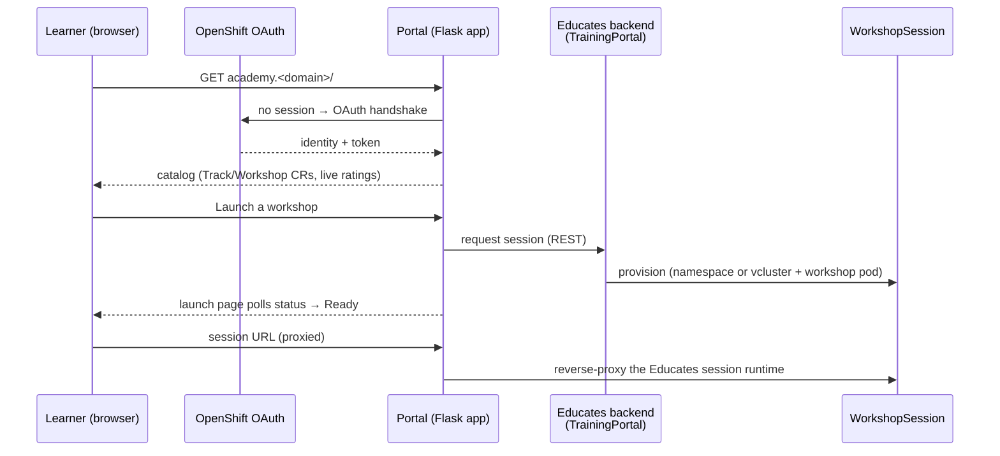

# DCS Academy — Architecture

How every chart, operator, and CRD in this repo fits together to deliver the
**DCS Academy**: interactive [Educates](https://educates.dev) training for the
Digital Container Service (DCS), Airbus Defence and Space's on-prem, air-gapped,
OpenShift-based container platform.

This document lives with the platform chart but describes the **whole system** —
the four GitOps layers, the two custom charts, the CRDs, and the runtime request
flow. It is the map; each chart's own README has the detail.

## One-paragraph summary

Everything is **GitOps**: four ArgoCD `Application`s sync from `main`, in wave order,
onto the cluster. Layer 1 installs
kapp-controller. Layer 2 uses it to install the upstream Educates platform (operator +
CRDs). Layer 3 deploys the **custom DCS Academy portal** (the landing UI, OAuth gate,
feedback DB, and the Track CRD). Layer 4 fills the catalog with Track/Workshop CRs and
the TrainingPortal, all discovered by globbing the workshops monorepo. A learner hits
the portal, authenticates via OpenShift OAuth, browses the catalog, and launches a
session that Educates provisions on demand — the portal reverse-proxies that session.

## GitOps layers

Four ArgoCD `Application`s (`argocd/apps/`), each pinned to a sync-wave, roll out in
dependency order:

| Wave | ArgoCD Application | Path | Deploys | Namespace |
|---|---|---|---|---|
| 0 | `kapp-controller` | `dcs-academy-kapp-controller/` | Carvel kapp-controller (needed to install Educates) | `kapp-controller` |
| 1 | `dcs-academy-platform` | `dcs-academy-platform/` | Educates platform via the official installer `App` (operator, CRDs, cluster-essentials); CR metrics + monitoring | release in `dcs-educates`; installer in `dcs-educates-installer`; operator in `educates` |
| 2 | `dcs-academy-portal` | `dcs-academy-portal/chart/` | The whole academy front: portal app, OAuth gate, CNPG feedback DB, custom UI, **Track CRD** | `dcs-academy-portal` |
| 3 | `dcs-academy-tracks-and-workshops` | `workshops-monorepo/` | Track CRs, Workshop CRs, TrainingPortal (all globbed from the tree) | `dcs-academy-tracks-and-workshops` |

**Wave order is load-bearing** and enforced two ways:

- **Across apps** — the four Applications carry `sync-wave: 0/1/2/3`, so ArgoCD rolls
  them out (and, in reverse, tears them down) in dependency order.
- **Within an app** — resources carry their own sync-waves. The portal chart is the
  subtle one: its host-reservation ValidatingAdmissionPolicy (wave -1) must be admitted
  **before** the TrainingPortal triggers Educates' auto-route, so the OAuth gate is
  never briefly bypassed. CRs that depend on not-yet-existing CRDs (CNPG `Cluster`,
  Workshop/TrainingPortal) carry `SkipDryRunOnMissingResource=true` so ArgoCD retries
  instead of hard-failing on first apply.

Why wave 3 needs wave 2 first: the TrainingPortal CR (wave 3) is the Educates backend
the portal reads, but it must list every workshop by name — so it is generated from the
globbed workshop set. It also depends on the **Track CRD**, which ships in the *portal*
chart (wave 2). If layer 3 synced first, the Track CRs would have no CRD.

## The two custom charts and what each owns

| Chart | Owns | Notes |
|---|---|---|
| **`dcs-academy-platform`** (this chart) | Educates install (wrapped kapp-controller `App`), CR metrics (kube-state-metrics + ServiceMonitor), Grafana reader token + dashboards | Platform only. Pinned to Educates **3.7.2** (`appVersion`). Air-gap via `global.registry.host`. |
| **`dcs-academy-portal`** | Portal Deployment/Service/Route, OpenShift **OAuth gate**, session cookie secret, **CNPG** feedback `Cluster`, NetworkPolicy, ServiceMonitor, host-reservation VAP, **Track CRD** (`crds/track.yaml`), K10 backup | One chart owns the entire academy experience. The old `dcs-academy-workshops` chart was merged into it. |

The catalog content itself is not a chart in the usual sense — the
`workshops-monorepo/` chart is a thin templating layer that emits Track/Workshop CRs
**verbatim** from the folder tree plus one TrainingPortal listing them all.

## CRDs — who ships them, who fills them

| CRD | Shipped by | Instances created by |
|---|---|---|
| `Workshop`, `TrainingPortal`, `WorkshopSession`, … (`training.educates.dev`) | Educates installer (platform chart, wave 1) | workshops app (wave 3) creates Workshop + TrainingPortal; Educates creates WorkshopSession per launch |
| `Track` (`academy.dcs`) | **portal chart** `crds/` (wave 2) | workshops app (wave 3), one per `track.yaml` |
| `Cluster` (`postgresql.cnpg.io`) | CNPG operator (cluster prerequisite) | portal chart, one feedback DB |
| `App` (`kappctrl.k14s.io`) | kapp-controller (wave 0) | platform chart, the Educates installer App |

## Runtime request flow

Key points:

- **The portal is UI + BFF + reverse-proxy in one image.** Custom Flask routes own the
  landing experience; a proxy blueprint forwards the allowlisted Educates session paths.
  Everything else 404s.
- **OAuth gate.** `academy.<domain>` is fronted by OpenShift OAuth. A host-reservation
  VAP keeps the academy host closed until the portal is ready, so Educates' auto-created
  session routes are always gated (see the portal chart + `educates-oauth-gating`).
- **Sessions** run either in the learner's **OpenShift session namespace** (the common
  case) or a throwaway **per-session vcluster** (only when the lab needs cluster-admin;
  requires the vcluster SCC RoleBinding or CoreDNS crashloops on OpenShift).
- **Feedback** is captured by the portal's `/form` route (the old standalone
  `feedback.*` collector was absorbed) and stored in CNPG (Postgres) in prod / SQLite in
  dev. Course pages show a **live** star rating from that DB; `/admin` shows comments.
- **Workshop content** is fetched at session start by vendir from `spec.workshop.files`
  (a published OCI files-image in prod, or git for dev). Behind a private CA (internal
  GitLab/Harbor), that HTTPS fetch fails TLS unless the CA is trusted — set one of
  `educates.ingress.caCertificate` / `caCertificateRef` / `caFromClusterBundle` (the last
  syncs the OpenShift cluster trust bundle, nothing in git) and Educates mounts it into the
  download + workshop containers' trust store. See the platform README's *Private CA for
  workshop content*.

## Namespaces at a glance

| Namespace | Holds | Lifetime |
|---|---|---|
| `kapp-controller` | Carvel kapp-controller | static |
| `dcs-educates-installer` | Educates installer `App` + RBAC + config | static |
| `dcs-educates` | platform helm release + monitoring | static |
| `educates` | Educates operator + backend | static |
| `dcs-academy-portal` | portal app, OAuth gate, CNPG feedback | static |
| `dcs-academy-tracks-and-workshops` | Track/Workshop CRs + TrainingPortal | static |
| `dcst-*` | live per-session workshop namespaces (+ `-vc` for vcluster labs) | ephemeral, per session |

## CRC (local / Apple-Silicon) specifics

The `argocd/envs/platform-crc.yaml` values file (shared by the platform and portal apps
via `$values`) points ingress at `apps-crc.testing` and the CRC router cert, and enables
two CRC-only workarounds: `openssl.armcap: "0"` and a `crcWorkaround` PostSync job, both
because the cryptography Rust extension SIGILLs on Apple-Silicon CRC. The Educates portal
itself is unusable on arm64 CRC — workshop **content** is tested portal-less against CRC
(see `crc-local-testing/`), while the full portal path is validated on amd64.

## See also

- `dcs-academy-platform/README.md` — how Educates is installed (kapp-controller App, ytt/kbld/kapp), values, air-gap, security grants.
- `dcs-academy-portal/` — portal app, OAuth gate, feedback, Track CRD.
- `workshops-monorepo/README.md` — the catalog contract (add a track/workshop) and deploy order.
- `argocd/` — the four ArgoCD Applications and per-cluster env values.
