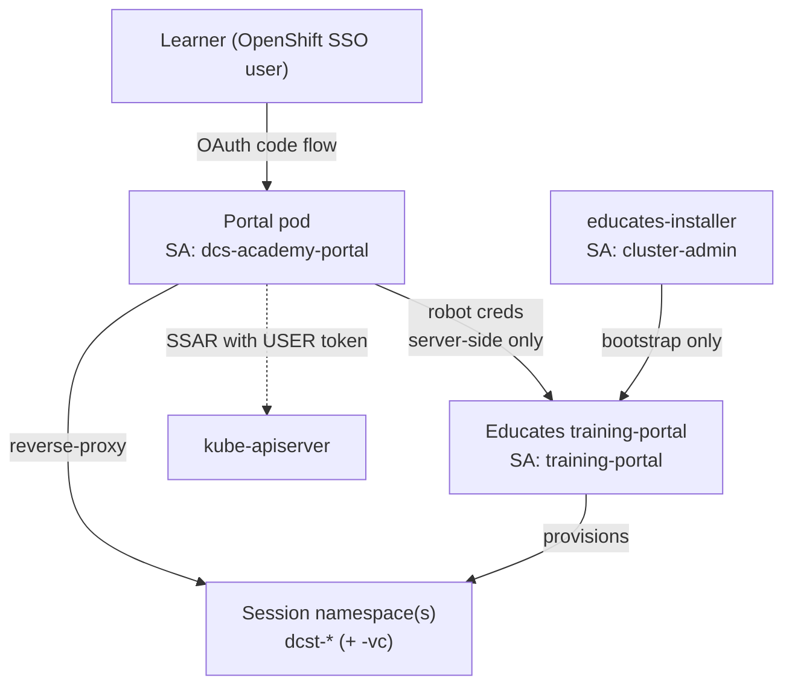

# DCS Academy — Security & RBAC

Companion to [architecture.md](architecture.md). That doc is the map of *what*
runs; this one justifies *why the trust boundaries and RBAC grants are drawn
where they are*, judges each grant against least-privilege, and states the rule
for **when a workshop gets a vCluster vs a plain namespace**.

The academy runs on the **DCS** platform: on-prem, air-gapped, multi-national
OpenShift. That context sets the bar — every image comes from Harbor, there is
no egress to public registries, and learners are real Airbus SSO identities, not
throwaway accounts. Isolation and blast-radius control matter more than they
would on a public playground.

## Trust boundaries

Four identities, four different privilege levels. The design keeps the powerful
ones off the request path and the request-path one nearly powerless:

| Identity | Scope | On the learner request path? | Privilege |
|---|---|---|---|
| **Learner** (SSO user) | Their own session ns | Yes | Whatever the session/vCluster grants them — nothing on the host by default |
| **Portal SA** (`dcs-academy-portal`) | Cluster-wide **read-only** | Yes | get/list on catalog CRs, pods, routes. No writes, no secrets |
| **Educates portal robot** | Session lifecycle | Yes (server-side) | Allocate/terminate sessions via REST. Creds never reach the browser |
| **educates-installer** | `cluster-admin` | **No** (bootstrap) | Everything — but only during install/upgrade |

The load-bearing idea: **the two credentials a browser can touch are the weakest
two.** The portal SA can only read, and the robot credential lives entirely
server-side (fetched from `TrainingPortal.status`, attached to REST calls in
[educates.py](../images/dcs-academy-portal/portal/educates.py), never templated
into a page). `cluster-admin` exists exactly once, on an SA that never serves a
request.

## RBAC judgment — grant by grant

Reviewed all four RBAC-bearing charts. Verdict up front: **not excessive.** One
grant is `cluster-admin` and is justified-by-necessity; one dead verb was
trimmed; the rest are already least-privilege.

### 1. Portal app SA — `dcs-academy-portal` · *appropriate (trimmed)*

[`00-serviceaccount-rbac.yaml`](../dcs-academy-portal/chart/templates/00-serviceaccount-rbac.yaml)
— cluster-wide **read** on `workshops`, `trainingportals`, `workshopsessions`,
`tracks`, `pods`, `routes`.

- **No write anywhere. No `secrets`.** Session allocation is delegated to the
  Educates REST API (robot-authed), not done with this SA — so it needs no
  create/update/delete on any CR. This is the single most important scoping
  decision: a compromised portal pod can *read* the catalog, not *mutate* the
  cluster.
- **Cluster-wide, not namespaced — and it has to be.** Session namespaces
  (`dcst-*`, `dcst-*-vc`) are created on demand with unpredictable names, so pod
  and route reads can't be pinned to a namespace or `resourceNames`. The reads
  are the provisioning-progress feed and the route-admission gate.
- **Trim applied:** the role previously granted `watch` on every resource. The
  app only ever *polls* (`list`/`get`; the new [cache.py](../images/dcs-academy-portal/portal/cache.py)
  refresher re-lists on an interval) — it runs no watch informer — so `watch`
  was a dead grant. Removed. Least-privilege should not carry verbs nothing uses.

### 2. Educates CRD reader — `…-educates-crd-reader` · *appropriate*

[`01-educates-backend-rbac.yaml`](../dcs-academy-portal/chart/templates/01-educates-backend-rbac.yaml)
— get/list/**watch** on `customresourcedefinitions` only, bound to the
operator-owned `training-portal` SA.

Narrow and necessary: the training-portal's kopf watcher lists/watches CRDs at
cluster scope on startup and 403-dies on OpenShift without this. `watch` is
correct here — this one *is* a watcher. One resource, read-only. Nothing to cut.

### 3. Educates installer — `educates-installer` · *`cluster-admin`, justified*

[`10-installer-rbac.yaml`](templates/10-installer-rbac.yaml) — a
`ClusterRoleBinding` to the built-in `cluster-admin`.

This is the only alarming grant, and it is **inherent to what an Educates install
is**: creating CRDs, cluster packages, the operator, and custom SCCs is a
cluster-admin-level act, and the binding mirrors upstream
`educates-installer-app-rbac.yaml` exactly. Narrowing it would mean forking and
tracking every permission the upstream installer needs across versions — high
maintenance cost, and it would drift and break on upgrade.

Why it is acceptable here rather than merely tolerated:

- **Off the request path.** No learner traffic, no browser-reachable credential
  touches this SA. It is driven only by ArgoCD sync of the platform layer.
- **Isolated.** It lives in its own `dcs-educates-installer` namespace, separate
  from where anything runs.
- **Auditable + reversible.** GitOps means the binding's existence and every
  change to it is in `main`'s history; ArgoCD prune removes it if the manifest
  goes away.

**Recommendation (not a blocker):** treat it as a *bootstrap* credential. Once
the platform is installed and stable, the binding can be scaled out of the active
set (the installer `App` reconciles only on change), and on a locked-down cluster
it is worth pairing this SA with an audit-log alert on any use outside a sync
window. Do **not** hand-narrow the ClusterRole — the upstream coupling makes that
a losing maintenance trade.

### 4. kapp-controller — `kapp-controller-cluster-role` · *appropriate (vendored)*

[`kapp-controller.yaml`](../dcs-academy-kapp-controller/templates/kapp-controller.yaml)
— `*` verbs on the Carvel APIs (`kappctrl.k14s.io`, `packaging.carvel.dev`, …),
plus `secrets` create/get/list/watch, `serviceaccounts/token` create, and
`configmaps` `*`.

Broad but **not** cluster-admin, and this is the upstream Carvel manifest
verbatim (pinned `v0.60.3`). The `*` is confined to Carvel's own resource groups;
`secrets` and `serviceaccounts/token` are how it reconciles package installs.
Crucially, the *actual* install work runs under **per-`App` service accounts**
(`spec.serviceAccountName`), not this controller role — so a workshop's package
install is scoped to its own SA, not to the controller's cluster reach. Vendored
+ pinned + digest-installable from Harbor; leave as-is.

### Summary

| Chart / SA | Scope | Writes? | Secrets? | Verdict |
|---|---|---|---|---|
| Portal app | cluster read | no | no | ✅ appropriate — `watch` trimmed |
| Educates CRD reader | CRDs r/o | no | no | ✅ appropriate |
| Educates installer | `cluster-admin` | yes | yes | ⚠️ justified (bootstrap, off-path, isolated) |
| kapp-controller | Carvel `*` | Carvel only | create/get | ✅ appropriate (vendored, per-App SAs) |

## Session isolation — vCluster vs namespace

Every workshop runs in an on-demand, learner-owned space that Educates tears down
at the end. The choice is **how much cluster** that space is:

- **Plain namespace** (`dcst-<session>`) — the learner is confined to one
  OpenShift namespace on the shared host cluster. They see host RBAC, host SCCs,
  host NetworkPolicies, and only namespaced objects. Cheap, fast to provision,
  and correct for the *DCS tenant experience* — because a real DCS tenant **is** a
  set of namespaces (no "project" layer above them; see the
  `dcs-domain-corrections` house model).
- **vCluster** (`dcst-<session>-vc`) — a full virtual control plane per session.
  The learner is effectively cluster-admin *inside* their vCluster while the host
  stays untouched. Costs a control-plane pod (+ coredns) per session and needs
  the `educates-privileged-scc` for coredns in the vc namespace.

### The rule

> **Default to a plain namespace. Reach for a vCluster only when the lab must
> teach or mutate something that is cluster-scoped or host-dangerous.**

| Use a **namespace** when the lab… | Use a **vCluster** when the lab… |
|---|---|
| deploys/inspects workloads, services, routes, configmaps, secrets | needs the learner to create **CRDs, ClusterRoles, or cluster-scoped objects** |
| teaches the real DCS tenant model (namespaces, quotas, Kyverno on PROD) | installs an **operator / Helm chart with cluster RBAC** |
| observes host-enforced policy it must *not* be able to bypass (RBAC, NetworkPolicy-as-observe, PROD Kyverno) | must run **privileged / SCC-elevated** workloads that would breach host SCCs |
| is short and provisioning speed matters | needs an **API-server-level** view (admission, apiservices, `kubectl api-resources`) |

Decide once per workshop and record the reason in the workshop's plan — the
portal already surfaces the choice (the launch flow shows "Starting virtual
cluster" vs "Setting up namespace", driven by
`session.applications.vcluster.enabled`). Two constraints from the DCS model bias
the default toward namespaces: **PROD-style policy (Kyverno) is host-enforced and
learners should experience it, not escape it**, and **NetworkPolicy is not yet
self-service — teach it as observe**. A vCluster would hide exactly the host
policy those labs exist to demonstrate. So vClusters are the exception, granted
deliberately, not the default.

## See also

- [architecture.md](architecture.md) — system map, GitOps layers, request flow
- `educates-oauth-gating-openshift` (auto-memory) — the OAuth gate + host-reservation VAP
- `dcs-domain-corrections` (auto-memory) — tenant model, Kyverno/PROD, NetworkPolicy stance
