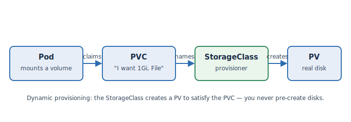

A container's filesystem disappears when the container does. To keep data, you attach a
**volume** backed by storage that the platform provisions for you. Understanding the three
objects involved makes everything else on this page straightforward.

## PVC → StorageClass → PV



- A **[PersistentVolumeClaim (PVC)](https://kubernetes.io/docs/concepts/storage/persistent-volumes/)**
  is your *request*: "I want 1Gi, this access mode, this class." You write it; you don't say
  *where* the disk comes from.
- A **[StorageClass](https://kubernetes.io/docs/concepts/storage/storage-classes/)** is the
  *provisioner* — it knows how to create real storage of a given kind on
  .
- A **PersistentVolume (PV)** is the *real disk* the StorageClass creates to satisfy your
  claim.

This is **dynamic provisioning**: you never pre-create disks. You submit a PVC naming a
StorageClass, and the platform creates a matching PV and **binds** it to your claim. The Pod
then mounts the PVC like any other volume.

The analogy: a PVC is like ordering a disk from the platform's catalogue — you state the size
and type, and  provisions and delivers it. You don't rack a physical
drive; you request a capability.

## The DCS storage classes

 provides storage classes for you — you don't create them. List
what's available:

```terminal:execute
command: oc get storageclass
```

You should see the  classes, including the **File** and **Block**
ones this workshop uses. Their names are configured per environment, which is why the exercise
manifests reference them through variables rather than hardcoding a name.

```examiner:execute-test
name: verify-storageclass
title: The DCS File storage class exists
args:
- ${DCS_SC_FILE}
timeout: 10
```


Storage-class names differ between clusters, so this workshop uses the `dcs_sc_file` and
`dcs_sc_block` variables. Never hardcode a storage-class name in a manifest — it won't port
between environments.

