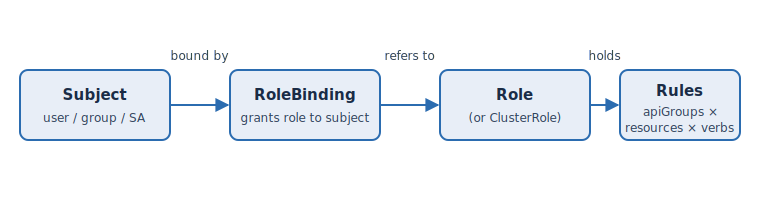

[RBAC](https://kubernetes.io/docs/reference/access-authn-authz/rbac/) — role-based access
control — is how Kubernetes and  decide who may do what. It has
just four object types, and they chain together in one direction.

## The chain



Read it left to right: a **subject** (a user, group, or ServiceAccount) is connected by a
**binding** to a **role**, and the role holds **rules**. Permissions only ever *add* — there
are no "deny" rules; if no rule grants an action, it's denied by default.

## Role vs ClusterRole

The difference is **scope**:

- A **Role** lives in a namespace and its permissions apply only there.
- A **ClusterRole** is cluster-wide and reusable — it can grant access to cluster-scoped
  resources (like nodes) or be reused across namespaces via bindings.

On  you manage Roles/RoleBindings **within your own namespaces**;
ClusterRoles are platform-managed and read-only to you. Let's read one. List the cluster
roles:

```terminal:execute
command: oc get clusterroles | head
```

```examiner:execute-test
name: verify-clusterroles
title: ClusterRoles are listable
timeout: 10
```

## Reading rules

Every role is a set of **rules**, and each rule is `apiGroups × resources × verbs`. Look at
the built-in `view` ClusterRole:

```terminal:execute
command: oc describe clusterrole view | head -n 30
```

Each line pairs an API group and resource with the verbs allowed (`get`, `list`, `watch`
for a read-only role like `view`). That's the whole vocabulary of RBAC — the rest is just
who those rules are bound to.


`view`, `edit`, and `admin` are OpenShift's built-in ClusterRoles — see
[Using RBAC](https://docs.openshift.com/container-platform/latest/authentication/using-rbac.html).
You rarely write cluster roles; you bind these.

