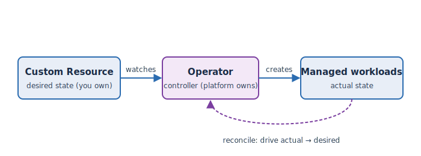

Kubernetes knows how to run a Pod, but it doesn't know how to run *PostgreSQL* — when to
fail over, how to back up, how to do a safe version upgrade. An
[Operator](https://kubernetes.io/docs/concepts/extend-kubernetes/operator/) is how that
application-specific knowledge is added to the cluster.

## A controller with a reconcile loop

An Operator is a **controller**: a program that continuously compares *desired* state to
*actual* state and takes action to close the gap. You express the desired state as a
**Custom Resource**; the operator does the rest, over and over.

Read it left to right: you write a **Custom Resource** that says "I want a 1-instance
PostgreSQL of this size"; the **Operator** watches for it and **creates** the actual pods,
service, and config; then it keeps **reconciling** — if a pod dies or the spec changes, it
acts to bring actual back in line with desired. It's an experienced operator of that one
application, encoded as software.

The analogy: hiring a specialist. A Deployment is like a work instruction ("keep 3 copies
running"). An Operator is like hiring a database administrator who knows the whole lifecycle
— you tell them *what* you want, they handle the *how*, continuously.

See also OpenShift's
[Operators overview](https://docs.openshift.com/container-platform/latest/operators/understanding/olm-what-operators-are.html).

This is the pattern behind every service in the  Operators
track — GitLab, Argo CD, and the PostgreSQL operator you'll use here.
