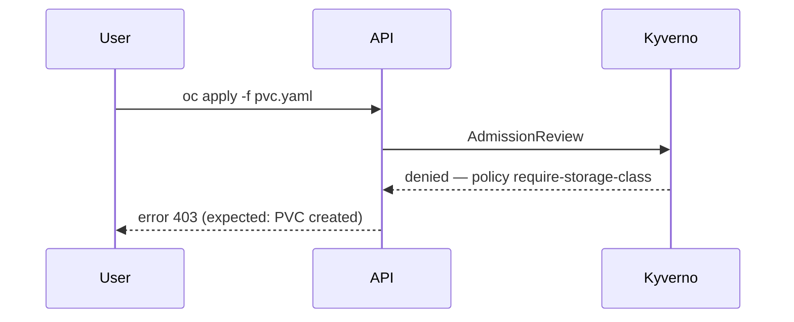

# DCS Bug Authoring

A bug is **one broken behaviour, reproducible or clearly evidenced**, with a fix whose
completion is checkable. It is a GitLab issue with `type::bug`, filed under the
`ContainerHub Ops & Bugs` epic — not under the feature epic that introduced it.

## 0. Resolve the GitLab target — always first

1. `git -C /projects/<any-repo> remote get-url origin` → GitLab host + group path.
   Never hardcode a host. Never assume gitlab.com.
2. **Issues are project level.** Default to the project the broken component lives in
   (its chart repo). Ask if that is ambiguous.
3. Find the `ContainerHub Ops & Bugs` epic at group level — that is the parent.

## 1. Discover before writing

| Need | MCP tool | REST fallback |
|---|---|---|
| exact label strings | `list_labels(namespace=<group>, include_ancestor_groups=true)` | `GET /groups/<group>/labels?include_ancestor_groups=true` |
| the bugs epic | `list_work_items(namespace=<group>, types=["EPIC"])` | `GET /groups/<group>/epics?search=ContainerHub` |
| a duplicate already filed | `list_work_items(namespace=<group>/<project>)` | `GET /projects/<id>/issues?labels=type::bug&search=<symptom>` |
| the story or test case that covers this behaviour | same | same |

**Search for a duplicate before writing.** If one exists, say so and add a comment
there instead of filing a second issue.

**Never invent a label value.** Copy the exact string the API returned.

## 2. Labels — all three are required

| Label | Values | How to set | Ask when |
|---|---|---|---|
| `type::bug` | fixed | always | — |
| `P::<n>` | `1`, `2`, `3` | This is severity **and** priority — DCS has no separate severity axis. `P::1` = production broken, data loss, security exposure, or no workaround · `P::2` = feature broken with a workaround · `P::3` = cosmetic, rare, or DEV-only annoyance | impact is unclear from the report |
| `env::<v>` | `de`, `div`, `es` | The environment(s) where the bug was observed. Apply one label per affected environment. | the report does not name the cluster or environment |

Optional, only when clearly true: `component::<exact live value>`,
`complexity::<low\|medium\|high>`, `external-support` (needs a vendor/RH case),
`status::<state>`.

**Never** put `test-de::` / `test-div::` / `test-es::` on a bug — those are test-case
labels only.

Ask for any required label you cannot infer, in one short question listing the allowed
values. `P::` and `env::` are never guessed silently.

## 3. Milestone

If the `ContainerHub Ops & Bugs` epic sits under a `Development Stream R<n>`, set the
matching `Release <n>` milestone. If it does not, leave the milestone unset rather than
inventing one.

## 4. Title

Imperative or symptom-first, naming the component and the observable failure. No
`BUG:` prefix — the label carries that.

- ✅ `Kyverno admission webhook rejects PVCs in dcs-monitoring after 1.13 upgrade`
- ✅ `ArgoCD prunes the customer robot account on every sync`
- ❌ `Kyverno broken` (no observable, no component)
- ❌ `P1: urgent registry issue` (metadata belongs in labels)

## 5. Body — locked template

No header block. Severity, priority and environment live in the labels; do not
restate them as body fields. The `**Environment**` section carries only what a label
cannot: cluster, namespace, chart and product versions.

````markdown
# Description

<What is broken, in two or three sentences: the component, the trigger, the
observable failure, and who it affects. State whether it is a regression and
against what it last worked.>

**Steps to Reproduce**

1. <concrete, copy-pasteable command or UI action>
2. <...>
3. <the step where it fails>

**Expected**

<The exact correct outcome: exit code `0`, resource created, status `Bound`,
`200 OK`, the specific field value.>

**Actual**

<The exact observed outcome. Paste the real error verbatim in a fenced block —
never paraphrase an error message.>

```text
<verbatim error / event / log excerpt, trimmed to the relevant lines>
```

**Environment**

* Cluster / environment: <cluster name>
* Namespace(s): `<namespace>`
* Component + version: <chart or operator name and version>
* First observed: <date> · Regression since: <version, or "unknown">

**Acceptance Criteria**

- [ ] <the reproduction above no longer reproduces — state the passing outcome>
- [ ] <root cause addressed, not just the symptom, where known>
- [ ] <regression guard: a test case exists / the existing test case now covers it>
````

Rules:

- **Steps to Reproduce must be runnable.** Real resource names, real namespaces, real
  `oc` invocations with the `-o jsonpath=` / `-o yaml` flags needed to see the failure.
  Never `kubectl` — this platform is OpenShift.
- **Errors verbatim.** Quote them exactly, in a fenced block. A paraphrased error is
  unsearchable.
- **Not yet reproduced is acceptable**, but say so plainly: replace the steps with
  `**Reproduction:** not yet reproduced — observed <n> times on <dates>`, and attach
  the evidence (events, pod logs, pipeline job URL). Never present a guessed
  reproduction as a real one.
- **Acceptance criteria define the fix**, not the investigation. If the cause is
  unknown and needs research first, file a `type::spike` story via
  `dcs-user-story-authoring` and link it.
- Never redact a real error into placeholders, but do not paste credentials, tokens, or
  full secret values — trim those lines and mark them `<redacted>`.

## 6. Diagram

Add one ```mermaid block only when the failure is about a **flow or sequence** and the
diagram shows where it breaks — an admission path, a request chain, a sync loop. Skip
it for a wrong value or a crashing pod.

- ≤ 12 nodes, `sequenceDiagram` or `flowchart LR`.
- Mark the failing hop in the label text, e.g. `-->|denied 403|`.
- No styling directives, no emoji in node labels.



## 7. Links — always full URLs

- the story or epic whose work introduced it:
  `https://<host>/groups/<group>/-/epics/<iid>` · `.../-/issues/<iid>`
- the test case that should have caught it:
  `https://<host>/<group>/<project>/-/quality/test_cases/<iid>`
- the failing pipeline job, the MR that regressed it, the chart template at a pinned
  ref (`/-/blob/<sha>/templates/...` — never `main`, it moves).
- the upstream issue or public doc for the component (`docs.openshift.com`,
  `kyverno.io`, `goharbor.io`, vendor docs). The instance is not air-gapped.

## 8. Create it

Writes are direct — no confirmation gate for a **new** bug. Editing an **existing**
issue needs the user's explicit OK first.

1. `glab` if on PATH:
   `glab api --method POST "projects/<url-encoded-path>/issues" -f title="..." -f description=@body.md -f labels="type::bug,P::1,env::de" -f epic_id=<bugs-epic-id>`
2. `curl` REST with `$GITLAB_TOKEN`:
   `POST https://<host>/api/v4/projects/<id>/issues` with `title`, `description`,
   `labels`, `epic_id`, optional `milestone_id`.
3. MCP `create_work_item(workItemType="ISSUE", namespace="<group>/<project>")` last —
   it takes label **IDs**, not names, and no epic field, so follow up with
   `update_work_item`.

Then print the issue's `web_url`.

## 9. Follow-ups worth proposing (never created silently)

After filing, offer — do not create without a yes:

- a **test case** in `dcs-helm-charts` that asserts the fixed behaviour
  (`dcs-test-case-authoring`), so the regression is guarded;
- a `type::spike` story when the root cause is unknown;
- adding `env::` labels for other environments once someone confirms the bug there.

## 10. Self-check before creating

- [ ] Searched for an existing duplicate.
- [ ] Title names the component and the observable failure.
- [ ] Steps to Reproduce are runnable `oc` commands, or the report says explicitly
      that it is not yet reproduced.
- [ ] Expected and Actual are both exact — values, codes, statuses, not "works" /
      "broken".
- [ ] The error text is verbatim in a fenced block, with no credentials in it.
- [ ] Environment names the cluster, namespace and component version.
- [ ] Acceptance criteria are checkboxes and describe the fixed state.
- [ ] `type::bug`, `P::`, `env::` all set, copied verbatim from the live label list.
- [ ] No `test-*::` labels. No severity/priority restated in the body.
- [ ] Parent epic = `ContainerHub Ops & Bugs`.
- [ ] Every link is a full URL; chart links are pinned to a sha.

## Gold example

Title: `Kyverno admission denies PVCs in dcs-monitoring after policy 1.13 rollout` ·
Labels: `type::bug`, `P::1`, `env::div`, `component::kyverno` · Epic: `ContainerHub Ops & Bugs`

````markdown
# Description

Since the Kyverno policy bundle 1.13 was synced to DIV, every `PersistentVolumeClaim`
created in `dcs-monitoring` is rejected by the admission webhook. Prometheus cannot
restart after a node drain, so monitoring data collection stops. This is a regression —
the same manifest applied cleanly on bundle 1.12.

**Steps to Reproduce**

1. `oc project dcs-monitoring`
2. `oc apply -f https://<host>/dcs/dcs-helm-charts/-/raw/<sha>/test/fixtures/pvc-basic.yaml`
3. Observe the admission response.

**Expected**

The PVC is created and reaches `Bound`:
`oc get pvc test-pvc -o jsonpath='{.status.phase}'` returns `Bound`, command exits `0`.

**Actual**

The request is denied and no PVC exists:

```text
Error from server: admission webhook "validate.kyverno.svc-fail" denied the request:
policy require-storage-class/autogen-check-sc fail: validation error: a storageClassName
must be set. rule check-sc failed at path /spec/storageClassName/
```

**Environment**

* Cluster / environment: DIV
* Namespace(s): `dcs-monitoring`
* Component + version: `kyverno-policies` chart 1.13.0, Kyverno 1.12.5
* First observed: 2026-08-21 · Regression since: `kyverno-policies` 1.13.0

**Acceptance Criteria**

- [ ] The reproduction above creates a `Bound` PVC in `dcs-monitoring` on DIV.
- [ ] The policy's exclusion list covers platform namespaces, rather than the fixture
      being changed to satisfy the policy.
- [ ] A test case asserts PVC creation in a platform namespace under the current
      policy bundle.
````
