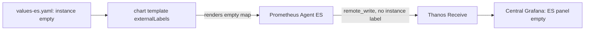

> **Test-run artifact — not created in GitLab.** Produced by `dcs-bug-authoring`.
>
> | | |
> |---|---|
> | Work item | Issue (project level) |
> | Title | `Metrics from ES arrive centrally without the instance label, collapsing per-country filtering` |
> | Namespace | `<group>/dcs-helm-charts` (project owning the `dcs-monitoring` chart) |
> | Parent epic | `ContainerHub Ops & Bugs` |
> | Labels | `type::bug`, `P::2`, `env::es`, `component::monitoring` |
> | Milestone | `Release 5` — only if the bugs epic sits under `Development Stream R5`; otherwise unset |
>
> **Label reasoning:** `P::2` — a real capability is broken (per-country filtering) but a
> workaround exists (query by `receive_replica`), and no tenant workload is affected.
> `env::es` only — DE and DIV are unaffected, so no second `env::` label.
> **A real run would ask:** nothing here, because the report names the environment and
> the impact. Had the report said only "the dashboards look wrong", the skill would ask
> for `env::` and for the impact before setting `P::`.
> **Diagram included:** the failure is a multi-hop flow and the diagram pins down which
> hop drops the label.

---

# Description

Since the ES national instance was onboarded to the central metric aggregation, every
series it pushes arrives at **Thanos Receive** without the `instance` label. The central
Grafana dashboards filter per country on that label, so all ES data falls into the
unfiltered bucket: the per-country view shows ES as empty while the global aggregates
silently include ES twice for any panel that sums across the label.

DE and DIV are unaffected and carry the label correctly, so this is a per-country
configuration or chart-templating defect rather than a central ingestion defect. Not a
regression of a previously working state — ES has never reported correctly since
onboarding.

**Steps to Reproduce**

1. Confirm the label is missing centrally:
   `curl -s --cert client-central.crt --key client-central.key "https://thanos-querier.<central-domain>/api/v1/query?query=up" | jq -r '.data.result[].metric.instance' | sort -u`
2. Compare the three countries' agent configuration:
   `oc --context es -n dcs-monitoring get prometheus prometheus-agent -o jsonpath='{.spec.externalLabels}'`
   then repeat with `--context de` and `--context div`.
3. Read back the rendered values on ES:
   `oc --context es -n dcs-monitoring get cm dcs-monitoring-values -o jsonpath='{.data.values\.yaml}' | grep -A3 externalLabels`

**Expected**

Step 1 lists `de`, `div` and `es`. Step 2 returns `{"instance":"es"}` on the ES
cluster, matching the shape returned on DE and DIV. Step 3 shows `externalLabels`
populated with the country identifier.

**Actual**

Step 1 lists only `de` and `div` — ES series carry no `instance` label at all. Step 2
returns an empty map on ES, while DE returns the expected value:

```text
$ oc --context es -n dcs-monitoring get prometheus prometheus-agent -o jsonpath='{.spec.externalLabels}'
{}
$ oc --context de -n dcs-monitoring get prometheus prometheus-agent -o jsonpath='{.spec.externalLabels}'
{"instance":"de"}
```

Step 3 shows the key is present but its value is empty, so the chart renders an empty
map rather than failing:

```text
externalLabels:
  instance: ""
```

**Environment**

* Cluster / environment: ES (national instance, Spain)
* Namespace(s): `dcs-monitoring` on ES, `dcs-monitoring` on the central cluster
* Component + version: `dcs-monitoring` chart 2.4.1, Prometheus Operator 0.75.2,
  Thanos Receive 0.35.1
* First observed: 2026-08-22, immediately after ES onboarding · Regression since: not a
  regression — ES has never reported the label



**Acceptance Criteria**

- [ ] Step 1 of the reproduction lists `es` alongside `de` and `div`.
- [ ] `oc --context es -n dcs-monitoring get prometheus prometheus-agent -o jsonpath='{.spec.externalLabels}'`
      returns `{"instance":"es"}`.
- [ ] The `dcs-monitoring` chart **fails to render** when the country identifier is
      empty or unset, rather than producing an empty map — root cause, so the next
      country onboarding cannot repeat this silently.
- [ ] Central Grafana's per-country view shows ES data, and no panel double-counts ES
      in its global aggregate.
- [ ] A test case asserts that every series in the central store carries a non-empty
      national identifier label.

## External References

* Parent epic: `https://<host>/groups/<group>/-/epics/<iid>` (`ContainerHub Ops & Bugs`)
* Capability epic: `https://<host>/groups/<group>/-/epics/<iid>`
  (`Cross Country Metric Aggregation`)
* Test case that should have caught this:
  `https://<host>/<group>/dcs-helm-charts/-/quality/test_cases/<iid>` (`XCM-TST-001`)
* Chart template, pinned:
  `https://<host>/<group>/dcs-helm-charts/-/blob/<sha>/charts/dcs-monitoring/templates/prometheus-agent.yaml`
* Prometheus external labels:
  https://prometheus.io/docs/prometheus/latest/configuration/configuration/#configuration-file
* Helm `required` for fail-fast values:
  https://helm.sh/docs/howto/charts_tips_and_tricks/#using-the-required-function
