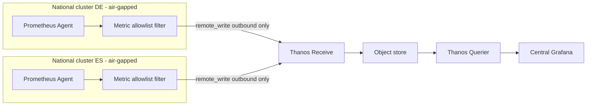

> **Test-run artifact — not created in GitLab.** Produced by `dcs-epic-authoring`.
>
> | | |
> |---|---|
> | Work item | Epic (group level) |
> | Title | `Cross Country Metric Aggregation` |
> | Namespace | `<group>` (group level — epics are never project level) |
> | Parent | `Development Stream R5` |
> | Labels | `P::2`, `complexity::medium`, `subproduct::naaS` |
>
> **Label reasoning:** `P::2` — planned for the release, does not block other epics.
> `complexity::medium` — one new central component (Thanos Receive) plus a per-country
> agent, no new stack. `subproduct::naaS` — tenancy/platform observability, not
> hardware and not registry.
> **A real run would ask:** nothing — all three labels are inferable from the prompt.
> It *would* flag that `&41` already carries this title and offer to extend it instead.

---

## Description

The Digital Container Service (DCS) runs as a set of isolated national instances
alongside a shared central instance. Each national environment is air-gapped, so the
central platform and product teams have no unified view of fleet health, software
compliance, capacity, or test stability. The goal of this Epic is to design, validate,
and implement a centralized metric aggregation framework that gives the central
Operations Team a single pane of glass across every country, while strictly preserving
the isolation boundaries the national environments are certified under. All components
are managed declaratively via **ArgoCD** and **Helm charts**.

## Strict Architectural Principle

> ⚠️ **CRITICAL CONSTRAINT:** The network data flow for all monitoring, metrics, and
> heartbeats must **always originate from the National Cluster and push outbound to the
> Central Cluster**. The Central Cluster must **never** initiate inbound network
> connections to any national instance. Any design that requires a central scrape, a
> central query into a national cluster, or a reverse tunnel is out of bounds
> regardless of its technical merit.

## Importance of the Epic

This release targets the central Platform Operations Team and the DCS product owners.
Today an outage in a national instance is discovered by the country team and reported
by mail; there is no central signal at all. Version drift between national deployments
and the central release baseline is likewise invisible until a support case exposes it.

Without central visibility the platform cannot report on its own SLA, cannot forecast
hardware and GPU investment across countries, and cannot demonstrate that every
national instance runs an approved software baseline — all three are commitments the
service is measured against. Because national environments carry data-residency
obligations, the aggregation must be provably one-directional and provably free of log
and tenant payloads, which is why the architecture constraint above is treated as a
non-negotiable rather than a design preference.

## Scope

### In Scope:

* **Architecture validation:** a PoC for push-based metric routing (Prometheus
  `remote_write` into **Thanos Receive**, with Pushgateway evaluated as the fallback).
* **Platform component health:** high-level uptime and availability of core
  OpenShift control-plane and platform components per country.
* **Version governance:** collecting deployed **Helm chart** versions and visualizing
  drift against the central release baseline.
* **Capacity and tenancy:** CPU, memory, storage and GPU footprints, plus tenant,
  user, namespace (DEV vs PROD type) and DevSpaces counts.
* **Anonymized test results:** binary pass/fail pipeline outcomes, without payloads.

### Out of Scope:

* **Centralized log collection** — aggregating raw application or system logs centrally
  is forbidden by data privacy policy.
* **Centralized trace collection** — distributed tracing ingestion is deferred.
* **Cross-cluster control actions** — this framework is observability only; pushing
  configuration from Central to National over this path is prohibited.

## Functional Requirements

* Deploy a central ingestion endpoint (**Thanos Receive** behind an OpenShift Route
  with mTLS) and its object storage, managed by ArgoCD.
* Deploy a **Prometheus Agent** per national cluster, configured for `remote_write`
  to the central endpoint only.
* Implement a metric **allowlist filter** in the agent that drops everything not
  explicitly permitted, applied before transmission.
* Inject a mandatory national instance identifier label on every exported series so
  central dashboards can filter per country.
* Expose deployed Helm chart versions as metrics and build a drift dashboard against
  the central release baseline.
* Build central Grafana dashboards for fleet health, capacity/GPU, tenancy and
  DevSpaces, each with an executive and an operational view.
* Export anonymized pipeline pass/fail results and ingest them centrally.
* Mirror every required image and chart into the internal registry before rollout.
* Document the firewall requirement (single outbound destination, single port) so each
  country can raise its own change request.

## Non-Functional Requirements

* **Security:** transport is mTLS with per-country client certificates; a national
  certificate can be revoked centrally without touching the other countries. The
  central endpoint authenticates every writer and rejects unauthenticated writes.
* **Compliance:** the allowlist is deny-by-default. No log lines, trace spans, tenant
  names or workload payloads may leave a national instance; this is verified by test,
  not by review.
* **Scalability:** the design must hold for at least eight national instances without
  central re-architecture, and tolerate a national cluster being offline for 24 hours
  without central data loss for the other countries.
* **Maintainability:** identical Helm chart and values structure per country; the only
  per-country delta is the identifier label and the client certificate.

## Success Criteria

* **Zero inbound connections:** 100% of the metric traffic is verified as outbound-only
  from national networks, confirmed by firewall log review and by an explicit negative
  test from Central.
* Central Grafana provides global aggregates alongside per-country filtering, with no
  series missing its national identifier label.
* The central system flags any national cluster running an unapproved or outdated
  platform Helm chart version, without manual comparison.
* A security review confirms that no application log data, trace data or sensitive
  tenant data is present in the central store.
* A national instance can be onboarded to the framework by values file and certificate
  alone, without central code changes.

## Roadmap Summary

Aggregate key metrics from the countries centrally to enhance oversight of the central
team and ensure service likeness in all countries, while keeping every national
instance air-gapped and inbound-closed.
