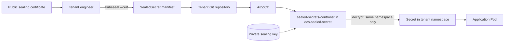

> **Test-run artifact — not created in GitLab.** Produced by `dcs-epic-authoring`.
>
> | | |
> |---|---|
> | Work item | Epic (group level) |
> | Title | `Sealed Secrets as a Service for Tenant Namespaces` |
> | Namespace | `<group>` |
> | Parent | `Development Stream R6` |
> | Labels | `P::2`, `complexity::medium`, `subproduct::naaS`, `component::sealed secrets` |
>
> **Label reasoning:** `P::2` — a planned release capability, not blocking other epics.
> `complexity::medium` — one new controller and its key lifecycle, no new stack, but it
> lands in all three national environments. `subproduct::naaS` — a service consumed
> inside tenant namespaces. `component::sealed secrets` is the exact live value from the
> corpus (note the space, not a hyphen).
> **A real run would ask:** nothing. All three required labels follow from the prompt.

---

## Description

Tenant teams on the Digital Container Service (DCS) currently have no supported way to
keep application secrets in Git. They either hand-create `Secret` objects out of band —
which breaks the GitOps model and leaves no audit trail — or they commit plaintext into
their repositories. The goal of this Epic is to deliver **Sealed Secrets** as a
self-service platform capability: a tenant encrypts a secret against the platform's
public sealing certificate, commits the resulting `SealedSecret` to Git, and the
platform controller decrypts it into a real `Secret` inside that tenant's namespace and
nowhere else. The controller, its policies and its monitoring are managed declaratively
via **ArgoCD** and **Helm charts**, and every image and chart is mirrored into
**Harbor** first.

## Strict Architectural Principle

> ⚠️ **CRITICAL CONSTRAINT:** The private sealing key never leaves the cluster and is
> never readable by a tenant, a tenant pipeline, or any workload outside the controller
> namespace. A `SealedSecret` must only ever be decryptable in the namespace it was
> sealed for — cluster-wide and namespace-wide sealing scopes are not offered to
> tenants, because either would let one tenant's encrypted material be unsealed in
> another tenant's namespace.

## Importance of the Epic

This release targets Tenant Application Owners, Application Team Engineers, and the
Security Operations Team. For tenants it removes the last structural reason to manage
part of a deployment outside GitOps: with sealed secrets, an entire application
including its credentials is reproducible from its repository, and a namespace can be
rebuilt from Git after a disaster without anyone re-typing a password.

For the platform it closes a live compliance gap. Plaintext credentials in tenant
repositories are undetectable by the platform today and are exactly the finding an
audit reports; hand-created secrets have no reviewable history of who set what. Sealed
Secrets makes secret changes reviewable in a merge request while keeping the values
unreadable to everyone but the target namespace.

The risk this Epic must manage is that the service is only as trustworthy as its key
custody. A lost sealing key makes every `SealedSecret` on the cluster permanently
undecryptable, and a leaked one makes every sealed value readable. Key backup, restore
rehearsal, and tenant-facing scope enforcement are therefore in scope as first-class
deliverables, not follow-ups.

## Scope

### In Scope:

* Mirroring the controller image, CRD and Helm chart into Harbor, and deploying the
  controller via ArgoCD into `dcs-sealed-secret`.
* Self-service distribution of the **public** sealing certificate and of the `kubeseal`
  CLI inside the air-gapped environments.
* Tenant RBAC for `SealedSecret` objects, and a Kyverno guardrail that rejects
  cluster-wide and namespace-wide sealing scopes.
* Sealing key backup, a rehearsed restore runbook, and automated key renewal.
* Monitoring, alerting and dashboards for unseal failures and certificate expiry.
* Tenant documentation, a GitLab CI sealing example, and rollout to DEV, DIV, DE, ES.

### Out of Scope:

* **External secret managers** — HashiCorp Vault, External Secrets Operator, and
  cloud KMS integrations are not part of this Epic.
* **Detecting plaintext secrets already committed** to tenant repositories — a
  repository-scanning capability belongs to the supply-chain Epic.
* **Automatic re-sealing of existing secrets** on key rotation. Old keys are retained,
  so existing `SealedSecret` objects keep working; re-sealing on demand is documented,
  not automated.
* **Secret rotation itself.** The platform seals what the tenant gives it; the validity
  and rotation of the credential stay the tenant's responsibility.

## Functional Requirements

* Mirror the `sealed-secrets-controller` image and Helm chart into Harbor using
  **skopeo**, and consume them from Harbor only.
* Deploy the controller and its `SealedSecret` CRD via ArgoCD into the
  `dcs-sealed-secret` namespace, with `prune` and `selfHeal` enabled.
* Publish the public sealing certificate so a tenant can fetch it without any access to
  the controller namespace.
* Package and publish the `kubeseal` CLI internally, with a checksum and a documented
  version-to-controller compatibility statement.
* Grant tenants create, read, update and delete on `SealedSecret` objects within their
  own namespaces, via the namespace provisioner's existing role bindings.
* Enforce that no tenant can read the sealing key `Secret`, and that no tenant-supplied
  `SealedSecret` carries a cluster-wide or namespace-wide scope annotation.
* Back up the active and retired sealing keys to the platform backup target, and prove
  restore by rehearsal.
* Enable automated sealing key renewal, retaining old keys so existing objects keep
  decrypting.
* Export controller metrics to platform monitoring, with alerts on unseal failures and
  on certificate expiry.
* Deliver tenant documentation covering the seal, commit, review and rollback workflow,
  including a GitLab CI job example.

## Non-Functional Requirements

* **Security:** the private key is readable only by the controller's ServiceAccount.
  Tenant scope isolation is verified by an automated negative test, not by review. No
  secret value appears in a controller log line at any log level used in production.
* **Availability:** a controller outage must not take running workloads down — existing
  `Secret` objects survive, only new or changed `SealedSecret` objects wait. Target
  recovery from a total key loss with a documented restore under 60 minutes.
* **Compliance:** all images resolve from Harbor. PROD namespaces keep their Kyverno
  enforcement; the controller must operate without exceptions being carved into policy.
* **Maintainability:** identical chart and values structure across DEV, DIV, DE and ES,
  the only per-environment delta being the key material and the certificate.
* **Usability:** a tenant with no prior knowledge can seal and deploy a secret by
  following the documentation alone, without a platform ticket.

## Success Criteria

* A tenant can seal a value, commit it, and see the resulting `Secret` appear in their
  namespace through ArgoCD, without any platform team involvement.
* A `SealedSecret` sealed for namespace A **fails** to decrypt when applied to
  namespace B, and the failure is visible to the tenant in the object's status.
* A tenant, using their own credentials, cannot read the sealing key `Secret` — verified
  by an explicit denied `oc auth can-i` check.
* A cluster-wide or namespace-wide scoped `SealedSecret` submitted by a tenant is
  rejected at admission with a message naming the policy.
* The sealing key is restored from backup into an empty controller in a rehearsal, and a
  `SealedSecret` created before the restore still decrypts afterwards.
* An unseal failure raises an alert in platform monitoring within one alert interval.
* The service is deployed and verified on DEV, DIV, DE and ES from the same chart.

## Milestones / Key Deliverables

* **Phase 1 — Foundation:** scope and rotation decision recorded, artifacts mirrored,
  controller deployed to DEV.
* **Phase 2 — Self-service:** certificate publication, `kubeseal` distribution, tenant
  RBAC, scope guardrail.
* **Phase 3 — Operability:** key backup and rehearsed restore, key renewal, monitoring
  and alerting.
* **Phase 4 — Rollout:** automated test suite, tenant documentation, rollout to DIV,
  then DE and ES.

## Documentation

* Upstream project: https://github.com/bitnami-labs/sealed-secrets
* `kubeseal` usage and scopes:
  https://github.com/bitnami-labs/sealed-secrets#scopes
* Key management and renewal:
  https://github.com/bitnami-labs/sealed-secrets/blob/main/docs/GETTING_STARTED.md
* OpenShift `Secret` handling:
  https://docs.openshift.com/container-platform/latest/nodes/pods/nodes-pods-secrets.html

## Roadmap Summary

Give DCS tenants a supported way to keep application secrets in Git, so a namespace and
its credentials are reproducible from source without the platform team holding the keys
for them — closing the last GitOps gap in tenant onboarding for Release 6.
