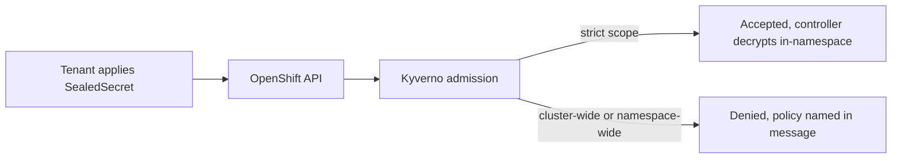
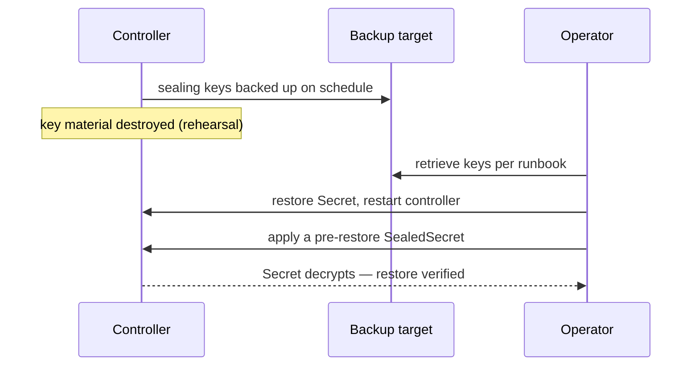

> **Test-run artifacts — not created in GitLab.** Produced by `dcs-user-story-authoring`.
>
> All 14 stories for `Sealed Secrets as a Service for Tenant Namespaces`, in **work
> order**. Every story: namespace `<group>/<project>` (inferred from the parent epic's
> existing children), parent epic = the Sealed Secrets epic, milestone **`Release 6`**
> (parent stream is `Development Stream R6`).
>
> **Split patterns used:** H4 spike-then-build (1 → 2,3), H3 lifecycle chain
> (2 → 3 → 4,5,6,7 → 11 → 12), H5 per-concern (4,5,6,7 are separate services with
> separate owners), H6 tests and docs as their own stories (11, 12), H1 environment
> ladder (13 → 14).
>
> **`P::` = order inside the epic.** Stories sharing a value can run in parallel.
>
> | # | Title | `type::` | `P::` |
> |---|---|---|---|
> | 1 | Decide the sealing scope model, key renewal period and certificate distribution route | `spike` | 1 |
> | 2 | Mirror the Sealed Secrets image and Helm chart into Harbor | `dev` | 1 |
> | 3 | Deploy the sealed-secrets-controller to DEV via ArgoCD | `dev` | 1 |
> | 4 | Publish the public sealing certificate for tenant self-service | `dev` | 2 |
> | 5 | Distribute the kubeseal CLI inside the air-gapped environments | `dev` | 2 |
> | 6 | Grant tenants RBAC for SealedSecret objects in their own namespaces | `dev` | 2 |
> | 7 | Reject cluster-wide and namespace-wide sealing scopes via Kyverno | `dev` | 2 |
> | 8 | Back up the sealing keys and rehearse a full restore | `dev` | 2 |
> | 9 | Enable automated sealing key renewal | `dev` | 3 |
> | 10 | Alert on unseal failures and certificate expiry | `dev` | 3 |
> | 11 | Automate the Sealed Secrets test suite | `test` | 3 |
> | 12 | Document the tenant sealing workflow with a GitLab CI example | `docs` | 3 |
> | 13 | Roll out Sealed Secrets to DIV | **`deployment`** | 3 |
> | 14 | Roll out Sealed Secrets to DE and ES | **`deployment`** | 3 |
>
> Stories 13 and 14 are `type::deployment`: the capability already exists and is being
> taken to a further environment. Story 3 stays `type::dev` — DEV is where it is built.
>
> One template throughout, opening with `As a / I want / So that`. Story 8 keeps the
> optional `How to Test` / `How to Demo` sections because they carry real content.
>
> **Titles are not numbered.** The epic has a `Milestones / Key Deliverables` section,
> but 14 stories do not map 1:1 onto its 4 phases, so numbered titles would imply a
> correspondence that does not exist.
>
> **A real run would ask:** for story 5, whether the internal distribution point is the
> GitLab package registry or a Harbor OCI artifact — the prompt does not say, and the
> choice changes the acceptance criteria. Everything else is inferable.
> `component::sealed secrets` is assumed to be the exact live label value on all 14.

---

# Story 1 — Decide the sealing scope model, key renewal period and certificate distribution route

`type::spike` · `P::1` · `component::sealed secrets` · Milestone `Release 6`

# Description

**As a** Platform Engineer, **I want** the sealing scope model, key renewal period and certificate distribution route decided and written down, **So that** the rest of the Epic is built on one agreed design instead of three implicit ones.

Record the three decisions the rest of the Epic depends on: which sealing scopes tenants
may use, how often the sealing key is renewed, and how a tenant obtains the public
certificate without access to the controller namespace. Timebox: 3 days. Output is a
written decision in the Epic's design document, not a deployment.

* **Key Requirements:**
    * **Scope model:** confirm that only the default `strict` scope (name **and**
      namespace bound) is offered, and record what breaks for tenants who expected to
      reuse one sealed value across namespaces.
    * **Renewal period:** choose the `--key-renew-period`, and state explicitly that
      retired keys are retained so existing `SealedSecret` objects keep decrypting.
    * **Certificate route:** compare fetching via the controller Service (needs
      cross-namespace access), a published Route serving `/v1/cert.pem`, and a
      ConfigMap replicated into each tenant namespace. Pick one and say why the other
      two were rejected.
    * **Blast radius:** state what a lost key and a leaked key each cost, to justify the
      backup story's priority.

**Acceptance Criteria**

- [ ] The three decisions are written into the Epic's design document, each with the
      rejected alternatives named.
- [ ] The chosen certificate route is validated by hand on the Sandbox cluster with a
      non-admin account that has no access to `dcs-sealed-secret`.
- [ ] The Security Operations Team has reviewed and accepted the scope decision.

## External References

* Scopes: https://github.com/bitnami-labs/sealed-secrets#scopes
* Key renewal: https://github.com/bitnami-labs/sealed-secrets#secret-rotation

---

# Story 2 — Mirror the Sealed Secrets image and Helm chart into Harbor

`type::dev` · `P::1` · `component::sealed secrets` · Milestone `Release 6`

# Description

**As a** Platform Engineer, **I want** the Sealed Secrets image and Helm chart mirrored into Harbor, **So that** air-gapped national clusters can deploy them without ever reaching an external registry.

Add the `sealed-secrets-controller` image and its Helm chart to the mirroring pipeline
so both resolve from Harbor. The national environments are air-gapped and Harbor is
pull-only for tenants, so nothing may be pulled from an external registry at deploy
time.

* **Key Requirements:**
    * **Mirror with skopeo:** add the image to the allowlist consumed by the mirroring
      pipeline. Do not introduce `docker` or `podman` into the pipeline.
    * **Chart too:** the Helm chart is mirrored as an OCI artifact, not fetched from an
      upstream chart repository at sync time.
    * **Pinned digests:** the mirrored image is referenced by digest in the values file,
      not by a floating tag.
    * **Scan clean:** the mirrored image passes the Harbor quality gate, or its findings
      are recorded as an explicit, time-bound allowlist exception.

**Acceptance Criteria**

- [ ] `skopeo inspect docker://<registry>/dcs-external-images/sealed-secrets-controller@<digest>`
      succeeds from inside a national cluster.
- [ ] The chart is pullable with `helm pull oci://<registry>/dcs-charts/sealed-secrets`
      and its version matches the one recorded in story 1.
- [ ] No manifest in the deployment references an external registry host.
- [ ] The Harbor scan result for the mirrored image is recorded in the story.

---

# Story 3 — Deploy the sealed-secrets-controller to DEV via ArgoCD

`type::dev` · `P::1` · `component::sealed secrets` · Milestone `Release 6`

# Description

**As a** Platform Engineer, **I want** the controller deployed to DEV through ArgoCD, **So that** the service is reproducible from Git and no one has to apply it by hand.

Deploy the controller and its `SealedSecret` CRD into the `dcs-sealed-secret` namespace
on the DEV environment, as an ArgoCD application with `prune` and `selfHeal` enabled.
This is the first environment; DIV, DE and ES follow in stories 13 and 14 from the same
chart.

* **Key Requirements:**
    * **GitOps only:** the application is added to the app-of-apps; nothing is applied
      by hand, and a manual change to a managed object is reverted by `selfHeal`.
    * **Namespace:** `dcs-sealed-secret`, consistent with the other platform service
      namespaces.
    * **Resource footprint:** requests and limits set, so the controller cannot be
      evicted first under node pressure.
    * **No policy exceptions:** the controller runs under the environment's existing
      Kyverno posture without a carve-out. If it cannot, that is a finding to raise, not
      a policy to weaken.

**Acceptance Criteria**

- [ ] `oc -n dcs-sealed-secret get deploy sealed-secrets-controller -o jsonpath='{.status.readyReplicas}'`
      returns `1`.
- [ ] `oc get crd sealedsecrets.bitnami.com` exits `0`.
- [ ] The ArgoCD application reports `Synced` and `Healthy`, and deleting a managed
      ConfigMap by hand results in ArgoCD restoring it.
- [ ] A sealed test secret applied to a scratch namespace produces the expected
      `Secret`, proving the controller decrypts end to end.
- [ ] No Kyverno policy exception was added for the controller.

---

# Story 4 — Publish the public sealing certificate for tenant self-service

`type::dev` · `P::2` · `component::sealed secrets` · Milestone `Release 6`

# Description

**As an** Application Team Engineer, **I want** to fetch the public sealing certificate without any access to the controller namespace, **So that** I can seal a secret myself instead of raising a platform ticket.

Make the **public** sealing certificate retrievable by any tenant engineer without
granting them access to the `dcs-sealed-secret` namespace, using the route chosen in
story 1. The private key is unaffected and stays unreadable.

* **Key Requirements:**
    * **No privileged access needed:** a tenant with rights only in their own namespace
      can fetch the certificate.
    * **Current key served:** after a key renewal (story 9) the published certificate
      reflects the new active key without manual republication.
    * **Integrity:** the certificate is served over TLS, and the documentation states how
      a tenant verifies they received the right one.
    * **Public only:** the publication path can never expose private key material —
      state how that is structurally prevented, not just intended.

**Acceptance Criteria**

- [ ] A tenant-scoped account fetches the certificate successfully and seals a value
      with it offline.
- [ ] The fetched certificate's fingerprint matches the controller's active key.
- [ ] `oc auth can-i get secrets -n dcs-sealed-secret --as=<tenant-user>` returns `no`,
      confirming the publication path did not widen access.
- [ ] After a forced key renewal, a re-fetch returns the new certificate and a value
      sealed with it unseals correctly.

---

# Story 5 — Distribute the kubeseal CLI inside the air-gapped environments

`type::dev` · `P::2` · `component::sealed secrets` · Milestone `Release 6`

# Description

**As an** Application Team Engineer working inside an air-gapped national environment, **I want** the `kubeseal` CLI from an internal distribution point with a verifiable checksum, **So that** I can seal a secret on my workstation without internet access or building the tool myself.

Publish the `kubeseal` CLI at an internal distribution point for the platforms tenant
engineers actually use, at a version compatible with the deployed controller, so no one
needs to build it or carry it in by hand.

* **Key Requirements:**
    * **Platforms:** Linux and macOS binaries, at a version matched to the deployed
      controller, with the compatibility statement written down rather than implied.
    * **Verifiable:** a SHA-256 checksum published beside each binary, and the
      verification command in the documentation.
    * **Reachable offline:** downloadable from inside a national environment with no
      internet access.
    * **Independently updatable:** a new CLI version can be published without a platform
      release.

**Acceptance Criteria**

- [ ] Linux and macOS binaries are published internally with a documented
      controller-compatibility statement.
- [ ] A SHA-256 checksum is published for each binary and the documented verification
      command succeeds.
- [ ] An engineer with no internet access downloads, verifies and runs
      `kubeseal --version` inside a national environment.
- [ ] The distribution point and the exact download command are linked from the tenant
      documentation (story 12).
- [ ] Publishing a new CLI version requires no platform release.

> Open question for a real run: internal distribution point — GitLab package registry
> or a Harbor OCI artifact? This changes the download command in the criteria above.

---

# Story 6 — Grant tenants RBAC for SealedSecret objects in their own namespaces

`type::dev` · `P::2` · `component::sealed secrets` · Milestone `Release 6`

# Description

**As a** Tenant Application Owner, **I want** my team to manage `SealedSecret` objects in our own namespaces, **So that** we control our own secrets without gaining access to anyone else's.

Extend the namespace provisioner's role bindings so tenant users can manage
`SealedSecret` objects inside their own namespaces, and confirm the boundary: no access
to the controller namespace, no access to the sealing key, no visibility of another
tenant's secrets.

* **Key Requirements:**
    * **Self-service CRUD:** create, read, update, delete and watch on
      `sealedsecrets.bitnami.com` within the tenant's own namespaces only.
    * **Provisioned, not hand-granted:** the permission comes from the namespace
      provisioner's templates, so every new namespace gets it automatically.
    * **Key stays closed:** no tenant role grants `get` on `Secret` objects in
      `dcs-sealed-secret`.
    * **Resulting Secret:** confirm whether tenants should be able to read the decrypted
      `Secret` in their own namespace — they can today via existing roles; state it
      explicitly so it is a decision rather than an accident.

**Acceptance Criteria**

- [ ] `oc auth can-i create sealedsecrets -n <own-namespace> --as=<tenant-user>`
      returns `yes`.
- [ ] The same check against another tenant's namespace returns `no`.
- [ ] `oc auth can-i get secrets -n dcs-sealed-secret --as=<tenant-user>` returns `no`.
- [ ] A freshly provisioned namespace carries the binding without manual intervention.

---

# Story 7 — Reject cluster-wide and namespace-wide sealing scopes via Kyverno

`type::dev` · `P::2` · `component::sealed secrets` · Milestone `Release 6`

# Description

**As a** Security Operations Engineer, **I want** cluster-wide and namespace-wide sealing scopes rejected at admission, **So that** one tenant's sealed value can never be unsealed in another tenant's namespace.

Enforce the Epic's architectural constraint at admission: a tenant-supplied
`SealedSecret` carrying `sealedsecrets.bitnami.com/cluster-wide` or
`sealedsecrets.bitnami.com/namespace-wide` is rejected with a message naming the policy.
Without this, a tenant could seal a value that unseals in any namespace.

* **Key Requirements:**
    * **Deny both annotations** on `SealedSecret` objects in tenant namespaces.
    * **Actionable message:** the denial names the policy and tells the tenant to re-seal
      without the scope flag.
    * **Platform namespaces:** decide and document whether platform-owned namespaces are
      excluded, and keep any exclusion list explicit rather than a wildcard.
    * **Environment posture:** enforced in PROD-type namespaces; DEV-type namespaces
      follow the environment's existing Kyverno baseline rather than getting a special
      case.

**Acceptance Criteria**

- [ ] Applying a `SealedSecret` annotated `cluster-wide: "true"` in a tenant namespace is
      denied, and the message names the policy.
- [ ] The same for `namespace-wide: "true"`.
- [ ] A `strict`-scoped `SealedSecret` is accepted and decrypts normally.
- [ ] The policy is delivered through the existing `kyverno-policies` chart, not applied
      by hand.
- [ ] The policy's own test fixtures run in the Kyverno test pipeline.

## External References

* Scopes: https://github.com/bitnami-labs/sealed-secrets#scopes
* Kyverno validation rules: https://kyverno.io/docs/writing-policies/validate/

---

# Story 8 — Back up the sealing keys and rehearse a full restore

`type::dev` · `P::2` · `complexity::high` · `component::sealed secrets` · Milestone `Release 6`

# Description

**As a** DCS Operator, **I want** the sealing keys backed up and the restore rehearsed, **So that** a lost key does not permanently destroy every tenant's secrets on the cluster.

A lost sealing key makes every `SealedSecret` on the cluster permanently undecryptable.
This story delivers the scheduled backup of the active and retired keys, a written
restore runbook, and a rehearsal proving the runbook works on a cluster where the key
has actually been destroyed.

* **Key Requirements:**
    * **Everything, not just the active key:** every `Secret` in `dcs-sealed-secret`
      labelled `sealedsecrets.bitnami.com/sealed-secrets-key`, retired keys included.
    * **Declarative schedule:** the backup is managed as code, not an operator's cron job.
    * **Custody:** stored encrypted at rest on the platform backup target, unreadable by
      any tenant role and never written to a tenant-accessible namespace or repository.
    * **Rehearsed, not written:** the runbook is executed on a cluster whose key material
      has been deleted, by an operator who did not write it, and the wall-clock time is
      recorded.

**Acceptance Criteria**

- [ ] A completed backup run contains every key `Secret`, active and retired.
- [ ] With the key deleted and not yet restored, a previously working `SealedSecret`
      fails to decrypt and reports `Synced=False` — the negative half, proving the
      rehearsal is real.
- [ ] After the runbook is followed, a `SealedSecret` created before the deletion
      decrypts to its original value.
- [ ] The restore completes within 60 minutes, performed by an operator who did not
      write the runbook, with no undocumented step needed.
- [ ] The backup schedule is delivered through the chart, not applied by hand.
- [ ] No tenant role can read the backup — verified by an explicit denied access check.

## How to Test

- Delete the sealing key `Secret` on a scratch cluster, follow the runbook verbatim,
  then apply a `SealedSecret` created before the deletion and confirm it decrypts.
- Confirm the negative: with the key deleted and **not** restored, the same object fails
  to decrypt and reports the failure in its status.

## How to Demo

- Show the rehearsal log: key destroyed, runbook followed, pre-existing sealed secret
  decrypting again, with the elapsed time.

## External References

- Key backup: https://github.com/bitnami-labs/sealed-secrets#how-can-i-do-a-backup-of-my-sealedsecrets

---

# Story 9 — Enable automated sealing key renewal

`type::dev` · `P::3` · `component::sealed secrets` · Milestone `Release 6`

# Description

**As a** Security Operations Engineer, **I want** the sealing key renewed automatically, **So that** a single key does not protect every tenant secret for the lifetime of the cluster.

Turn on automated key renewal at the period decided in story 1, so the active sealing key
does not live for the lifetime of the cluster. Retired keys are retained, so existing
`SealedSecret` objects continue to decrypt without re-sealing.

* **Key Requirements:**
    * **Configured in the chart:** the renewal period is a values entry, identical
      across environments.
    * **Old keys retained:** renewal must not invalidate existing objects — verify, do
      not assume.
    * **Published certificate follows:** after renewal, story 4's publication path serves
      the new certificate without manual action.
    * **Backup follows:** the new key appears in the next backup run (story 8).

**Acceptance Criteria**

- [ ] The renewal period in the running controller matches the decision from story 1.
- [ ] After a forced renewal, a `SealedSecret` sealed with the previous certificate still
      decrypts.
- [ ] A value sealed with the newly published certificate decrypts.
- [ ] The count of key `Secret` objects in `dcs-sealed-secret` increases by one and none
      are deleted.

---

# Story 10 — Alert on unseal failures and certificate expiry

`type::dev` · `P::3` · `component::sealed secrets` · Milestone `Release 6`

# Description

**As a** DCS Operator, **I want** unseal failures and approaching certificate expiry to raise alerts, **So that** I learn about a broken sealing service before a tenant reports it.

Make failures visible to the platform team rather than only to the tenant who hit them.
Export the controller's metrics into platform monitoring and alert on unseal errors and
on an approaching certificate expiry.

* **Key Requirements:**
    * **Scrape:** a `ServiceMonitor` for the controller in `dcs-sealed-secret`.
    * **Alerts:** unseal errors over a short window, and certificate expiry inside a
      documented lead time long enough to act on.
    * **Dashboard:** unseal successes and failures over time, plus the active key age.
    * **Routing:** the alert reaches the platform operations channel, not just the
      cluster's alert list.

**Acceptance Criteria**

- [ ] `sealed_secrets_controller_unseal_errors_total` is queryable in platform
      monitoring.
- [ ] Applying a deliberately corrupted `SealedSecret` raises the alert within one alert
      interval, and it resolves after the object is removed.
- [ ] The dashboard shows unseal successes, failures and active key age.
- [ ] The expiry alert fires against a test key whose expiry is inside the lead time.

---

# Story 11 — Automate the Sealed Secrets test suite

`type::test` · `P::3` · `component::sealed secrets` · Milestone `Release 6`

# Description

**As a** Platform Engineer, **I want** the Sealed Secrets test cases automated in the chart pipeline, **So that** the namespace isolation guarantee is re-verified on every change instead of once at delivery.

Implement the test cases written for this Epic (`SS-TST-008` … `SS-TST-013`) as automated
tests, so the guarantees — in particular namespace isolation — are re-verified on every
chart change rather than once at delivery.

* **Key Requirements:**
    * **Chainsaw for admission and decryption behaviour:** happy path, cross-namespace
      denial, scope rejection.
    * **Python for the restore rehearsal:** destroy and restore key material against a
      scratch cluster.
    * **Robot for the certificate endpoint** and its status codes.
    * **Pipeline:** the suite runs in the chart's CI job and fails the pipeline on any
      negative-case regression.

**Acceptance Criteria**

- [ ] Each of `SS-TST-008` … `SS-TST-013` has a runnable implementation, and the test
      case's `test-automation::` label is moved to `implemented`.
- [ ] The suite runs in the `dcs-helm-charts` pipeline and blocks the merge on failure.
- [ ] Deliberately breaking the namespace-isolation policy makes the suite go red.
- [ ] Fixtures are committed under `test/fixtures/sealed-secrets/`.

## External References

* Test cases: `https://<host>/<group>/dcs-helm-charts/-/quality/test_cases/<iid>`
* Chainsaw: https://kyverno.github.io/chainsaw/

---

# Story 12 — Document the tenant sealing workflow with a GitLab CI example

`type::docs` · `P::3` · `component::sealed secrets` · Milestone `Release 6`

# Description

**As an** Application Team Engineer, **I want** documentation covering the whole sealing workflow with a working CI example, **So that** I can adopt sealed secrets without a platform ticket.

Write the tenant-facing documentation for the whole workflow: fetch the certificate,
install `kubeseal`, seal a value, commit it, review it in a merge request, and roll it
back. Include a working GitLab CI job for teams that prefer to seal in a pipeline rather
than on a workstation.

* **Key Requirements:**
    * **End to end for a newcomer:** a tenant engineer who has never used Sealed Secrets
      can follow it without a platform ticket.
    * **State the limits plainly:** strict scope only, the same sealed value cannot be
      reused in another namespace, and a rotated credential must be re-sealed.
    * **CI example:** a job that fetches the certificate and seals a variable, with no
      plaintext written to a job log or artifact.
    * **Failure guide:** what an unseal failure looks like in the object status and the
      three most likely causes.

**Acceptance Criteria**

- [ ] The documentation is published in the tenant documentation space and linked from
      the namespace onboarding page.
- [ ] A reviewer from a tenant team follows it end to end on DEV without asking for help,
      and their feedback is incorporated.
- [ ] The CI example runs green in a sample project and writes no secret value into any
      log or artifact.
- [ ] The scope limitation and the re-sealing requirement are stated explicitly.

---

# Story 13 — Roll out Sealed Secrets to DIV

`type::deployment` · `P::3` · `component::sealed secrets` · Milestone `Release 6`

# Description

**As a** Tenant Application Owner on DIV, **I want** Sealed Secrets available in my environment, **So that** I can keep my application's secrets in Git like the teams on DEV already do.

Deploy the verified chart to the DIV environment from the same values structure used on
DEV, generating DIV's own key material. Nothing but the key material and the certificate
differs between environments.

* **Key Requirements:**
    * **Same chart, own key:** DIV generates its own sealing key. Key material is never
      copied between environments.
    * **Backup from day one:** DIV's key is in the backup schedule before any tenant
      seals against it.
    * **Enforced posture:** the scope guardrail from story 7 is active on DIV, not
      audit-only.
    * **Tenant comms:** the certificate location for DIV is published before announcing
      availability.

**Acceptance Criteria**

- [ ] The controller is `Synced` and `Healthy` on DIV, deployed only via ArgoCD.
- [ ] A tenant on DIV seals and deploys a secret end to end.
- [ ] A cross-namespace attempt on DIV is denied, and a cluster-wide scoped object is
      rejected at admission.
- [ ] DIV's key appears in a completed backup run.

---

# Story 14 — Roll out Sealed Secrets to DE and ES

`type::deployment` · `P::3` · `rollout::es` · `component::sealed secrets` · Milestone `Release 6`

# Description

**As a** Tenant Application Owner in Germany or Spain, **I want** Sealed Secrets available in my national environment, **So that** my team gets the same GitOps workflow as the rest of the platform.

Complete the rollout into the two remaining national environments after DIV has run
without incident, each with its own key material. This is the last rung of the ladder;
after it the service is generally available to tenants in all environments.

* **Key Requirements:**
    * **Per-country key material**, generated in place and never copied.
    * **Sequential, not simultaneous:** DE first, then ES, so a problem is contained to
      one country.
    * **Country change requests:** any firewall or approval steps each country needs are
      raised before deployment, not discovered during it.
    * **Availability announcement** goes out per country only after that country's
      end-to-end verification passes.

**Acceptance Criteria**

- [ ] The controller is `Synced` and `Healthy` on DE and on ES.
- [ ] A tenant seals and deploys a secret successfully in each country.
- [ ] The cross-namespace denial and the scope rejection are verified in each country.
- [ ] Both countries' keys appear in completed backup runs.
- [ ] `test-de::` and `test-es::` labels on the Epic's test cases are updated to reflect
      the verified result.
