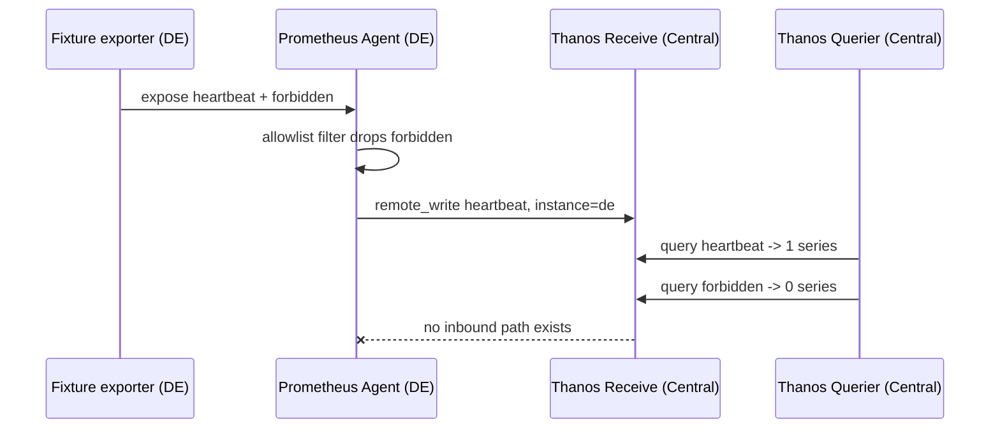

> **Test-run artifact — not created in GitLab.** Produced by `dcs-test-case-authoring`.
>
> | | |
> |---|---|
> | Work item | **Test Case** (`issue_type=test_case`) |
> | Title | `XCM-TST-001 - Verify Outbound remote_write Ingestion with National Identifier Label` |
> | Namespace | `<group>/dcs-helm-charts` |
> | Expected URL | `https://<host>/<group>/dcs-helm-charts/-/quality/test_cases/<iid>` |
> | Labels | `type::test`, `component::monitoring`, `test::robot`, `test-automation::planned`, `test-de::planned`, `test-div::planned`, `test-es::planned` |
> | Never set | `P::`, `release::` |
>
> **Prefix:** no existing case series covers cross-country metrics, so a real run would
> **ask for the prefix** rather than invent one. `XCM-` is my placeholder for this dry
> run — replace it if the team already uses another.
> **Label reasoning:** `test::robot` — the assertion is an HTTP/PromQL query against the
> Thanos Querier plus a status-code check, which is Robot + RequestsLibrary territory,
> not a manifest apply/assert (that would be `test::chainsaw`).
> `test-es::planned` rather than `n/a` because every national instance is in scope.

---

### Test Case 1: Outbound remote_write Ingestion with National Identifier Label

| | |
|---|---|
| **Test Case ID** | `XCM-TST-001` |
| **Test Case Name** | `Verify a national Prometheus Agent's outbound remote_write is ingested centrally with its national identifier label, and that a non-allowlisted metric is dropped at the source` |
| **Component(s)** | `prometheus-agent`, `thanos-receive`, `dcs-monitoring` |
| **Priority** | `Critical` |
| **Prerequisites** | 1. `oc` access to one national cluster (DE) and to the central cluster, with the platform-admin role on both. 2. The `dcs-monitoring` chart deployed on the national cluster with `remoteWrite.enabled=true` and `externalLabels.instance=de`. 3. **Thanos Receive** deployed centrally and reachable on its Route with a valid per-country client certificate. 4. `curl` and `jq` available on the workstation. 5. A test metric `dcs_testcase_heartbeat` on the allowlist, and a second metric `dcs_testcase_forbidden` deliberately **not** on the allowlist, both exposed by a fixture Deployment in `dcs-monitoring` on the national cluster. |
| **Manual Test Steps** | 1. Confirm both fixture metrics exist nationally: `oc --context de -n dcs-monitoring exec deploy/prometheus-agent -- promtool query instant http://localhost:9090 'dcs_testcase_heartbeat' ` and repeat for `dcs_testcase_forbidden`. 2. Confirm the agent is configured outbound-only: `oc --context de -n dcs-monitoring get prometheus prometheus-agent -o jsonpath='{.spec.remoteWrite[*].url}'` and assert no `scrape` target on the central cluster references a national address: `oc --context central -n dcs-monitoring get prometheus,servicemonitor -o yaml \| grep -c '\.de\.' `. 3. Wait for two scrape intervals, then query the central Thanos Querier: `curl -s --cert client-de.crt --key client-de.key "https://thanos-querier.<central-domain>/api/v1/query?query=dcs_testcase_heartbeat" \| jq '.data.result[0].metric'`. 4. Query centrally for the forbidden metric: `curl -s --cert client-de.crt --key client-de.key "https://thanos-querier.<central-domain>/api/v1/query?query=dcs_testcase_forbidden" \| jq '.data.result \| length'`. 5. Attempt an unauthenticated write to the ingestion endpoint: `curl -s -o /dev/null -w '%{http_code}' -X POST "https://thanos-receive.<central-domain>/api/v1/receive" --data-binary @/dev/null`. 6. From the central cluster, attempt to reach the national Prometheus directly: `oc --context central -n dcs-monitoring run probe --rm -i --restart=Never --image=<registry>/dcs-internal-images/curl:latest -- curl -s -m 10 -o /dev/null -w '%{http_code}' http://prometheus-agent.dcs-monitoring.svc.<de-domain>:9090/-/healthy`. |
| **Expected Outcome** | 1. Step 1 returns a non-empty result for **both** metrics — the fixture is producing them nationally. 2. Step 2 prints exactly one `remoteWrite` URL, pointing at the central Thanos Receive Route, and the central `grep -c` returns `0`. 3. Step 3 returns a metric object whose `instance` label equals `de`. A result without that label is a **fail**, not a partial pass. 4. Step 4 returns `0` — the non-allowlisted metric must **NOT** be present centrally, despite existing nationally in step 1. 5. Step 5 returns `401` or `403`. Any `2xx` is a fail. 6. Step 6 fails to connect: the command times out or returns `000`. A reachable national endpoint from Central violates the epic's architectural constraint and is a **Critical** fail. |
| **Automation Proposal** | Robot Framework with `RequestsLibrary` and `KubeLibrary`. Suite setup applies the fixture Deployment and waits for it to be `Available`. Test 1 asserts `GET /api/v1/query?query=dcs_testcase_heartbeat` on the Thanos Querier returns `200` with `data.result` length `>= 1` and `data.result[0].metric.instance == de`, retried for up to 3 scrape intervals. Test 2 asserts the same endpoint for `dcs_testcase_forbidden` returns `200` with `data.result` length `== 0`. Test 3 asserts an unauthenticated `POST /api/v1/receive` returns `401` or `403`. Test 4 uses KubeLibrary to run a probe Pod on the central cluster against the national Prometheus Service FQDN and asserts a connection failure (non-zero exit, no HTTP status) — the negative assertion that proves inbound is closed. Suite teardown removes the fixture. Fixtures: `test/fixtures/xcm/heartbeat-exporter.yaml`, `test/fixtures/xcm/allowlist-values.yaml`. |
| **Reference** | https://\<host\>/\<group\>/dcs-helm-charts/-/blob/\<sha\>/charts/dcs-monitoring/templates/prometheus-agent.yaml · https://thanos.io/tip/components/receive.md/ |

**Related Epics:** https://\<host\>/groups/\<group\>/-/epics/\<iid\>
