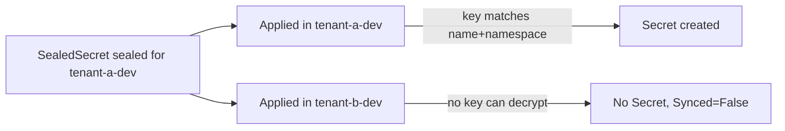

> **Test-run artifacts — not created in GitLab.** Produced by `dcs-test-case-authoring`.
>
> Six `test_case` work items in `<group>/dcs-helm-charts`, expected at
> `https://<host>/<group>/dcs-helm-charts/-/quality/test_cases/<iid>`.
>
> **Prefix:** `SS-` already exists for this component (highest seen in the corpus:
> `SS-TST-007`), so numbering continues at **008**. A real run confirms the true highest
> `nn` by searching `issue_type=test_case&search=SS-TST` before assigning.
>
> | ID | Behaviour | `test::` | Priority | Env labels |
> |---|---|---|---|---|
> | `SS-TST-008` | Seal and unseal inside the tenant's own namespace | `chainsaw` | High | de/div/es `planned` |
> | `SS-TST-009` | A SealedSecret must NOT unseal in another namespace | `chainsaw` | Critical | de/div/es `planned` |
> | `SS-TST-010` | Tenants cannot read the sealing key | `chainsaw` | Critical | de/div/es `planned` |
> | `SS-TST-011` | The published certificate serves the active key to an unprivileged account | `robot` | High | de/div/es `planned` |
> | `SS-TST-012` | Sealing key restore from backup makes old objects decrypt again | `python` | Critical | all `n/a` — destructive, Sandbox only |
> | `SS-TST-013` | An unseal failure raises the monitoring alert | `grafana` | Medium | de/div/es `planned` |
>
> All six carry `type::test`, `component::sealed secrets`, `test-automation::planned`.
> **None carries `P::` or `release::`** — those stay on the parent story and epic.
>
> **A real run would ask:** for the true highest `SS-TST-` sequence number, and whether
> the destructive restore rehearsal (`012`) is allowed to run on DIV or Sandbox only —
> that answer decides `n/a` versus `planned` on its environment labels.

---

### Test Case 8: Seal and Unseal Inside the Tenant's Own Namespace

| | |
|---|---|
| **Test Case ID** | `SS-TST-008` |
| **Test Case Name** | `Verify a strict-scoped SealedSecret applied to its own namespace produces a Secret with the original value` |
| **Component(s)** | `sealed-secrets-controller`, `dcs-namespace-provisioner` |
| **Priority** | `High` |
| **Prerequisites** | 1. `oc` access to the cluster with the platform-admin role. 2. The `sealed-secrets-controller` Deployment is `Available` in `dcs-sealed-secret`. 3. A tenant test namespace `tenant-a-dev` exists, provisioned normally. 4. `kubeseal` installed at the version published for this controller. 5. The public sealing certificate available locally as `cert.pem`. |
| **Manual Test Steps** | 1. Seal a known value for the target namespace: `echo -n 'p4ssw0rd' \| oc create secret generic app-db --dry-run=client --from-file=password=/dev/stdin -o yaml \| kubeseal --cert cert.pem --namespace tenant-a-dev -o yaml > sealed.yaml`. 2. Confirm the manifest holds no plaintext: `grep -c 'p4ssw0rd' sealed.yaml`. 3. Apply it: `oc -n tenant-a-dev apply -f sealed.yaml`. 4. Wait for reconciliation, then read the resulting Secret: `oc -n tenant-a-dev get secret app-db -o jsonpath='{.data.password}' \| base64 -d`. 5. Read the object's status: `oc -n tenant-a-dev get sealedsecret app-db -o jsonpath='{.status.conditions[?(@.type=="Synced")].status}'`. 6. Delete the `Secret` only and re-check after reconciliation: `oc -n tenant-a-dev delete secret app-db` then repeat step 4. |
| **Expected Outcome** | 1. Step 1 exits `0` and writes `sealed.yaml`. 2. Step 2 returns `0` — the plaintext must NOT appear anywhere in the sealed manifest. 3. Step 3 exits `0`. 4. Step 4 prints exactly `p4ssw0rd`. 5. Step 5 returns `True`. 6. Step 6 recreates the `Secret` with the same value — the controller re-reconciles a deleted child. |
| **Automation Proposal** | Chainsaw: `apply` a pre-sealed fixture `SealedSecret` into `tenant-a-dev`, `assert` a `Secret` named `app-db` exists with `data.password` equal to the expected base64 value, and `assert` the `SealedSecret` condition `Synced=True`. A second step `delete`s the `Secret` and re-`assert`s it reappears. A `command` step runs `grep -c` over the fixture to assert the plaintext is absent from the committed manifest. Fixtures: `test/fixtures/sealed-secrets/sealed-app-db-tenant-a.yaml`. Note for the implementer: the fixture must be re-sealed whenever the test cluster's key changes, so generate it in suite setup from the live certificate rather than committing a cluster-specific blob. |
| **Reference** | https://\<host\>/\<group\>/dcs-helm-charts/-/blob/\<sha\>/charts/sealed-secrets/values.yaml · https://github.com/bitnami-labs/sealed-secrets#usage |

**Related Epics:** https://\<host\>/groups/\<group\>/-/epics/\<iid\>

---

### Test Case 9: A SealedSecret Must Not Unseal in Another Namespace

| | |
|---|---|
| **Test Case ID** | `SS-TST-009` |
| **Test Case Name** | `Verify a SealedSecret sealed for one tenant namespace fails to decrypt when applied to a different namespace` |
| **Component(s)** | `sealed-secrets-controller` |
| **Priority** | `Critical` |
| **Prerequisites** | 1. `oc` access with the platform-admin role. 2. Two provisioned tenant namespaces, `tenant-a-dev` and `tenant-b-dev`, owned by different tenants. 3. A `SealedSecret` sealed with `--namespace tenant-a-dev` and the strict (default) scope, as produced by `SS-TST-008` step 1. |
| **Manual Test Steps** | 1. Apply the object to the namespace it was sealed for: `oc -n tenant-a-dev apply -f sealed.yaml` and confirm the `Secret` appears. 2. Apply the **same** object to the other namespace: `oc -n tenant-b-dev apply -f sealed.yaml`. 3. Check for a resulting Secret there: `oc -n tenant-b-dev get secret app-db`. 4. Read the failure from the object status: `oc -n tenant-b-dev get sealedsecret app-db -o jsonpath='{.status.conditions[?(@.type=="Synced")].message}'`. 5. Read the controller's view: `oc -n dcs-sealed-secret logs deploy/sealed-secrets-controller --tail=50 \| grep -i 'no key could decrypt'`. 6. Confirm no value leaked into the log: `oc -n dcs-sealed-secret logs deploy/sealed-secrets-controller --tail=200 \| grep -c 'p4ssw0rd'`. |
| **Expected Outcome** | 1. Step 1 produces the `Secret` in `tenant-a-dev`. 2. Step 2 exits `0` — the CR is accepted; the guarantee is enforced at decryption, not at admission. 3. Step 3 returns `Error from server (NotFound): secrets "app-db" not found`. The `Secret` must **NOT** exist in `tenant-b-dev`. 4. Step 4 returns a message indicating decryption failed, so the tenant can see the cause without platform help. 5. Step 5 matches at least one line. 6. Step 6 returns `0` — no secret value in any log line. |
| **Automation Proposal** | Chainsaw, two steps. Step 1: `apply` the fixture into `tenant-a-dev`, `assert` the `Secret` exists. Step 2: `apply` the identical fixture into `tenant-b-dev`, then `error` on any `Secret` named `app-db` existing in `tenant-b-dev`, and `assert` the `SealedSecret` there carries `Synced=False`. A `command` step greps the controller log for the plaintext and asserts a zero count — this is the leak check, and it must fail the suite if it ever matches. This is the multi-tenancy guarantee of the whole Epic: if this test is red, the service must not be released. |
| **Reference** | https://github.com/bitnami-labs/sealed-secrets#scopes |

**Related Epics:** https://\<host\>/groups/\<group\>/-/epics/\<iid\>

---

### Test Case 10: Tenants Cannot Read the Sealing Key

| | |
|---|---|
| **Test Case ID** | `SS-TST-010` |
| **Test Case Name** | `Verify a tenant-scoped account can manage SealedSecrets in its own namespaces but cannot read the sealing key or another tenant's namespace` |
| **Component(s)** | `sealed-secrets-controller`, `dcs-namespace-provisioner` |
| **Priority** | `Critical` |
| **Prerequisites** | 1. `oc` access with the platform-admin role for the impersonated checks. 2. A tenant user or ServiceAccount bound only to `tenant-a-dev` and `tenant-a-prod`. 3. A second tenant's namespace `tenant-b-dev`. 4. The controller deployed in `dcs-sealed-secret` with its key `Secret` present. |
| **Manual Test Steps** | 1. Positive: `oc auth can-i create sealedsecrets -n tenant-a-dev --as=<tenant-user>`. 2. Positive: `oc auth can-i delete sealedsecrets -n tenant-a-prod --as=<tenant-user>`. 3. Negative, other tenant: `oc auth can-i create sealedsecrets -n tenant-b-dev --as=<tenant-user>`. 4. Negative, the key itself: `oc auth can-i get secrets -n dcs-sealed-secret --as=<tenant-user>`. 5. Negative, list attempt: `oc auth can-i list secrets --all-namespaces --as=<tenant-user>`. 6. Direct attempt, not just an authorization check: `oc -n dcs-sealed-secret get secret -l sealedsecrets.bitnami.com/sealed-secrets-key --as=<tenant-user>`. |
| **Expected Outcome** | 1. Step 1 prints `yes`. 2. Step 2 prints `yes`. 3. Step 3 prints `no`. 4. Step 4 prints `no`. 5. Step 5 prints `no`. 6. Step 6 fails with `Error from server (Forbidden)` and returns no key material. |
| **Automation Proposal** | Chainsaw with `command` steps wrapping `oc auth can-i --as=<tenant-user>`, asserting stdout `yes` for the two positive checks and `no` for the three negative ones, plus one step asserting a non-zero exit and a `Forbidden` message on the direct impersonated `get` of the key `Secret`. Alternatively Robot with KubeLibrary issuing `SelfSubjectAccessReview` objects, which avoids shelling out; either is acceptable, but the negative assertions must fail the suite on a `yes`. Suite setup provisions the tenant namespaces through the provisioner so the RBAC under test is the provisioned one, not a hand-written binding. |
| **Reference** | https://\<host\>/\<group\>/dcs-helm-charts/-/blob/\<sha\>/charts/dcs-namespace-provisioner/templates/rolebindings.yaml |

**Related Epics:** https://\<host\>/groups/\<group\>/-/epics/\<iid\>

---

### Test Case 11: The Published Certificate Serves the Active Key to an Unprivileged Account

| | |
|---|---|
| **Test Case ID** | `SS-TST-011` |
| **Test Case Name** | `Verify the published sealing certificate is retrievable without access to dcs-sealed-secret and matches the controller's active key` |
| **Component(s)** | `sealed-secrets-controller`, `sealed-secrets-cert-publisher` |
| **Priority** | `High` |
| **Prerequisites** | 1. The certificate publication path from the epic's story 4 is deployed. 2. A tenant-scoped account with no rights in `dcs-sealed-secret`. 3. `openssl`, `curl` and `kubeseal` available. 4. `oc` platform-admin access, to read the active key's fingerprint for comparison. |
| **Manual Test Steps** | 1. Fetch as the tenant: `curl -sf https://<publication-host>/v1/cert.pem -o fetched.pem` (or the equivalent ConfigMap read in the tenant namespace, per the chosen route). 2. Fingerprint it: `openssl x509 -in fetched.pem -noout -fingerprint -sha256`. 3. Fingerprint the controller's active key: `oc -n dcs-sealed-secret get secret -l sealedsecrets.bitnami.com/sealed-secrets-key=active -o jsonpath='{.items[0].data.tls\.crt}' \| base64 -d \| openssl x509 -noout -fingerprint -sha256`. 4. Prove it works: seal a value with `fetched.pem` and apply it to a tenant namespace. 5. Negative, TLS: `curl -s -o /dev/null -w '%{http_code}' http://<publication-host>/v1/cert.pem`. 6. Negative, no key exposure: `curl -s https://<publication-host>/v1/cert.pem \| grep -c 'PRIVATE KEY'`. |
| **Expected Outcome** | 1. Step 1 exits `0` and writes a PEM file. 2. and 3. The two SHA-256 fingerprints are identical, character for character. 3. Step 4 produces a working `Secret`, proving the published certificate is the one in use. 4. Step 5 returns `301`, `308` or `403` — plain HTTP must not serve the certificate. 5. Step 6 returns `0` — the endpoint must **NOT** expose any private key material. |
| **Automation Proposal** | Robot Framework with `RequestsLibrary` and `KubeLibrary`: `GET` the publication URL, assert `200` and a `BEGIN CERTIFICATE` body; compute the fingerprint with `OperatingSystem`/`Process` calling `openssl`; read the active key `Secret` with KubeLibrary and assert the fingerprints match; assert a plain-HTTP `GET` does not return `200`; assert the response body does not contain `PRIVATE KEY`. Re-run the fingerprint comparison as a second test case after a forced key renewal, so a stale published certificate is caught. |
| **Reference** | https://github.com/bitnami-labs/sealed-secrets#fetch-the-public-key |

**Related Epics:** https://\<host\>/groups/\<group\>/-/epics/\<iid\>

---

### Test Case 12: Sealing Key Restore From Backup

| | |
|---|---|
| **Test Case ID** | `SS-TST-012` |
| **Test Case Name** | `Verify a SealedSecret created before key loss decrypts again after the documented restore, and does not decrypt before it` |
| **Component(s)** | `sealed-secrets-controller`, `dcs-backup` |
| **Priority** | `Critical` |
| **Prerequisites** | 1. A Sandbox or scratch cluster — **this test destroys key material and must never run on a national environment.** 2. `oc` platform-admin access to that cluster. 3. At least one completed backup run containing the key `Secret` objects. 4. A `SealedSecret` applied and successfully decrypted before the test begins, plus its expected plaintext value. 5. The restore runbook from the epic's story 8. |
| **Manual Test Steps** | 1. Record the baseline: `oc -n tenant-a-dev get secret app-db -o jsonpath='{.data.password}' \| base64 -d`. 2. Capture the key names: `oc -n dcs-sealed-secret get secret -l sealedsecrets.bitnami.com/sealed-secrets-key -o name`. 3. Destroy the key material: `oc -n dcs-sealed-secret delete secret -l sealedsecrets.bitnami.com/sealed-secrets-key`, then `oc -n dcs-sealed-secret rollout restart deploy/sealed-secrets-controller`. 4. Delete the derived Secret and force reconciliation: `oc -n tenant-a-dev delete secret app-db` then `oc -n tenant-a-dev annotate sealedsecret app-db test-touch="$(date +%s)" --overwrite`. 5. Confirm the pre-restore failure: `oc -n tenant-a-dev get secret app-db` and read the object status. 6. Follow the restore runbook verbatim, timing it. 7. Force reconciliation again and read the value: `oc -n tenant-a-dev get secret app-db -o jsonpath='{.data.password}' \| base64 -d`. 8. Confirm the key inventory: repeat step 2. |
| **Expected Outcome** | 1. Step 1 prints the known plaintext. 2. Step 5 shows **no** `Secret` and a `Synced=False` status — proving the test actually removed the capability rather than passing trivially. 3. Step 6 completes within 60 minutes, following the runbook without an undocumented step. 4. Step 7 prints the same plaintext as step 1. 5. Step 8 lists the same key names recorded in step 2, including the retired keys — a partial restore that recovers only the active key is a **fail**. |
| **Automation Proposal** | Python with the Kubernetes client, gated to run only against a Sandbox context — the harness must assert the current context is not a national cluster and abort otherwise. Sequence: read and store the plaintext; snapshot the key `Secret` names; delete them; restart the Deployment and wait for readiness; assert the derived `Secret` is absent and the CR condition is `False`; re-apply the key objects from the backup artifact; restart again; assert the plaintext matches the stored value and the key name set equals the snapshot. Record the elapsed restore time as test output so a regression in the runbook's cost is visible. |
| **Reference** | https://github.com/bitnami-labs/sealed-secrets#how-can-i-do-a-backup-of-my-sealedsecrets |

**Related Epics:** https://\<host\>/groups/\<group\>/-/epics/\<iid\>

---

### Test Case 13: An Unseal Failure Raises the Monitoring Alert

| | |
|---|---|
| **Test Case ID** | `SS-TST-013` |
| **Test Case Name** | `Verify a failed unseal increments the controller error metric and fires the platform alert, and that the alert resolves` |
| **Component(s)** | `sealed-secrets-controller`, `dcs-monitoring` |
| **Priority** | `Medium` |
| **Prerequisites** | 1. `oc` platform-admin access. 2. The controller's `ServiceMonitor` deployed and the target reported as `up` in platform monitoring. 3. The unseal-failure alert rule deployed. 4. A scratch namespace `sealed-secrets-test`. |
| **Manual Test Steps** | 1. Record the baseline: query `sealed_secrets_controller_unseal_errors_total` and note the value. 2. Apply a deliberately corrupted object: take a valid `SealedSecret`, mutate one character of the `encryptedData` value, and `oc -n sealed-secrets-test apply -f corrupted.yaml`. 3. Re-query the metric after one scrape interval. 4. Query the alert state: `curl -s <alertmanager>/api/v2/alerts \| jq '[.[] \| select(.labels.alertname=="SealedSecretsUnsealFailure")] \| length'`. 5. Remove the object: `oc -n sealed-secrets-test delete -f corrupted.yaml`. 6. Re-query the alert state after the resolve interval. 7. Check the dashboard panel for unseal failures over the test window. |
| **Expected Outcome** | 1. Step 3 shows the counter increased by at least `1` over the baseline from step 1. 2. Step 4 returns `>= 1` — the alert is firing, within one alert interval of step 2. 3. Step 6 returns `0` — the alert resolves after the cause is removed; an alert that never clears is a **fail**. 4. Step 7 shows the failure on the dashboard panel within the test window. 5. No secret value appears in the alert labels or annotations. |
| **Automation Proposal** | Grafana/Prometheus verification: query the Prometheus HTTP API for `sealed_secrets_controller_unseal_errors_total` before and after applying the corrupted fixture and assert a strictly increasing counter; query the Alertmanager API and assert an alert with `alertname="SealedSecretsUnsealFailure"` is present while the object exists and absent after deletion; assert the dashboard UID resolves with `GET /api/dashboards/uid/<uid>` returning `200`; and assert no alert label or annotation value matches the fixture's plaintext. Fixture: `test/fixtures/sealed-secrets/corrupted-sealed-secret.yaml`. |
| **Reference** | https://\<host\>/\<group\>/dcs-helm-charts/-/blob/\<sha\>/charts/sealed-secrets/templates/servicemonitor.yaml |

**Related Epics:** https://\<host\>/groups/\<group\>/-/epics/\<iid\>
