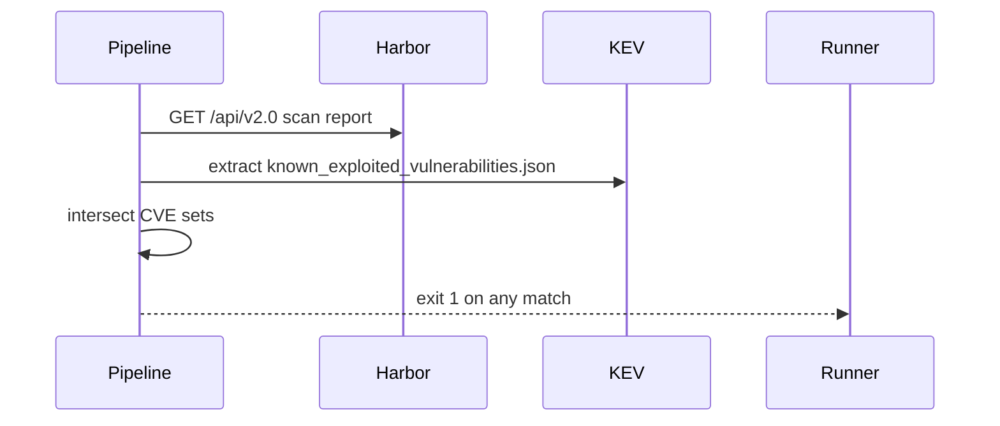

# DCS User Story Authoring

A story is **one small, testable unit of platform work** under a topic epic. Several
focused stories beat one large one.

```
Development Stream R<n>   group epic, type::tracking-only
└─ topic epic             dcs-epic-authoring
   └─ user story issues   THIS SKILL — ordered, P:: = order inside the epic
```

A story with `type::bug` is not written here → use `dcs-bug-authoring`.

## 0. Resolve the GitLab target — always first

1. `git -C /projects/<any-repo> remote get-url origin` → GitLab host + group path.
   Never hardcode a host. Never assume gitlab.com.
2. **Issues are project level.** If the target project is not in the prompt, list the
   parent epic's existing children and use the project they live in; ask if ambiguous.
3. Epics are group level — the parent epic reference is a group epic.

## 1. Discover before writing

| Need | MCP tool | REST fallback |
|---|---|---|
| exact label strings | `list_labels(namespace=<group>, include_ancestor_groups=true)` | `GET /groups/<group>/labels?include_ancestor_groups=true` |
| parent epic + its release stream | `list_work_items(namespace=<group>, types=["EPIC"])` | `GET /groups/<group>/epics?search=<topic>` |
| the milestone | `list_milestones(namespace=<group>, include_ancestors=true)` | `GET /groups/<group>/milestones?search=Release` |
| sibling stories — style, and the highest `P::` already used | `list_work_items(namespace=<group>/<project>)` | `GET /projects/<id>/issues?labels=...` |

**Never invent a label or milestone name.** Copy the exact string the API returned.

## 2. Labels — required

| Label | Values | Meaning / how to infer | Ask when |
|---|---|---|---|
| `type::<v>` | `dev`, `deployment`, `spike`, `test`, `docs`, `bug` | `dev` = default, build/configure/deploy something new · **`deployment` = rolling an already-built capability out to an environment or country** ("Roll out Sealed Secrets to DIV") · `spike` = investigate, assess feasibility, PoC with no committed outcome · `test` = write or automate tests · `docs` = documentation only · `bug` → stop, use `dcs-bug-authoring` | the work is investigation *and* delivery — split it instead |
| `P::<n>` | `1`, `2`, `3` | **Order of work inside the epic**, not global importance. `P::1` = do first. It is not the epic's own priority. | the sequence is not derivable from dependencies |

Optional, only when clearly true: `complexity::<low|medium|high>`,
`component::<exact live value>`, `external-support`, `rollout::<country>`, `lifecycle`.

A rollout story is `type::deployment`, and when it targets one country it also carries
`rollout::<country>`. "Deploy X to DEV for the first time" is `type::dev` — the
capability is still being built. "Roll out X to DIV / DE / ES" is `type::deployment` —
the capability exists and is being taken somewhere.

**Never** put `test-de::` / `test-div::` / `test-es::` on a story — test cases only.
**Never** put `env::<de|div|es>` on a story — bugs only.

Ask for any label you cannot infer, in one short question listing the allowed values.

## 3. Milestone — required

The milestone follows the parent epic's release stream, mechanically:

| Stream epic | Milestone |
|---|---|
| `Development Stream R5` | `Release 5` |
| `Development Stream R6` | `Release 6` |

Resolve the parent epic → its parent stream → the matching milestone. If that
milestone does not exist in GitLab, ask before creating it.

## 4. Ordering inside the epic

Stories are worked sequentially. Order them so each one is startable when reached:

1. Dependency order first (mirror images → deploy → configure → test → document).
2. `P::1` on the first block of work, `P::2` next, `P::3` last. Reuse a value for
   stories that can run in parallel.
3. Number the titles **only when the stories map one-to-one onto the epic's numbered
   phases**: `1. PoC for Unidirectional Metric Forwarding`, `2. Global Helm Chart
   Version Compliance Rollout`. With more stories than phases — the usual case for a
   release-sized epic — leave titles unnumbered and let `P::` carry the order; a number
   would imply a phase correspondence that does not exist.

## 5. Titles

Imperative, task-shaped, English. What gets done, on what, where.

- ✅ `Turn Kyverno into Enforce mode in DIV`
- ✅ `Deploy the signing solution to Harbor`
- ❌ `As a platform engineer I want enforce mode` (persona belongs in the body)
- ❌ `Kyverno improvements` (no deliverable)

## 6. Body — one locked template

There is **one** story template. Do not invent variants, do not switch layout by story
size, and do not drop the `As a / I want / So that` opening — every story starts with it,
including infrastructure and pipeline work.

```markdown
# Description

**As a** <role>, **I want** <capability>, **So that** <payoff>.

<What this story does, plain English, 1–3 sentences.>

* **Key Requirements:**
    * **<Aspect>:** <what exactly must be true>
    * **<Aspect>:** <...>

**Acceptance Criteria**

- [ ] <objectively verifiable outcome>
- [ ] <outcome>
```

**The opening line.** One sentence, bold labels, directly under `# Description`.

- `<role>` is a real DCS persona: Platform Engineer, DCS Operator, Application Team
  Engineer, Tenant Application Owner, Capacity Planner, Platform Administrator,
  Security Operations Engineer. Never "user", never "we".
- `<capability>` is what that role gains, not the implementation step.
- `<payoff>` is why it matters to them. If the payoff only restates the capability, the
  role is probably wrong — find who actually benefits.
- Platform work still has a beneficiary. "As a Platform Engineer, I want the controller
  image mirrored into Harbor, so that national clusters can deploy it without internet
  access" beats pretending a mirroring task has no user.
- The title stays imperative and task-shaped — the persona lives here, not in the title.

**`* **Key Requirements:**` is optional** — drop it when the description already says it
all. A short story is normal, not a defect: a two-line upgrade task needs two lines.

**Optional trailing sections**, only when they carry real content, in this order after
the acceptance criteria: `## How to Test`, `## How to Demo`, `## External References`.

### Definition of Ready / Definition of Done

Not part of the template. Append them **only when the user asks** or the team's process
requires the gates on that story. When appended, they are **fixed boilerplate — copy
verbatim, never reword**:

```markdown
## Definition of Ready

- [ ] Does it have business value and acceptance criteria?
- [ ] Does it have a clear scope and requirements?
- [ ] Is it technically feasible, testable and compliant?
- [ ] Does it have minimal dependencies?
- [ ] Is it small enough?
- [ ] Does it have a Priority, Epic, Milestone and Iteration assigned?

## Definition of Done

- [ ] Has acceptance criteria been met?
- [ ] Has it been validated and verified?
- [ ] Has it passed review and has it been merged/released?
- [ ] Has it been documented?
- [ ] Has the development space been cleaned after the work has finished?
```

Never bolt these gates onto a three-line task.

### Acceptance criteria rules

- Checkbox list (`- [ ]` or `* [ ]`), never prose-only.
- Each line independently verifiable: a state, a value, a command outcome. Not
  "works correctly".
- Cover the negative where one exists ("unauthorized users are met with Access Denied").
- `type::spike` and pure upgrade tasks may ship without acceptance criteria — a
  numbered description of what to assess or upgrade is enough.
- Never Gherkin (`Given/When/Then`). Not house style.
- Never copy the epic's objectives verbatim — break them into verifiable units.

## 7. Diagram

Add one ```mermaid block when the story describes a **flow, sequence, topology, or
state change** and the diagram removes ambiguity from the acceptance criteria. Skip it
for a value change or a version bump.

- ≤ 12 nodes, `flowchart LR` or `sequenceDiagram`.
- No styling directives, no emoji in node labels, no `<br/>`.



## 8. Links — always full URLs

- parent epic: `https://<host>/groups/<group>/-/epics/<iid>`
- related issue: `https://<host>/<group>/<project>/-/issues/<iid>`
- test case: `https://<host>/<group>/<project>/-/quality/test_cases/<iid>`
- merge request: `https://<host>/<group>/<project>/-/merge_requests/<iid>`

Link the blocking story, the chart or template being changed, and the public doc for
any non-obvious construct (`docs.openshift.com`, `kyverno.io`, `goharbor.io`,
`argo-cd.readthedocs.io`, vendor docs). The instance is not air-gapped. When a story
depends on another, say so in the description with the URL, not just by label.

## 9. Splitting

When an epic needs stories, or a story is too big for one iteration, load
`references/splitting-patterns.md` and apply the first pattern that fits. Output is a
**sequentially ordered list** of stories, each written with this skill's template.

## 10. Create them

Writes are direct — no confirmation gate for **new** issues. Modifying an **existing**
issue needs the user's explicit OK first. Create in work order, so the issue IIDs
follow the sequence.

1. `glab` if on PATH:
   `glab api --method POST "projects/<url-encoded-path>/issues" -f title="..." -f description=@body.md -f labels="type::dev,P::1" -f milestone_id=<id> -f epic_id=<id>`
2. `curl` REST with `$GITLAB_TOKEN`: `POST https://<host>/api/v4/projects/<id>/issues`
   with `title`, `description`, `labels`, `milestone_id`, `epic_id`.
3. MCP `create_work_item(workItemType="ISSUE", namespace="<group>/<project>")` last —
   it takes label **IDs**, not names.

Print each issue's `web_url` in creation order so the user can refine them in the UI.

## 11. Self-check before creating

- [ ] Title is imperative and names a deliverable, with no persona in it.
- [ ] Body opens with `**As a** <real persona>, **I want** ..., **So that** ...`, and the
      payoff is not a restatement of the capability.
- [ ] Acceptance criteria are checkboxes and individually verifiable (or the story is
      a spike/upgrade task where they are waived).
- [ ] `type::` and `P::` set, copied verbatim from the live label list. A rollout to an
      existing environment is `type::deployment`, not `type::dev`.
- [ ] `P::` reflects order inside the epic, and the set of stories reads as a work
      sequence.
- [ ] Parent epic linked, milestone = `Release <n>` matching the stream.
- [ ] No `env::` and no `test-*::` labels.
- [ ] Every link is a full URL.
- [ ] Story is small enough to finish in one iteration; if not, split it.
- [ ] Definition of Ready / Done appended only if the user asked for them.

## Gold example

Title: `Define Platform Admin Roles (RBAC Mapping)` · Labels: `type::dev`, `P::2` ·
Milestone: `Release 6` · Epic: Runtime Security Implementation Release 6

```markdown
# Description

**As a** Platform Administrator, **I want** the LDAP groups mapped to the security
tool's roles, **So that** I administer the tool with my existing corporate account and
every action is attributable to a named person.

Map the authentication backends (LDAP) to the specific permission sets (Roles) within
the tool.

* **Key Requirements:**
    * **Platform Admin (LDAP):** Map the `infra-admin` LDAP group to the
      **Global-Admin** role (full access to all clusters and settings).
    * **Auditability:** Ensure that every action in the UI is tied to a uniquely
      identifiable user from these backends.

**Acceptance Criteria**

- [ ] An LDAP user in the "Infra-Admins" group has visibility across ALL Managed clusters.
- [ ] Unauthorized users are met with an "Access Denied" or "No Scoped Data" screen.
```
