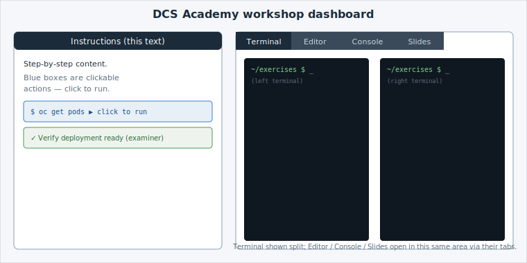

# DCS Academy — Your Lab Environment

First time in a DCS Academy lab? This page explains everything you see on screen, so
you can focus on learning rather than figuring out the tools. Each lab runs entirely in
your browser — nothing to install.

> This guide is published to the internal DCS documentation portal; the workshops link
> to it from their overview page. Screenshots marked _(screenshot)_ are placeholders to
> be captured from a live session — the diagram below shows the overall layout.

## The overall layout

The screen is split in two:

- **Left — Instructions.** The step-by-step lab content (like the page you started from).
  You scroll through it and click the highlighted actions.
- **Right — Work area.** A set of tabs — **Terminal**, **Editor**, **Console**,
  **Slides** — where the actual work happens. Only one tab is visible at a time; click a
  tab header to switch. Which tabs appear depends on the lab.

## Clickable actions (you rarely type)

The labs are *guided*: instead of typing commands, you click the highlighted boxes in the
instructions and they run for you. There are three kinds you'll meet most:

- **Run a command** — a dark/blue box showing a shell command. Clicking it types and runs
  the command in the terminal for you. _(screenshot: a `terminal:execute` action)_
- **Edit a file** — clicking opens a file in the editor and makes the change (highlight,
  insert, replace). You don't hand-edit. _(screenshot: an editor action)_
- **Verify (examiner)** — a green "check" box that runs a test to confirm the previous
  step actually worked (pod running, service reachable) before you move on.
  _(screenshot: an examiner check passing)_

If a box doesn't seem to do anything, make sure the relevant tab (usually Terminal) is
visible, and click again.

## The tabs

### Terminal

A shell connected to your DCS session. It starts in the `~/exercises` directory where the
lab's files live. Many labs use a **split terminal** (two side-by-side) — for example one
to `watch` something while the other makes a change. Commands are run with the OpenShift
CLI, `oc`. You can type here too, but the guided actions do the typing for you.
_(screenshot: split terminal)_

### Editor

A full VS Code editor opened on `~/exercises`, for viewing and editing the lab's files.
Editor clickable actions open the right file and make edits automatically — you can watch
the change happen. _(screenshot: editor with a file open)_

### Console

The web console for the cluster — a visual view of what you deploy (Deployments, Pods,
Services). Labs sometimes send you here to *see* a resource you just created from the
terminal. _(screenshot: console showing a deployment)_

### Slides

Where a lab includes presentation slides (concept explanations, diagrams) alongside the
hands-on steps. Not every lab has slides. _(screenshot: slides tab)_

## Tips

- **Follow the order.** Steps build on each other; a verify (examiner) check gates
  progress on purpose.
- **Watch which tab is visible.** Running a command switches you to the Terminal; if a
  step told you to look at the Console or a web app, switch back to that tab afterwards.
- **Take your time.** Sessions have a generous time limit; read the *why*, not just the
  *what*.
- **Something stuck?** Re-read the last expected output, check the Terminal tab is
  visible, and re-run the action. Diagnose/challenge steps include hints.

## More

- Educates platform docs (the technology behind these labs): https://docs.educates.dev/
- DCS platform documentation: _(internal DCS docs portal home)_
