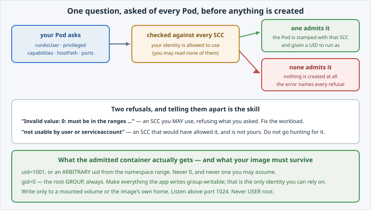

Three of the four rejected lines came from the same control, so it is worth meeting properly:
the [**Security Context Constraint**](https://docs.openshift.com/container-platform/latest/authentication/managing-security-context-constraints.html).

An SCC is an **admission** policy that answers one question about every Pod: *is this workload
allowed to ask for what it is asking for?*

Open the slide for this page (📊 **Slides** tab):

```dashboard:reload-dashboard
name: Slides
url: :///slides/#/scc
```



## Ask for root, and read the refusal

The fastest way to understand an SCC is to be refused by one:

```terminal:execute
command: |-
  cat <<'YAML' | oc apply -f - 2>&1 | tail -4 || true
  apiVersion: v1
  kind: Pod
  metadata:
    name: rootme
  spec:
    containers:
    - name: c
      image: ${DCS_REGISTRY}/samples/hello-dcs:1.0
      securityContext:
        runAsUser: 0
  YAML
```

```examiner:execute-test
name: verify-root-rejected
title: Verify the platform refused to create a root container
timeout: 30
retries: .INF
delay: 3
```

The message is long on purpose. It lists **every** SCC on the cluster and why each one said no:

```
unable to validate against any security context constraint:
  provider restricted-v2: .containers[0].runAsUser: Invalid value: 0:
      must be in the ranges: [1002100000, 1002109999]
  provider "anyuid": Forbidden: not usable by user or serviceaccount
  provider "privileged": Forbidden: not usable by user or serviceaccount
```

Two different refusals are mixed in there, and telling them apart is the skill:

- **"Invalid value"** — an SCC you *may* use, refusing what you asked for. Fix the workload.
- **"not usable by user or serviceaccount"** — an SCC that would have allowed it, which you may
  not use. Do not go looking for that permission; it is not coming.

Nothing was created. Like the namespace policies in a later lab, an SCC decides at
**admission**, so there is no half-started Pod to debug.

## Which constraints may you use?

You cannot read the SCCs themselves — they are cluster-scoped, and platform-owned:

```terminal:execute
command: oc get scc 2>&1 | tail -2 || true
```

But you can ask whether you may **use** a particular one, which is the question that matters:

```terminal:execute
command: |-
  for s in restricted-v2 anyuid privileged; do
    printf '%-14s %s\n' "$s" "$(oc auth can-i use scc/$s 2>/dev/null | tail -1)"
  done
```

```examiner:execute-test
name: verify-scc-boundary
title: Verify you may use the restricted SCC and not the permissive ones
timeout: 30
retries: .INF
delay: 3
```

`restricted-v2` **yes**; `anyuid` and `privileged` **no**. That is the whole tenant story: you
get the constraint everyone gets, and the escape hatches belong to the platform.

## What your running container actually got

```terminal:execute
command: oc exec deploy/hello-dcs -- id
```

```examiner:execute-test
name: verify-runtime-identity
title: Verify the container runs as a non-root user in the root group
timeout: 30
retries: .INF
delay: 3
```

Two things in that output decide whether an image works here at all:

- **`uid=1001`** — not 0. On  the platform may also assign an
  **arbitrary** UID from the namespace's range instead of the image's own, and your process
  must not care which one it gets.
- **`gid=0(root)`** — the **root group**, always. This is the one people miss: an OpenShift
  container runs as an unpredictable user but a predictable *group*.

## What that means for images you build

Four rules, and they follow directly from the two lines above:

1. **Never `USER root`.** Declare a non-root user, and do not assume it is the one you get.
2. **Make files group-writable** (`chgrp 0` + `chmod g=u`) for anything the app writes.
   Group 0 is the only identity you can rely on.
3. **Write only where you own** — a mounted volume, or the image's own home. `/data` at the
   root of the filesystem will be root-owned and unwritable.
4. **Do not bind ports below 1024.** That needs a capability you will not be granted; listen
   on 8080 and let a Service map it.


**💡 Tip:** an image built to these rules runs unchanged on a laptop, on plain Kubernetes and
here. An image that assumes root runs in exactly one of those places.


## Clean up

```terminal:execute
command: oc delete pod rootme --ignore-not-found
```

Nothing to delete, in fact — the Pod was never created. Running it anyway is a fair habit:
after a refusal, check rather than assume.
