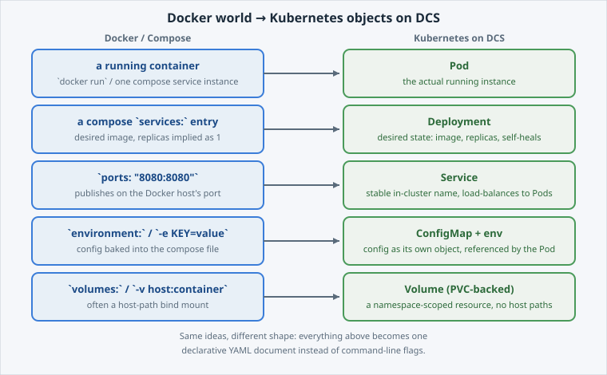
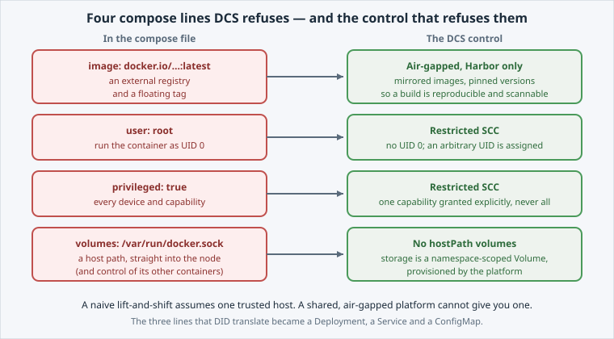

<!-- Edit this file: one slide per line of three dashes. Give a slide a deep-link id with an id-comment on its own line. Markdown: headings, - lists, **bold**, `code`, fenced code, , [text](url). -->

<!-- id: intro -->
# From Docker to Kubernetes

The on-ramp to the Build & Run track. You migrate a real `docker-compose.yml` onto DCS, object by object, and then meet the lines the platform refuses.

**In this lab:** the mapping · container to Deployment · ports to Service · environment to ConfigMap · what does not translate.

Digital Container Service · DCS Academy

---

<!-- id: mental-model -->
## The mental model

Nothing about Docker is wasted here. The objects do the same jobs under different names — what really changes is *how you describe them*.

- **Imperative** — `docker run` tells the daemon what to do, once.
- **Declarative** — a Deployment states the end state, and the platform keeps reconciling to it.
- That is why a dead Pod comes back with nobody running a command.
- Four compose concepts, four Kubernetes objects.



---

<!-- id: deployment -->
## Container to Deployment

A compose service becomes a **Deployment**: the desired number of Pods, the image to run, and the labels that tie them together.

On DCS the image always comes from the platform's own registry — never `docker.io`.

```
envsubst < deployment.yaml | oc apply -f -
oc get deployment,pods -l app=hello-dcs
```

- `envsubst` fills in `${DCS_REGISTRY}` before `oc` ever sees the manifest.
- Expect `READY 1/1` on the Deployment and `Running` on the Pod.
- **House rule:** any manifest with a `${VAR}` goes through `envsubst`.

---

<!-- id: service -->
## Ports to Service

`ports: "8080:8080"` binds a port on the Docker **host**. A cluster has no such host, so the app gets a stable address of its own instead.

A **Service** load-balances to whichever Pods match its **selector**, and its name outlives them.

```
oc apply -f service.yaml
curl -s -o /dev/null -w 'HTTP %{http_code}\n' \
  "http://hello-dcs.$(oc project -q).svc:8080"
```

- An **endpoint** is a Pod IP the Service currently sends traffic to.
- `HTTP 200` from `hello-dcs.<namespace>.svc` — in-cluster only, nothing exposed outside yet.

---

<!-- id: configmap -->
## Env to ConfigMap

A compose `environment:` block welds config into the file. A **ConfigMap** lifts it out into its own object that any workload in the namespace can reference.

```
oc apply -f configmap.yaml
oc set env deploy/hello-dcs --from=configmap/hello-dcs-config
```

- Referencing the ConfigMap changes the Pod template, so the Deployment **rolls out** a new Pod.
- A ConfigMap on its own changes nothing until a workload references it.
- Editing it later does **not** restart anything by itself.

---

<!-- id: rejected -->
## What does not translate

Four compose lines never became a manifest, because DCS refuses them. This is the half of the migration that changes how you build.

- `image: docker.io/...:latest` — air-gapped platform, Harbor only, and no floating tags.
- `user: root` — the restricted SCC forbids UID 0 and assigns an arbitrary UID.
- `privileged: true` — one capability granted explicitly, never a blanket escape hatch.
- `volumes: /var/run/docker.sock` — no host paths; storage is a namespace-scoped Volume.



---

<!-- id: next -->
## What's next

You migrated an image somebody else built. Three compose lines became a Deployment, a Service and a ConfigMap; four lines met a platform control.

**Next lab — Build Your Image on DCS:** point a **BuildConfig** at a git repository, let the platform build *your* code into an image, and push it to the registry. No Docker daemon anywhere.

Digital Container Service · DCS Academy
