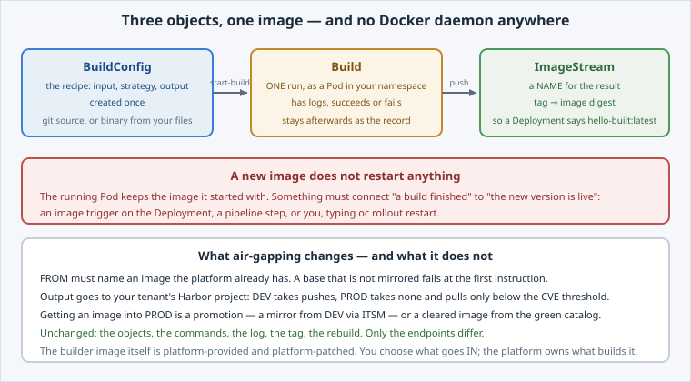

<!-- Edit this file: one slide per line of three dashes. Give a slide a deep-link id with an id-comment on its own line. Markdown: headings, - lists, **bold**, `code`, fenced code, , [text](url). -->

<!-- id: intro -->
# Build Your Image on DCS

Every lab so far ran an image somebody else built. This one builds yours — with no Docker daemon anywhere.

**In this lab:** the three objects · build from your files · deploy what you built · rebuild · what changes on DCS.

Digital Container Service · DCS Academy

---

<!-- id: objects -->
## Three objects, one image

Keep them straight and every later error message reads clearly.

- **BuildConfig** — the recipe: input, strategy, output. Created once.
- **Build** — one run of it, as a Pod, with logs and a status. Kept as the record.
- **ImageStream** — a name for the result: tag → digest, so a Deployment references a name.
- **Strategies:** Docker (you bring a Containerfile) or Source/S2I (you bring code only).
- **Input:** git — on DCS, your tenant's in-cluster GitLab — or binary, handed over at start.



---

<!-- id: build -->
## Build it

```
oc new-build --binary --strategy=docker --name=hello-built
oc start-build hello-built --from-dir=. --follow
oc get builds
```

- One command creates **both** the BuildConfig and its ImageStream.
- The log shows three phases worth recognising: **uploading**, **STEP n/n**, **pushing**.
- `FROM` pulls from the platform's registry — on an air-gapped cluster nothing else is reachable.
- A build is a Pod: it queues, it costs budget, and the first one is slow.

---

<!-- id: deploy -->
## Deploy what you built

Reference the **ImageStream tag**, not a registry URL with a digest you would have to keep updating.

```
oc get imagestream hello-built
envsubst < deployment.yaml | oc apply -f -
oc exec deploy/hello-built -- printenv GREETING
```

- The tag resolves to an image **digest** — the digest is the identity, the tag is a label that moves.
- `GREETING` came from the **image**, not from `oc set env`.
- Configuration is attached at deploy time; what is in the image is decided at build time.

---

<!-- id: rebuild -->
## Change it, build it again

```
sed -i 's/Built on DCS, by me/Rebuilt, and it shows/' Containerfile
oc start-build hello-built --from-dir=. --follow
oc exec deploy/hello-built -- printenv GREETING   # still the OLD value
oc rollout restart deploy/hello-built
```

- Faster the second time: unchanged layers are reused.
- **A new image restarts nothing.** The Pod keeps what it started with.
- **Build triggers** start a build on a push; **image triggers** roll out when a tag moves.
- Automatic promotion is exactly as safe as your build — which is why PROD takes no pushes.

---

<!-- id: on-dcs -->
## What changes on DCS

Three differences, all of them consequences of air-gapping.

- **Base images** come from Harbor. A base that is not mirrored does not build.
- **Output** goes to your tenant's project: DEV takes pushes, PROD takes none.
- **Into PROD** by promotion — a mirror from DEV via ITSM — or from the **green catalog**.
- **The builder** is platform-provided and platform-patched.
- **Unchanged:** every object and command you just used. Only the endpoints differ.

---

<!-- id: next -->
## What's next

You can turn files into a running image without privileged tooling, and you know what makes a new one appear.

**Next lab — Harbor: Projects, Push & Scan:** the registry stops being a URL. Catalogs, the project your namespace gets, what a scan reports, and the gate that decides what PROD will run.

Digital Container Service · DCS Academy
