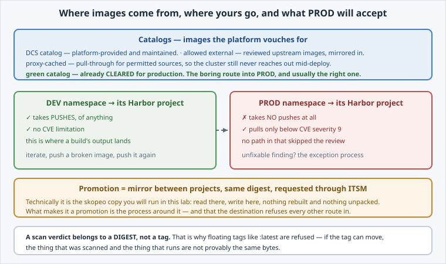

<!-- Edit this file: one slide per line of three dashes. Give a slide a deep-link id with an id-comment on its own line. Markdown: headings, - lists, **bold**, `code`, fenced code, , [text](url). -->

<!-- id: intro -->
# Harbor: Projects, Push & Scan

The registry is not a string in your manifest. It is where the platform decides what may run.

**In this lab:** catalogs and projects · inspect without pulling · copy between registries · read a scan · how an image reaches PROD.

Digital Container Service · DCS Academy

---

<!-- id: rules -->
## Catalogs, projects, and the asymmetry

Three ideas, and the third explains most of the surprises.

- **Catalogs** — DCS, allowed-external, proxy-cached, and the **green catalog** of cleared images.
- **Projects** — a tenant may get one, scoped **per namespace** today (per-tenant is the direction).
- **DEV takes pushes**, of anything, with no CVE limitation.
- **PROD takes none**, and pulls only **below CVE severity 9**.
- Unfixable finding in something you need? That is the **security exception** process.



---

<!-- id: inspect -->
## Look without pulling

`skopeo` asks the registry directly — no daemon, nothing downloaded.

```
skopeo inspect docker://$DCS_REGISTRY/samples/hello-dcs:1.0
skopeo inspect --config docker://$DCS_REGISTRY/samples/hello-dcs:1.0
```

- **Digest** — the real identity. Content-addressed: same digest, same bytes.
- **RepoTags** — tags move; digests do not.
- **Layers** — shared base, shared layers, faster rebuilds.
- **--config** — `User`, `Env`, `Cmd`. Check `User` before you meet the restricted SCC.

---

<!-- id: copy -->
## Copy it somewhere else

One command moves an image between registries. This is the operation behind every mirror, import and promotion.

```
skopeo copy --dest-tls-verify=false \
  --dest-creds "$(oc whoami):$(oc whoami -t)" \
  docker://$DCS_REGISTRY/samples/hello-dcs:1.0 \
  docker://image-registry.openshift-image-registry.svc:5000/$SESSION_NAMESPACE/mirrored:1.0
```

- Read there, write here. Layer digests preserved; nothing rebuilt, nothing unpacked.
- Credentials: your token here — a Harbor **robot account** on DCS, scoped to one project.
- A promotion is this, plus a process, plus a destination that refuses every other route.

---

<!-- id: scan -->
## Read a scan

The verdict is four numbers in `summary.severityCount`; the decision is in the detail.

```
jq '{artifact, summary}' scan-report-flagged.json
jq -r '.vulnerabilities[] | select(.severity=="Critical")
       | "\(.id) \(.package) \(.installedVersion) → \(.FixedVersion // "no fix")"' \
  scan-report-flagged.json
```

- Critical is 9.0+, so a flagged image is refused by PROD and lives happily in DEV.
- **`fixable`** is the number to read first: most findings are a newer base away.
- No fix available → remove it, replace it, or take the exception route.
- The verdict attaches to a **digest** — re-pushing a tag does not inherit it.

---

<!-- id: promotion -->
## Getting into PROD

Exactly two routes, and naming both is the point.

- **The green catalog** — already cleared. Boring, and usually right. A cleared base also helps your own builds pass.
- **Promotion** — a mirror from DEV, requested through **ITSM**, with the digest preserved and the gate enforced.
- **Robot accounts** for automation: scoped to one project, revocable, and they outlive you.
- "No pushes" is a stronger guarantee than "pushes that are checked" — there is no accidental path in.

---

<!-- id: next -->
## What's next

You can follow one artefact end to end: built on the cluster, pushed to DEV, scanned, promoted or replaced, and finally deployed into a PROD namespace that enforces its own policies.

The rest of **Build & Run** is about the workload it becomes — sizing, scaling, exposing, state, and surviving the platform's maintenance.

Digital Container Service · DCS Academy
