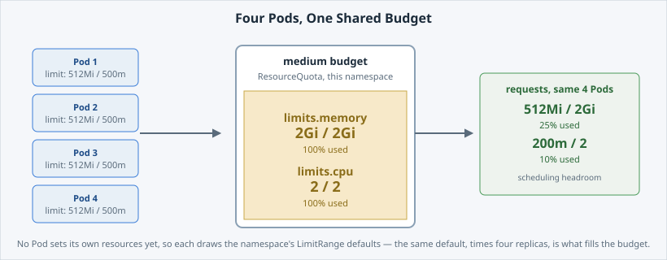

Scaling a [**Deployment**](https://kubernetes.io/docs/concepts/workloads/controllers/deployment/)
means asking  to keep several identical copies running instead of
one.

"Several" is not free. Every copy draws on the same **namespace budget**, and that budget is
finite.

Open the slide for this page (📊 **Slides** tab):

```dashboard:reload-dashboard
name: Slides
url: :///slides/#/budget
```

## Deploy the starting point

`deployment-base.yaml` is `hello-dcs` as it usually arrives: **one replica**, no probes, and
**no `resources` block** at all.

```editor:open-file
file: ~/exercises/deployment-base.yaml
```

Apply it, together with a Service so later pages have an endpoint list to watch.
`envsubst` fills in `${DCS_REGISTRY}` before `oc` sees the manifest:

```terminal:execute
command: envsubst < deployment-base.yaml | oc apply -f - && oc apply -f service.yaml && oc rollout status deploy/hello-dcs --timeout=120s
```

```examiner:execute-test
name: verify-app-deployed
title: Verify hello-dcs is running with one replica and a Service
timeout: 15
retries: .INF
delay: 2
```


**📌 The colours on that button.** A check is **amber** while it waits or runs, **green**
when the state it describes is true, **red** when it is not.


## Scale it up

`--replicas` sets the desired copy count the Deployment must maintain:

```terminal:execute
command: oc scale deploy/hello-dcs --replicas=4
```

```examiner:execute-test
name: verify-scaled
title: Verify hello-dcs is scaled to 4 ready replicas
args:
- "4"
timeout: 20
retries: .INF
delay: 2
```

Look at what you now have:

```terminal:execute
command: oc get deployment,pods -l app=hello-dcs
```

Four Pods, `4/4` READY.  created three more copies from the same
template, each scheduled and health-tracked on its own.

## What that costs

None of these Pods states its own resource needs, so each one takes your namespace's
[**LimitRange**](https://kubernetes.io/docs/concepts/policy/limit-range/) defaults for a
`medium` budget:

- a **request** of 128Mi memory / 50m CPU — what the Pod is guaranteed, and what the
  scheduler counts;
- a **limit** of 512Mi memory / 500m CPU — the ceiling it may not cross.

Four Pods at that default limit is **exactly** the whole `medium` budget:



Read your namespace's [**ResourceQuota**](/concepts/quotas)
to see it for real:

```terminal:execute
command: oc describe quota
```

```examiner:execute-test
name: verify-quota-present
title: Verify a ResourceQuota is present in your namespace
timeout: 10
retries: 3
delay: 2
```

The table shows **Used** against **Hard** per resource. Two things to notice:

- **`limits.memory` and `limits.cpu`** now read Used = Hard. The limit side is fully spent.
- **`requests.memory` and `requests.cpu`** are nowhere near full, because the default
  *request* is much smaller than the default *limit*.

Nothing is broken — Used equals Hard, not more. But there is now **zero headroom on
limits**. The next page asks for more than that, on purpose.
