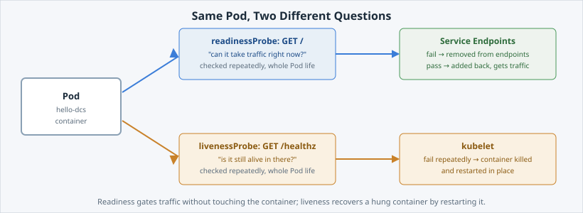

<!-- Edit this file: one slide per line of three dashes. Give a slide a deep-link id with an id-comment on its own line. Markdown: headings, - lists, **bold**, `code`, fenced code, , [text](url). -->

<!-- id: intro -->
# Health & Resources

One replica, no probes, no resource numbers is a demo. This lab turns it into something the platform can keep alive.

**In this lab:** scale and read the budget · hit the quota on purpose · right-size requests and limits · readiness vs liveness · self-healing.

Digital Container Service · DCS Academy

---

<!-- id: budget -->
## Scale, and what it costs

Scaling asks DCS to keep several identical copies running. Every copy draws on the same finite namespace budget.

A Pod that sets no `resources` of its own takes the namespace **LimitRange** defaults — and the default *limit* is much larger than the default *request*.

```
oc scale deploy/hello-dcs --replicas=4
oc describe quota
```

- **request** — what the Pod is guaranteed; the scheduler counts it.
- **limit** — the ceiling it may not cross.
- Four Pods at the default limit fill the `medium` budget **exactly**.


---

<!-- id: quota-reject -->
## Hitting the limit

With the limit side fully spent, a template asking for more per Pod cannot land. The quota refuses the Pod at **admission** — before a node is picked, before an image is pulled.

```
envsubst < deployment-oversized.yaml | oc apply -f -
oc get events --sort-by=.lastTimestamp
```

- Nothing crashes: the new Pods are never created.
- The `FailedCreate` event names what was **requested**, what is **used**, and the **limited** ceiling.
- Read it left to right and the arithmetic is obvious.
- The fix is not a bigger namespace. It is a better-sized Pod.

---

<!-- id: right-size -->
## Right-sizing

State what the app actually needs, instead of taking the defaults or guessing high.

```
envsubst < deployment-probes.yaml | oc apply -f -
oc describe quota
```

- `requests: 50m / 64Mi` · `limits: 100m / 128Mi` for this small app.
- Applying a known-good manifest **over** a stuck rollout is the declarative recovery move.
- Same four replicas, about a quarter of the budget, real headroom left.
- Memory over its limit is **OOMKilled**; CPU over its limit is **throttled**.

---

<!-- id: probes -->
## Readiness and liveness

Two different questions the platform keeps asking a Pod, with two different consequences.

- **Readiness** — can you take traffic? Fail and the Pod leaves the Service **endpoints**. The container is untouched.
- **Liveness** — are you alive in there? Fail repeatedly and the kubelet **restarts** the container.
- A **startup** probe holds liveness off while a slow app boots.
- Break readiness and one replica is quarantined; the others serve on.



---

<!-- id: self-healing -->
## Self-healing

Delete a Pod by hand — no rollout, no manifest — and the count comes back on its own.

```
oc get pods -l app=hello-dcs -o name | head -n 1
oc delete pod/<that-one>
```

- The deleted Pod never returns; a **new** one is created from the same template.
- The **ReplicaSet** compares actual against `spec.replicas` and closes the gap.
- Change the *desired* state and it rolls out; change the *actual* state and it rolls forward.
- Same mechanism recovers a node failure, an eviction or a crash.

---

<!-- id: next -->
## What's next

Your app now fits its budget and proves its own health — the two things that let the platform keep it alive without you.

**Next lab — Autoscaling:** let a **HorizontalPodAutoscaler** move the replica count as load changes, and see why it cannot work at all without the `requests` you set here.

Digital Container Service · DCS Academy
