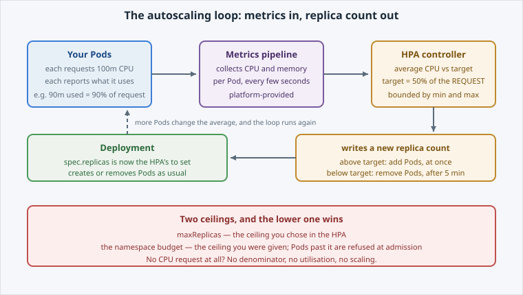

<!-- Edit this file: one slide per line of three dashes. Give a slide a deep-link id with an id-comment on its own line. Markdown: headings, - lists, **bold**, `code`, fenced code, , [text](url). -->

<!-- id: intro -->
# Autoscaling

Setting the replica count by hand only works while someone is watching. This lab hands that decision to a controller.

**In this lab:** how an HPA computes a replica count · create one · drive load and scale out · scale-in and the budget ceiling · where VPA fits.

Digital Container Service · DCS Academy

---

<!-- id: hpa-loop -->
## How an HPA works

A controller running a loop, not a rule that fires once: it reads per-Pod CPU, averages it, compares it with a target, and writes a new replica count.

The target is a percentage **of the Pod's CPU request** — which is why an app with no request can never autoscale on CPU.

- 100m requested, 50% target → **50m per Pod**.
- Average 90m across 4 Pods → 180% of target → scale out.
- It adds copies of the app. It does not make the app faster.



---

<!-- id: create -->
## Create the HPA

Three fields carry the whole behaviour: what it owns, the range it may move in, and what it watches.

```
oc apply -f hpa.yaml
oc get hpa hello-dcs
oc describe hpa hello-dcs
```

- `scaleTargetRef` — the Deployment this HPA owns.
- `minReplicas` / `maxReplicas` — 1 to 6 here.
- `metrics` — CPU at 50% average utilisation.
- TARGETS shows `<unknown>` until the first metrics land, then `3%/50%`.
- `oc autoscale deploy/hello-dcs --min=1 --max=6 --cpu-percent=50` creates the same object.

---

<!-- id: load -->
## Under load

No load tool needed: eight parallel request loops from the terminal will push a 100m request past a 50% target.

```
url="http://hello-dcs.$(oc project -q).svc:8080"
for i in $(seq 1 8); do
  ( while [ "$(date +%s)" -lt "$end" ]; do
      curl -s -o /dev/null "$url"
    done ) &
done; wait
```

- Resolve the URL **once**, outside the loop: an `oc` call per request loads your terminal, not the app.
- The HPA samples every ~15s and scales out at most once per interval.
- Expect the first extra Pod after roughly half a minute.
- Nobody runs `oc scale` — the HPA writes the count, the Deployment does the rest.
- Every decision is an **event** naming the metric that caused it.

---

<!-- id: scale-in -->
## Scale in, and ceilings

Scaling out is the easy half. What happens next is where the design lives.

- Scale-in waits out a **stabilisation window**, 5 minutes by default, using the highest recommendation in it.
- Quick to add, slow to remove — because removing a replica you immediately need again is thrashing.
- Tune with `behavior.scaleDown.stabilizationWindowSeconds`.
- `maxReplicas` is the ceiling you chose; the **namespace budget** is the ceiling you were given, and it wins.
- 6 x 200m = 1.2 CPU, inside a `medium` 2 CPU budget. At `maxReplicas: 20` the extra Pods are refused and the HPA reports `ScalingLimited`.

---

<!-- id: vpa -->
## The other autoscaler

HPA changes **how many** Pods. VPA changes **how big** each one asks to be.

- **HPA** — "one Pod is not enough for this load." More Pods.
- **VPA** — "this Pod asked for 500m and never used 40m." Smaller request.
- Wrong requests are the most common reason a namespace runs out of budget while idle.
- Start in **recommendation-only** mode: applying a new request **replaces** the Pod.
- Never point both at the same resource — they fight over the number utilisation is measured against.
- On DCS, VPA arrives as an operator: the platform owns the controller, you own the object.

---

<!-- id: next -->
## What's next

The replica count is no longer yours to babysit, and you know which ceiling stops it.

**Next lab — Services & Cluster Networking:** the Service types, cluster DNS, headless Services, and why DCS hands you a Route for anything that has to be reachable from outside.

Digital Container Service · DCS Academy
