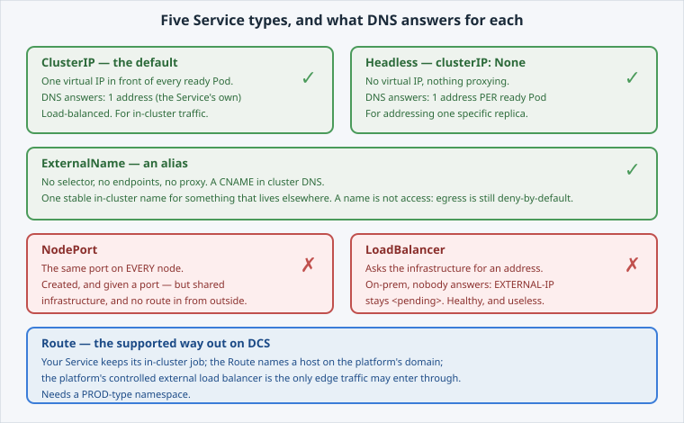

<!-- Edit this file: one slide per line of three dashes. Give a slide a deep-link id with an id-comment on its own line. Markdown: headings, - lists, **bold**, `code`, fenced code, , [text](url). -->

<!-- id: intro -->
# Services & Cluster Networking

"Just expose it" hides at least five different answers. This lab walks them, resolving each one through cluster DNS by hand.

**In this lab:** the types · ClusterIP and DNS · headless · ExternalName · the two that look right and are not.

Digital Container Service · DCS Academy

---

<!-- id: types -->
## The types, and which you get

Every Service has a selector and ports. The `type` decides what the platform builds around them — and what DNS answers.

- **ClusterIP** — one virtual IP, load-balanced. The default.
- **Headless** — `clusterIP: None`: one DNS record per ready Pod.
- **ExternalName** — a CNAME to something elsewhere.
- **NodePort** — a port on every node. Shared, and unreachable from outside here.
- **LoadBalancer** — needs a provider. On-prem, nobody answers.



---

<!-- id: clusterip -->
## ClusterIP and cluster DNS

One name, one virtual IP that never changes, and a list of endpoints behind it that changes constantly as Pods come and go.

```
oc apply -f service-clusterip.yaml
getent hosts hello-dcs.$(oc project -q).svc.cluster.local
```

- DNS answers with **exactly one** address: the Service's own.
- `oc get endpoints` shows the ready Pod IPs it forwards to.
- Endpoints follow **readiness** — an unready Pod is not in the list.
- `hello-dcs:8080` works as a short form inside the same namespace.

---

<!-- id: headless -->
## Headless

Sometimes one address is exactly wrong: a client that must reach **replica 2**, or peers that discover each other.

```
oc apply -f service-headless.yaml
getent hosts hello-dcs-peers.$(oc project -q).svc.cluster.local
```

- `clusterIP: None` — no virtual IP, nothing proxying.
- DNS answers **one record per ready Pod**; the client chooses.
- No load balancing and no failover: the client owns the retry.
- This is how a StatefulSet gives each replica a stable name.

---

<!-- id: externalname -->
## ExternalName

No selector, no endpoints, no proxy — an alias in cluster DNS, so your code keeps one name while the thing behind it moves.

```
oc apply -f service-externalname.yaml
getent hosts api-alias.$(oc project -q).svc.cluster.local
```

- The answer comes back as the **target's** address and name: the CNAME being followed.
- Same manifest, different target per environment.
- **A name is not access.** Egress is deny-by-default; the destination still has to be allowed through the managed egress proxy.

---

<!-- id: refused -->
## The two that look right

Both are created without complaint. Neither gets you what you came for.

```
oc get svc hello-dcs-nodeport   # 8080:30113/TCP
oc get svc hello-dcs-lb         # EXTERNAL-IP <pending>
```

- **NodePort** — a port on shared nodes, outside your tenant boundary, and no route in: the platform's monitored external load balancer is the only edge.
- **LoadBalancer** — a request to infrastructure that has no provider to fulfil it. Stays `<pending>` forever, reporting healthy.
- **Route** is the supported way out — and it needs a PROD-type namespace.

---

<!-- id: next -->
## What's next

You have a name per Pod that survives a restart, and you know which door the platform lets traffic in through.

**Next lab — Stateful Workloads:** a StatefulSet with its own headless Service, a PersistentVolumeClaim **per replica**, and an ordered rollout — for when replicas are not interchangeable.

Digital Container Service · DCS Academy
