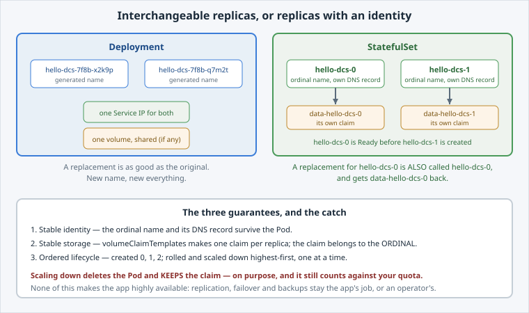

The difference is not "stateful apps need storage". A Deployment can mount a volume perfectly
well.

The difference is whether a replica **is somebody**.

Open the slide for this page (📊 **Slides** tab):

```dashboard:reload-dashboard
name: Slides
url: :///slides/#/identity
```



## What a Deployment gives you

- Pods with **generated** names — `hello-dcs-7f8b9c6d4-x2k9p`. A new Pod gets a new name.
- One volume, **shared** by every replica, if you mount one at all.
- Replacements created in **any order**, several at once.

That is exactly right for a stateless app, and exactly wrong for a replica that owns data.

## What a StatefulSet adds

Three guarantees, and each one is worth naming:

1. **Stable identity.** Pods are `hello-dcs-0`, `hello-dcs-1`, in order. A replacement for
   `hello-dcs-0` is *also* called `hello-dcs-0`, and gets the same DNS name back.
2. **Stable storage.** `volumeClaimTemplates` creates **one PersistentVolumeClaim per
   replica** — `data-hello-dcs-0`, `data-hello-dcs-1` — and re-attaches each claim to its own
   ordinal. Replica 1 never gets replica 0's disk.
3. **Ordered lifecycle.** `hello-dcs-0` is Ready before `hello-dcs-1` is created. A rollout
   replaces one Pod at a time, highest ordinal first. Scale-down removes the highest first.

## Why the order matters

For a database cluster, "start replica 0 first" is not pedantry — it is how the first member
can initialise before the others try to join it.

Ordering is the guarantee that lets an app assume *something* about its peers. A Deployment
makes no such promise.


**⚠️ Watch out:** a StatefulSet is not a database. It gives an app the identity and storage
guarantees a database needs — replication, failover and backups are still the app's problem,
or an **operator's**. That is the Operators track.


Next: build one.
