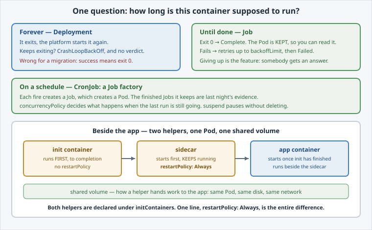

One question decides which object you need: **how long is this container supposed to run?**

Open the slide for this page (📊 **Slides** tab):

```dashboard:reload-dashboard
name: Slides
url: :///slides/#/shapes
```



## Forever: a Deployment

You know this one. The container exits, the platform starts it again — and if it keeps
exiting, you get `CrashLoopBackOff`.

For a migration script that is exactly wrong: a successful migration **exits 0**, and a
Deployment would helpfully run it again.

## Until it is done: a Job

A [**Job**](https://kubernetes.io/docs/concepts/workloads/controllers/job/) runs a Pod and
expects it to **end**. Exit 0 and the Job is `Complete`; fail and it retries up to
`backoffLimit`, then gives up and reports `Failed`.

Giving up is the feature. A migration that cannot work will not work on the fortieth attempt
either, and a Job that stops tells you so.

## Until it is done, again and again: a CronJob

A [**CronJob**](https://kubernetes.io/docs/concepts/workloads/controllers/cron-jobs/) is a
**Job factory** on a schedule. Every fire creates a new Job, which creates a Pod. The Jobs
it leaves behind are how you inspect what happened last night.

## Beside the app: helper containers in the same Pod

Both of these live in the **same Pod** as your app and share its network and volumes:

- an **init container** runs to completion **before** the app container starts — fetch
  config, prepare a volume, wait for a dependency;
- a **sidecar** starts before the app and **keeps running** next to it — a log shipper, a
  proxy, a metrics exporter.

Here is the part people find surprising: on current Kubernetes a **native sidecar is declared
as an init container**, with one extra line — `restartPolicy: Always`. That single field is
the whole difference between "finish first" and "run alongside".


**📌 Why declare a sidecar as an init container at all?** Because init containers have
guaranteed ordering. A sidecar declared this way is **started before** the app container and
**stopped after** it, which is what a log shipper or proxy actually needs — an ordinary
container in the `containers:` list gets neither guarantee.


Next: run one to completion.
