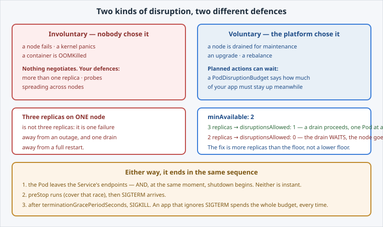

<!-- Edit this file: one slide per line of three dashes. Give a slide a deep-link id with an id-comment on its own line. Markdown: headings, - lists, **bold**, `code`, fenced code, , [text](url). -->

<!-- id: intro -->
# Resilience & Scheduling

The platform will move your Pods — drains, upgrades, rebalancing. None of it asks permission. This lab is how you state your terms.

**In this lab:** two kinds of disruption · a PodDisruptionBudget · timing a real shutdown · spreading replicas.

Digital Container Service · DCS Academy

---

<!-- id: disruption -->
## Two kinds of disruption

They need different answers, and only one of them can be negotiated with.

- **Involuntary** — a node fails, a container is OOMKilled. Defences: replicas, probes, spreading.
- **Voluntary** — a drain, an upgrade, a rebalance. Planned, so it can **wait**: that is what a PDB is for.
- On DCS you never run the drain. Your budget constrains the platform without you being in the room.
- Both paths end in the same shutdown sequence.



---

<!-- id: pdb -->
## A budget for maintenance

The useful part of a PDB is its **status** — and almost nobody looks at it.

```
oc apply -f pdb.yaml
oc get pdb hello-dcs -o custom-columns=\
MIN:.spec.minAvailable,ALLOWED:.status.disruptionsAllowed,\
HEALTHY:.status.currentHealthy,EXPECTED:.status.expectedPods
```

- **disruptionsAllowed** — how many Pods the platform may take **right now**.
- 3 replicas, floor of 2 → **1**: a drain proceeds one Pod at a time.
- Scale to 2 → **0**: the drain waits, and the node goes unpatched.
- A budget nobody can satisfy is not safety — it is the reason somebody overrides it.
- The fix is **more replicas than the floor**.

---

<!-- id: shutdown -->
## Shutting down well

Deletion is a sequence, not an event — and two of its steps race.

```
pod=$(oc get pods -l app=hello-dcs -o name | head -1)
start=$(date +%s); oc delete "$pod"; end=$(date +%s)
echo $(( end - start ))
```

- Endpoint removal and shutdown start **together**; neither is instant.
- `preStop` pauses before SIGTERM, covering that race.
- `terminationGracePeriodSeconds` is the total budget — preStop comes out of it.
- Ours takes the **full 30s**: hello-dcs ignores SIGTERM, so the kubelet SIGKILLs it.
- A well-behaved app exits early and nobody notices the maintenance. That is the image's job, not the manifest's.

---

<!-- id: spread -->
## Spreading replicas

Three replicas on one node is one node's failure away from an outage. The scheduler packs by default — it is optimising, not protecting you.

```
topologySpreadConstraints:
- maxSkew: 1
  topologyKey: kubernetes.io/hostname
  whenUnsatisfiable: ScheduleAnyway
```

- `ScheduleAnyway` — a **preference**: better placement when possible, never a stuck Pod.
- `DoNotSchedule` — a **requirement**: guaranteed spread, and Pending Pods when it cannot be met.
- On a single-node cluster everything lands together, and ScheduleAnyway is why it still runs.
- Hard spreads interact with quota and free capacity: read `oc describe pod` before blaming the platform.

---

<!-- id: next -->
## What's next

That is the Build & Run track: built, configured, sized, autoscaled, reachable, stateful where it must be — and now survivable.

**Operate & Observe** takes it from here: metrics and logs for the app you just made resilient, the tenancy and RBAC model underneath it, and the DEV to PROD promotion path.

Digital Container Service · DCS Academy
