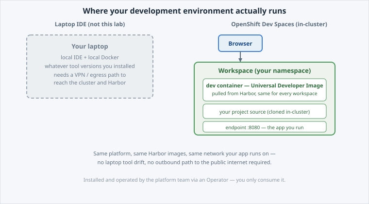
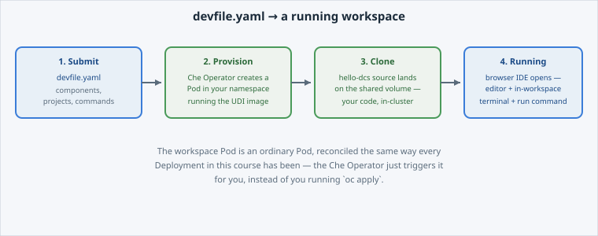
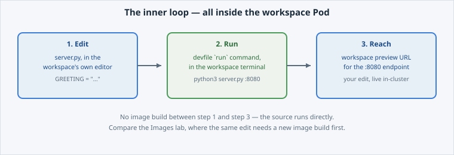
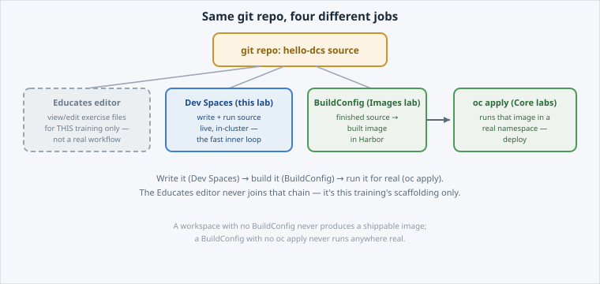

<!-- Edit this file: one slide per line of three dashes. Give a slide a deep-link id with an id-comment on its own line. Markdown: headings, - lists, **bold**, `code`, fenced code, , [text](url). -->

<!-- id: intro -->
# Dev Spaces

*Optional.* The track used git as a build source. Dev Spaces uses it as an **in-cluster IDE** — a workspace on the cluster, defined by a file in your repo.

**In this lab:** what Dev Spaces is · the devfile · launching a workspace · working inside one · where it fits.

Digital Container Service · DCS Academy

---

<!-- id: what -->
## What it is

A browser IDE running **on the cluster**, in your namespace, under the same rules as anything else you deploy.

- The workspace is a **Pod**: same registry, same SCC, same quota.
- Its definition lives **in the repository**, so every developer gets the same environment.
- Nothing is installed on your laptop, and nothing depends on what your laptop has.
- Operator-provided: the platform owns it, you own your workspace.



---

<!-- id: devfile -->
## The devfile

The environment as code, next to the code it builds.

```
schemaVersion: 2.2.0
components:
  - name: dev
    container:
      image: ${DCS_REGISTRY}/devspaces/udi:latest
      endpoints: [{name: hello-dcs, targetPort: 8080}]
commands:
  - id: run
```

- **components** — what you develop *in*. On DCS, an image from the platform registry.
- **endpoints** — how you reach the app you are running, from the browser.
- **commands** — build, run, test, as named actions rather than tribal knowledge.
- Air-gapped applies here too: no public registry, no public git host.

---

<!-- id: launch -->
## Launching a workspace

A URL, a repository, and the devfile decides the rest.

- The workspace starts as Pods in **your** namespace and counts against **your** quota.
- Source is cloned in; endpoints become routes you can open.
- Idle workspaces are stopped — they are compute, not a desk you keep.



---

<!-- id: inside -->
## Working inside one

Edit, run, reach — without leaving the cluster.

- The app runs **next to** the IDE, in the same workspace, so "works on my machine" stops being a category.
- Its endpoint is reachable in the browser while you work.
- What you push is what the BuildConfig will build: same source, same base image.



---

<!-- id: compare -->
## Four jobs, one repository

The track has now used a git repository four different ways. Knowing which one you need is the point.

- **The Educates editor** — this session's files. A teaching tool, gone when the session ends.
- **Your laptop** — full control, and entirely your problem to keep consistent.
- **A BuildConfig** — git as a **build source**: code in, image out.
- **Dev Spaces** — git as a **development environment**: same rules as production, nothing local.



---

<!-- id: next -->
## What's next

That is **Build & Run** complete: from a Docker mental model to an image you built, a registry that governs it, and a workload that is sized, scaled, reachable, stateful and survivable.

**Operate & Observe** is the other half: metrics, logs, the RBAC and tenancy model underneath, DEV to PROD promotion, and the operators behind the platform's services.

Digital Container Service · DCS Academy
