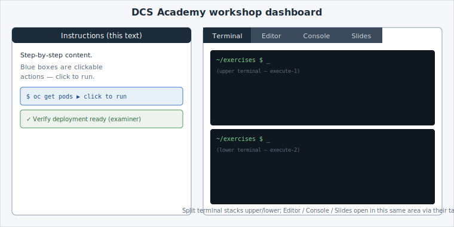

Take a look at your screen. It's split into two halves, and every lab in the academy uses
the same layout — so once you know it, you know them all.

## Two halves

- **Left — Instructions.** The step-by-step lab content — the page you're reading right
  now. You scroll through it and click the highlighted actions.
- **Right — Work area.** A set of **tabs** — Terminal, Editor, Console — where the actual
  work happens. Only one tab is visible at a time; click a tab header to switch. Which
  tabs appear depends on the lab.

## You click — you rarely type

The labs are **guided**: instead of typing commands, you click the highlighted boxes in
the instructions and they run for you. There are three kinds you'll meet most:

- **Run a command** — a box showing a shell command. Clicking it types and runs the
  command in the terminal for you.
- **Edit a file** — clicking opens a file in the editor and makes the change. You don't
  hand-edit.
- **Verify** — a green "check" box (an [examiner](https://docs.educates.dev/) test) that
  confirms the previous step actually worked before you move on.

You'll try all three over the next few pages.

## The evaluator (Verify checks)

Those green **Verify** boxes are the lab's *evaluator*. Each one runs a small script that
inspects the cluster — is the pod actually running? did the Service answer? — and turns
green only when the previous step truly succeeded. They exist for two reasons:

- **You get instant, honest feedback** that a step worked, instead of guessing.
- **They gate progress on purpose** — if a check is red, something's off; fix it before
  moving on rather than piling the next step on a broken one.

If a check is red, re-read the expected output of the step above, make sure the right tab
is visible, and click the step (then the check) again — they're safe to re-run.


**Two habits worth forming now:**
- **Watch which tab is visible.** Running a command switches you to the Terminal tab; if a
  step sent you to the Console or Editor, switch back afterwards.
- **If a box seems to do nothing,** make sure the right tab (usually Terminal) is visible,
  then click it again.

