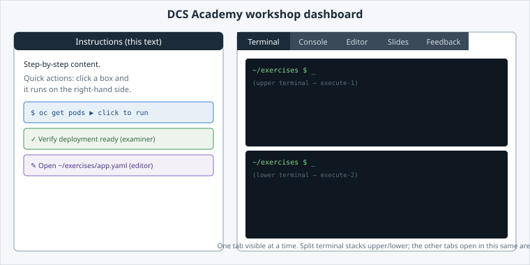

Look at your screen. It is split into two halves, and every lab in the academy uses the
same layout — learn it once and every other lab works the same way.

Open the slide for this page (📊 **Slides** tab):

```dashboard:reload-dashboard
name: Slides
url: :///slides/#/dashboard-layout
```



## Two halves

- **Left — Instructions.** The step-by-step lab content — the page you're reading right
  now. You scroll through it and click the boxes you met on the previous page.
- **Right — Work area.** A set of **tabs** — Terminal, Console, Editor, Slides, Feedback —
  where the work happens. Only one tab is visible at a time; click a tab header to switch.
  Which tabs appear depends on the lab.

## The tabs

| Tab | What it is |
|---|---|
| **Terminal** | A shell in your session, split into an upper and a lower pane. |
| **Console** | A visual view of your namespace (the Kubernetes Dashboard). |
| **Editor** | VS Code, opened on your `~/exercises` folder. |
| **Slides** | The slide deck for the lab, one slide per page. |
| **Feedback** | The short end-of-lab form. Submitting it also records the lab as done. |

The rest of this lab is one page per tab.


**⚠️ Watch which tab is visible.** Running a command switches you to the Terminal tab; if a
step sent you to the Console, the Editor or the Slides, switch back afterwards.

