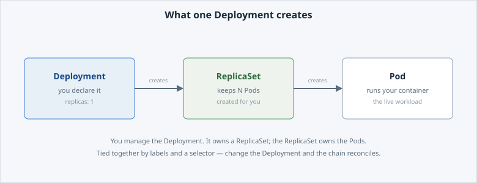

<!-- Edit this file: one slide per line of three dashes. Give a slide a deep-link id with an id-comment on its own line. Markdown: headings, - lists, **bold**, `code`, fenced code, , [text](url). -->

<!-- id: intro -->
# Deploy Your First App

The hands-on entry point to the course. You get an app running on DCS in minutes, then look at how it works underneath.

**In this lab:** deploy an image · customise it with config · reach it locally · watch a rollout · read the desired-state YAML behind it all.

Digital Container Service · DCS Academy

---

<!-- id: deploy -->
## Deploy it

A **Deployment** is how you tell DCS "keep one copy of this image running for me." It pulls the image from Harbor, starts a **Pod**, and keeps it alive.

```
oc create deployment hello-dcs \
  --image=${DCS_REGISTRY}/samples/hello-dcs:1.0
```

- Output: `deployment.apps/hello-dcs created`.
- The image pull can take a few seconds the first time.
- Check it is live — one Pod, `1/1` Ready:

```
oc get deployment,pods -l app=hello-dcs
```

---

<!-- id: customise -->
## Customise it

The sample app reads its greeting from an **environment variable**, `GREETING`. Setting an env var changes how the app behaves **without rebuilding the image** — same image, different configuration.

```
oc set env deploy/hello-dcs GREETING="Hello from the DCS Academy"
```

- `oc set env … --list` shows the app's env before and after.
- Changing the env var updates the Deployment's desired state, so DCS rolls out a new Pod with the new value.

---

<!-- id: reach -->
## Reach it

Nothing outside the cluster can reach the app yet. For a quick local test, `oc port-forward` opens a **tunnel** from your terminal straight to the Pod — no public address needed.

```
oc port-forward deploy/hello-dcs 8080:8080
curl -s localhost:8080
```

- The tunnel is local and lasts only while the command runs — it is not real exposure.
- A proper external address (a **Route**) is the subject of **A03**.

---

<!-- id: rollout -->
## Change it and watch the rollout

Change the desired state, and the platform reconciles to it: it rolls out a **new** Pod with the new config and retires the old one — no downtime, nothing to restart by hand.

```
oc set env deploy/hello-dcs GREETING="Updated without a rebuild"
curl -s localhost:8080
```

- The new Pod replaces the old one; the earlier tunnel (to the old Pod) closes, so you reopen it.
- The response now shows the new greeting — served by a brand-new Pod, same image, no rebuild.

---

<!-- id: behind -->
## What's behind it

You worked **imperatively** (`oc create`, `oc set env`). Underneath, DCS turned every command into one **declarative desired-state document** — the YAML you write yourself from A02 on.

- **Imperative** — step-by-step commands; each does one thing, once.
- **Declarative** — write down the desired end state; the platform keeps reality matching it.
- One Deployment owns a **ReplicaSet**, which owns the **Pods** — tied together by labels and a selector.



```
oc get all -l app=hello-dcs
```
