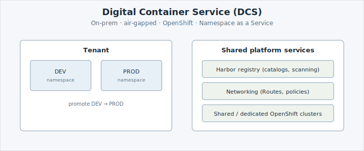

**** is Airbus Defence and Space's on-prem, multi-national
(European) container platform, built on Red Hat OpenShift. It gives teams a governed,
secure place to run containerised applications without managing the underlying
infrastructure — and because it runs on-premises and **air-gapped**, everything you
need (images, tools) is provided from within the platform.

## Why DCS?

Airbus Commercial adopted OpenShift to modernise how applications are built and run.
Airbus Defence and Space faces the same need at greater scale and under stricter
security and sovereignty requirements — which is what 
delivers: a **Namespace as a Service** platform where teams request namespaces and ship
applications, while the platform handles the clusters, security, and compliance.

The payoff for you as a tenant: it's **air-gapped and sovereign** (your workloads and
data stay inside the platform), it's **managed** (the platform team runs the clusters,
security, and compliance), and it's **self-service** (you request a namespace and ship,
without raising infrastructure tickets). Learn more in the
[ services overview](/services/overview).

## Next

Next, you'll see how  is delivered as more than one cluster.
