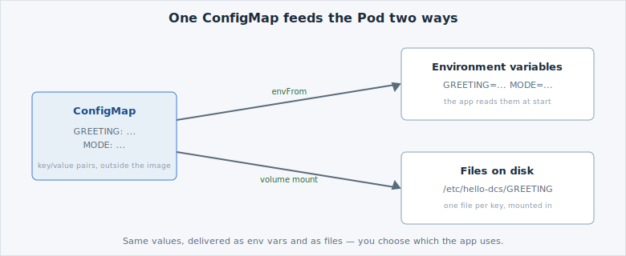

A [**ConfigMap**](https://kubernetes.io/docs/concepts/configuration/configmap/) holds
non-secret configuration as key/value pairs, *outside* your image. The same image can
then run in DEV, QA and PROD with different ConfigMaps — no rebuild to change a setting.
On an air-gapped platform that matters: promoting an app moves its **config**, not a new
image.

*[📊 See this on a slide](/slides/#/configmap) — opens the **Slides** tab on this topic.*


If you've run VMs: a ConfigMap is like the answer file or config drive you attach to one
golden template — same image, environment-specific settings supplied from outside.


A Pod can read a ConfigMap in two ways at once: every key becomes an **environment
variable**, and the same keys can also be **mounted as files**. You will use both below.



## Look at the ConfigMap

Open the ConfigMap file. It defines two keys the app reads — `GREETING` and `MODE`:

```editor:open-file
file: ~/exercises/configmap.yaml
```

Read the two values under `data:`. `GREETING` is the message the app prints; `MODE` is a
label it reports. Nothing here is secret — that is what makes a ConfigMap the right place
for it (secret values go in a Secret, on the next page).

## Apply the ConfigMap

Apply the file. This creates the ConfigMap object in your namespace:

```terminal:execute
command: oc apply -f configmap.yaml
```

```examiner:execute-test
name: verify-configmap
title: Verify the ConfigMap exists
timeout: 10
```

## Wire it into the app

Now open the Deployment. This is the declarative manifest behind the app you deployed in
A01, written out in full. It consumes the ConfigMap **both ways**: `envFrom` turns every
key into an environment variable, and a volume mounts the same keys as files under
`/etc/hello-dcs`.

```editor:open-file
file: ~/exercises/deployment-configured.yaml
```

Applying it takes two steps. Run them one after another and read what each does.

**Step 1 — fill in the registry, then apply.** The manifest names its image as
`${DCS_REGISTRY}/...` instead of a hard-coded registry, so the same file works on any DCS
environment. `envsubst` replaces `${DCS_REGISTRY}` with the real value from your
environment and prints the finished manifest; the `|` pipe hands that output straight to
`oc apply -f -` (the `-` means "read the manifest from the pipe, not a file"):

```terminal:execute
command: envsubst < deployment-configured.yaml | oc apply -f -
```

**Step 2 — wait for the rollout.** `oc rollout status` blocks until the new Pod is Ready,
so you know the change is live before moving on:

```terminal:execute
command: oc rollout status deploy/hello-dcs --timeout=90s
```

```examiner:execute-test
name: verify-configured
title: Verify the app runs and serves the configured greeting
timeout: 15
retries: .INF
delay: 2
```

The app now answers with **`Configured by a ConfigMap`**, and the same values are also
readable as files in `/etc/hello-dcs` — env and file, from one ConfigMap.
