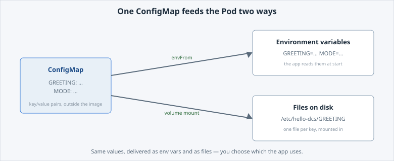

<!-- Edit this file: one slide per line of three dashes. Give a slide a deep-link id with an id-comment on its own line. Markdown: headings, - lists, **bold**, `code`, fenced code, , [text](url). -->

<!-- id: intro -->
# Configure & Troubleshoot Your App

Move configuration out of the command line and into dedicated objects — then break the app on purpose and learn to diagnose and fix it.

**In this lab:** ConfigMap · Secret · roll out a config change · break it · read the cluster's signals · recover.

Digital Container Service · DCS Academy

---

<!-- id: configmap -->
## Config in a ConfigMap

A **ConfigMap** holds non-secret configuration as key/value pairs, *outside* your image. The same image runs in DEV, QA and PROD with different ConfigMaps — no rebuild to change a setting.

- A Pod reads it **two ways at once**: `envFrom` turns keys into environment variables; a volume mounts the same keys as files.
- On an air-gapped platform this matters: promoting an app moves its **config**, not a new image.

```
oc apply -f configmap.yaml
```



---

<!-- id: secret -->
## A Secret

A **Secret** looks like a ConfigMap but is for sensitive values — tokens, passwords, keys.

- Values are **base64-encoded, not encrypted**. Safe because RBAC restricts access and values stay out of manifests and logs — *not* because of base64.
- **Never** print a Secret's value or bake it into an image.
- Prove a value is set by counting its characters, never showing it:

```
oc apply -f secret.yaml
oc set env deploy/hello-dcs --from=secret/hello-dcs-secret
oc exec deploy/hello-dcs -- printenv API_TOKEN | wc -c
```

Create the Secret **before** the workload that references it.

---

<!-- id: rollout -->
## Roll out a change

Editing a ConfigMap does **not** restart running Pods — a Pod reads its config only once, at start. The change is staged, but nothing serving it has picked it up.

- Trigger a rollout so new Pods start and read the new value.
- Same image, same template except the config it reads — the rollout makes the staged change live.

```
oc rollout restart deploy/hello-dcs
oc rollout status  deploy/hello-dcs --timeout=90s
oc exec deploy/hello-dcs -- printenv GREETING
```

---

<!-- id: breaks -->
## Then it breaks

A small mistake in a manifest can stop the app from starting. Here you apply a broken Deployment on purpose, so the next pages can teach diagnosis.

- The Pod is **not Ready** — a status like `CreateContainerConfigError`.
- Something the new manifest asked for cannot be satisfied.
- Don't guess — read what the cluster reports first.

```
oc get pods -l app=hello-dcs
```

---

<!-- id: diagnose -->
## Diagnose it

Three commands, in order — each narrows the problem. Read what the platform reports before changing anything.

- **Describe** the Pod — its status and an **Events** list (what was tried, what failed).
- **Events** for the namespace — the same story, most recent last.
- **Logs** — and *no* logs is itself a clue: the container never started, so the failure is config, not code.

```
oc describe pod -l app=hello-dcs | tail -n 30
oc get events --sort-by=.lastTimestamp | tail -n 15
oc logs -l app=hello-dcs --tail=20
```

Here the events name it: a ConfigMap the manifest references does not exist (`hello-dcs-conf` vs `hello-dcs-config`).

---

<!-- id: fix -->
## Fix it and verify

Recover by re-applying the **known-good desired state** — the declarative way to fix a workload, rather than hand-patching the running object.

```
envsubst < deployment-configured.yaml | oc apply -f -
oc rollout status deploy/hello-dcs --timeout=90s
```

- The Pod is Ready again and serving its configuration.
- The loop to remember: **observe → diagnose → fix → verify.**
