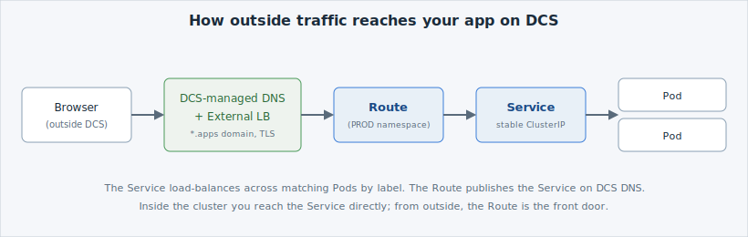

Your Service works — but only *inside* the cluster. A colleague on their laptop can't
reach `hello-dcs.<namespace>.svc`; that name only resolves in cluster DNS. To let traffic
in from outside,  uses a chain of pieces, each with one job.

## The chain, one link at a time

- **[Service](https://kubernetes.io/docs/concepts/services-networking/service/)** — a
  stable in-cluster address that load-balances across your Pods by label (you just created
  this).
- **[Route](https://docs.openshift.com/container-platform/latest/networking/routes/route-configuration.html)** —
  publishes a Service on a public hostname. A Route is OpenShift's take on the upstream
  Kubernetes [Ingress](https://kubernetes.io/docs/concepts/services-networking/ingress/);
  same idea, OpenShift-native.
- **External load balancer + DCS-managed DNS** —  runs the
  load balancer and owns the DNS. If your Route host stays inside the platform's
  **`*.apps`** domain, DCS handles the DNS record, the load balancer, and the TLS
  certificate for you — nothing to request.


The external load balancer is **not** a native Kubernetes object — you won't find it with
`oc get`.  puts it in front of the cluster as a **security
requirement**: all outside traffic terminates at a controlled, monitored edge and is
forwarded inward, so the cluster itself is never exposed directly to the network.



You *can* ask for a custom DNS record outside `*.apps`, but that's a manual ITSM request,
not automated — so it's not recommended for development, testing, or this lab. Stay on
`*.apps` and exposure is automatic.


Next: create the Route and reach your app from outside.
