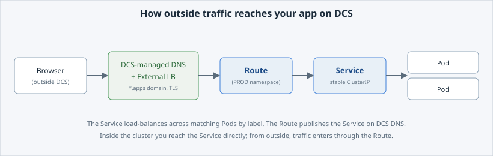

<!-- Edit this file: one slide per line of three dashes. Give a slide a deep-link id with an id-comment on its own line. Markdown: headings, - lists, **bold**, `code`, fenced code, , [text](url). -->

<!-- id: intro -->
# Expose Your App

Take the app from a private local tunnel to a real, external address on DCS — first a stable in-cluster name, then a public URL anyone can reach.

**In this lab:** a Service for a stable address · the Service → Route → load balancer chain · a real external Route · the app as an in-session tab · network policy and egress.

Digital Container Service · DCS Academy

---

<!-- id: service -->
## A Stable Address

Pods are replaced on every rollout and get a new IP each time, so you cannot use a Pod IP as a fixed address. A **Service** gives a stable name and IP that load-balances to whichever Pods match its selector.

- The Service `selector: app: hello-dcs` matches the labels the Deployment puts on its Pods.
- It is reachable inside the cluster at `hello-dcs.<namespace>.svc`.
- The address survives Pod restarts; the Pods behind it can come and go.

```
oc apply -f service.yaml
curl -s -o /dev/null -w 'HTTP %{http_code}\n' \
  "http://hello-dcs.$(oc project -q).svc:8080"
```

- Expected: `HTTP 200` — but only from inside the cluster.

---

<!-- id: traffic-chain -->
## The Traffic Chain

A Service is in-cluster only. To let outside traffic in, DCS uses a chain of parts, each with one job.

- **Service** — stable in-cluster address, load-balances across Pods by label.
- **Route** — publishes a Service on a public hostname (OpenShift's version of Ingress).
- **External load balancer + DCS-managed DNS** — DCS owns both; stay on the `*.apps` domain and DNS, TLS, and the load balancer are handled for you.
- The load balancer is not a Kubernetes object — it is a controlled, monitored edge in front of the cluster.



---

<!-- id: route -->
## Expose It for Real

A **Route** gives the app a real external URL. With no explicit `host`, OpenShift assigns one that includes your namespace, on the DCS `*.apps` domain.

- A Route requires a **PROD-type namespace**; a DEV namespace cannot expose anything.
- Your session namespace is PROD-type for this lab.
- The assigned host is on public DCS DNS, reachable from a normal browser.

```
oc apply -f route.yaml
oc get route hello-dcs -o jsonpath='{.spec.host}{"\n"}'
HOST=$(oc get route hello-dcs -o jsonpath='{.spec.host}')
curl -sk -o /dev/null -w 'HTTP %{http_code}\n' "http://$HOST"
```

- Expected: `HTTP 200` from outside the session.

---

<!-- id: app-tab -->
## See It in the Session

The Route is the real external address. For convenience while you work, you can also pin the running app as a **dashboard tab** in the session, served through the Educates session proxy.

- The **session proxy** tab is an HTTPS, auth-gated endpoint for use inside your session.
- The **Route** is the real, external URL anyone can reach from outside.
- Same app, two separate entry points.

```
dashboard:create-dashboard
name: App
url: https://app-<session-hostname>
```

---

<!-- id: network -->
## Network Policies & Egress

Exposing an app is one part of networking; the other is which traffic is allowed. On a shared, air-gapped platform the defaults are restrictive on purpose.

- A **NetworkPolicy** controls which traffic may reach a Pod, matched by labels.
- On DCS you *inspect* one — tenants cannot self-create NetworkPolicies yet (roadmap).
- DCS is **air-gapped**: workloads have no route to the public internet.
- A controlled egress proxy exists, but each destination must be explicitly whitelisted.

```
oc describe networkpolicy allow-hello-dcs-ingress
oc exec deploy/hello-dcs -- \
  python3 -c "import urllib.request; urllib.request.urlopen('https://example.com', timeout=5)"
```

- Expected: the egress call fails or times out — as intended.

---

<!-- id: next -->
## What's Next

You gave the app a stable in-cluster address, a real external Route, an in-session tab, and saw how network policy and egress are restricted by default.

- The app is reachable, but still forgets everything when a Pod restarts — no storage.
- **Storage** gives it a persistent volume so its data survives restarts.

Digital Container Service · DCS Academy
