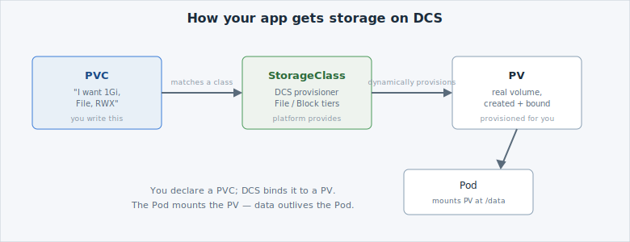

You don't hand an app a disk directly on . You *ask* for one,
and the platform provisions it. Three objects make that work:



- A [**PersistentVolumeClaim (PVC)**](https://kubernetes.io/docs/concepts/storage/persistent-volumes/) —
  your request: "I want this much space, this type." You write this.
- A [**StorageClass**](https://kubernetes.io/docs/concepts/storage/storage-classes/) —
  the platform's offering (File, Block, different tiers). DCS provides these.
- A **PersistentVolume (PV)** — the real volume DCS provisions and **binds** to your claim.

This is **dynamic provisioning**: you never pre-create the disk, you just claim one and DCS
creates and binds a matching PV automatically.


If you've run VMs: a PVC is like ordering a disk from the platform catalog — you state the
size and type, and the platform attaches a provisioned volume. You don't format a physical
disk yourself.


## See what DCS offers

List the storage classes available to you:

```terminal:execute
command: oc get storageclass
```

```examiner:execute-test
name: verify-storageclass
title: Verify storage classes are available
timeout: 10
```

Each row is a kind of storage you can request. On  you'll see
**File** and **Block** classes — more on choosing between them shortly.
