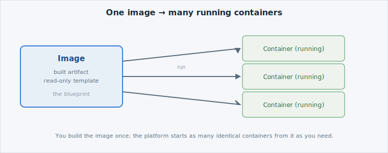

Everything you run on  runs in a **container** — including the
apps you've already deployed earlier in this track. Here's what that actually means, and
how it differs from the virtual machines you may already know.

Open the slide for this page (📊 **Slides** tab):

```dashboard:reload-dashboard
name: Slides
url: :///slides/#/images
```

## From Virtual Machines to Containers

A **virtual machine** carries a full operating system of its own, which makes it powerful
but heavy — it takes minutes to boot and gigabytes of disk. A
[container](https://kubernetes.io/docs/concepts/containers/) carries only your application
and the few libraries it needs, and shares the host's operating system kernel. The result:
containers start in seconds, are much smaller, and run the same way on any machine.


If you've run VMs: a container is like a VM stripped down to just your app — no separate
guest OS to boot or patch. The analogy stops there, though: a container is process
isolation, not a full machine.


## Image vs Container

Two words that are easy to mix up:

- An [image](https://kubernetes.io/docs/concepts/containers/images/) is the **built
  artifact** — a packaged, read-only template of your application and everything it needs
  to run.
- A **container** is a **running instance** of that image. One image can start many
  containers at once.

You build an image once, then run it as a container wherever you need it.



## Where DCS images come from

Because  is air-gapped, images don't come from the public
internet. They live in the platform's own registry (Harbor, at ``),
and in Foundations you **pull** from it — you don't push. That's all you need for now;
the registry gets a workshop of its own later in the course.

## Next

Next: if a container just runs on one machine, why do we need Kubernetes at all?
