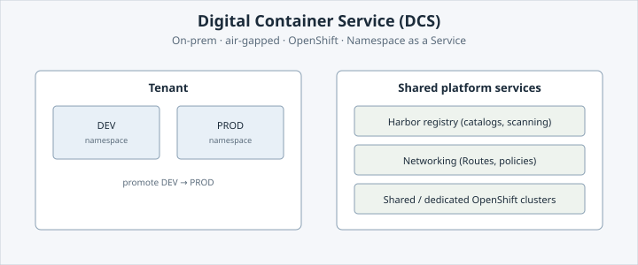
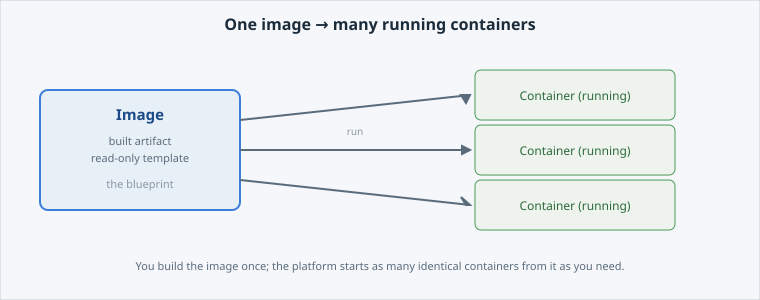

<!-- Edit this file: one slide per line of three dashes. Give a slide a deep-link id with an id-comment on its own line. Markdown: headings, - lists, **bold**, `code`, fenced code, , [text](url). -->

<!-- id: intro -->
# What is DCS?

The one-glance version of this lab. Every point here is explained in full on the matching page to the left — the slides are the map, the pages are the territory.

**In this lab:** what DCS is · the two clusters · containers vs images · why Kubernetes · your session tools.

Digital Container Service · DCS Academy

---

<!-- id: platform -->
## An air-gapped, on-prem container platform

**** is Airbus Defence and Space's own container platform, built on Red Hat OpenShift and run **on-premises and air-gapped** — nothing comes from the public internet.

- **Namespace as a Service** — you request namespaces and ship apps; the platform team runs the clusters, security, and compliance.
- **Air-gapped & sovereign** — your workloads and data stay inside the platform.
- **Self-service** — request a namespace and deploy, no infrastructure tickets.
- Images come from the platform's own **Harbor** registry, not the internet.



---

<!-- id: clusters -->
## Two clusters: Sandbox & PROD

As a tenant you meet two clusters. They are **essentially identical** — same platform, same capabilities, same way of working. Sandbox is not a weaker PROD.

- **One** real difference: **when new features arrive** and **how much maintenance notice** you get.
- Rollout pipeline: **DEV/QA → Sandbox → PROD**. A feature hits Sandbox in month 1, PROD in month 2.
- **Sandbox** — newest features first; shorter maintenance notice, slightly lower SLA.
- **PROD** — features a month later, already proven; longer notice, higher SLA.

A **cluster** (Sandbox/PROD) is *where* the platform runs — not the same as a DEV/PROD **namespace type**, which is *how* one namespace is governed.

---

<!-- id: images -->
## Images and containers

Everything on DCS runs in a **container**. A container carries only your app and its libraries and shares the host's OS kernel — so it starts in seconds and is far smaller than a virtual machine.

- **Image** — the built, read-only template of your app (everything it needs to run).
- **Container** — a running instance of an image.
- One image can start **many identical containers**.
- Build the image once; run it as a container wherever you need it.
- On DCS, images live in **Harbor** — you **pull** from it, you don't push.



---

<!-- id: kubernetes -->
## Why Kubernetes, not just Docker?

Docker can start one container on one machine. A shared platform running many teams' apps needs far more — that is what Kubernetes (and OpenShift on top of it) adds.

- **Scheduling** — you say "run this"; the platform picks a machine with room. No hand-placing.
- **Self-healing** — a crashed container is restarted/rescheduled automatically; lose a machine and work moves elsewhere.
- **Scaling** — ask for N replicas, up or down; no cloning by hand.
- **Declarative desired-state** — you describe the end state; the platform continuously reconciles reality toward it.

Plain `docker run` is fire-and-forget: nothing records what *should* run, so nothing repairs drift.

---

<!-- id: session -->
## Your session

On the right is a **terminal** already connected to DCS and pointed at your own project, plus an **editor** for viewing files. Every command uses `oc`, the OpenShift CLI — click the command blocks, you never type by hand.

Confirm who you are, that the cluster is reachable, and which project you are in:

```
oc whoami
oc version
oc project -q
oc status
```

The terminal is **split** — an upper pane (`execute-1`) and a lower pane (`execute-2`).

---

<!-- id: deploy -->
# Ready to deploy

That's the map: an air-gapped OpenShift platform, two matching clusters, apps packaged as images and run as containers, orchestrated by Kubernetes — all driven with `oc`.

Head to **Deploy Your First App** to put it into practice: your own app running on DCS in minutes.
