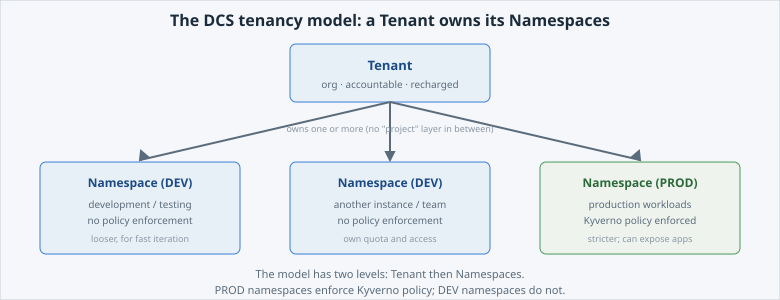

One more piece of vocabulary completes the model. Every namespace belongs to a **Tenant**.

Open the slide for this page (📊 **Slides** tab):

```dashboard:reload-dashboard
name: Slides
url: :///slides/#/tenancy
```

## Tenant → Namespaces

A [**Tenant**](/services/tenants) is the
org-level unit on : it is who is accountable, and it is what
gets billed (recharged). A Tenant **owns one or more Namespaces**. That is the entire
model — two levels, Tenant then Namespaces:




There is **no separate "project" layer**. On OpenShift, "project" is simply the word for
a namespace — the same thing you've been using — not a third level between Tenant and
Namespace. If you've seen a "Namespace → Project → Tenant" diagram elsewhere, it's wrong
for .


## DEV and PROD namespace types

Namespaces come in **types** — most importantly **DEV** and **PROD** — and they behave
differently: PROD is governed more strictly (policy enforcement, and it's where you're
allowed to expose apps), DEV is looser for fast iteration. That the types *exist* is the
point here; *how* the difference is enforced is a Developer-track topic (**DEV vs PROD Namespaces & Policies**).

Look at the labels on your own namespace. The command reads them and formats them one per
line. `-o jsonpath='{.metadata.labels}'` extracts just the labels field from the namespace
object; the first `tr ',' '\n'` puts each label on its own line (`tr` replaces one
character with another — here a comma with a newline); the second `tr -d '{}"'` deletes the
braces and quotes so the output is easy to read:

```terminal:execute
command: oc get namespace "$(oc project -q)" -o jsonpath='{.metadata.labels}' | tr ',' '\n' | tr -d '{}"' | tee ~/exercises/ns-labels.txt
```

```examiner:execute-test
name: verify-namespace-labels
title: Verify your namespace labels are readable
timeout: 10
```

The labels are how the platform tracks which Tenant a namespace belongs to and what type
it is.


Don't confuse a **cluster** with a **namespace type**. From the **What is DCS?** lab: Sandbox and PROD are
*clusters* — where the platform runs. DEV and PROD here are *namespace types* — how a
namespace is governed. Different things that reuse the word "PROD".

