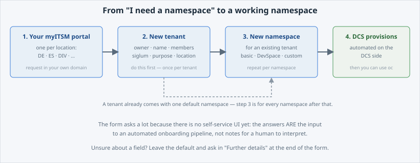

Everything you have deployed so far ran in a namespace somebody handed you. This page is
about how that namespace comes into existence — and the first step is finding **which**
ITSM portal to ask.

Open the slide for this page (📊 **Slides** tab):

```dashboard:reload-dashboard
name: Slides
url: :///slides/#/portals
```

## There is no single ITSM portal

 is a **multi-national** platform: it runs in several national
environments, and each national organisation has its **own myITSM portal**. There is no
one central form.

That has one consequence you must get right before you type anything:


**A Tenant has to be requested for each location separately, in that location's own
myITSM portal.** You can only pick locations inside your own domain — to get a Tenant in
the German national environment you request it through the German myITSM, in the Spanish
one through the Spanish myITSM, and so on. A Tenant, once created, **cannot be moved**
to another location.


## Where to find yours

The list of portals — DIV, DE, ES and the rest — lives on one documentation page:

- [ ITSM requests — Service Requests](/itsm-requests/#service-requests)

Pick the entry for your location, open its portal, and search the service catalogue for
the  request. Bookmark it: the same form serves tenants,
namespaces, user management, whitelisting and general questions.


**Which location is "mine"?** The one your organisation and your account belong to — the
same national domain your colleagues use. If two locations look plausible, ask in the
"Further details" box of the request rather than guessing: moving a Tenant afterwards is
not possible.


## The shape of the whole journey



Two requests, in this order:

1. **New tenant — do this first.** The Tenant is the org-level unit you met in A06: who is
   accountable, and what gets recharged. You do this **once**.
2. **New namespace for existing tenant.** A Tenant already comes with one **default
   namespace**, so you only come back here for the *second* namespace onwards — a separate
   DEV and PROD, another team, another app.

Then  takes over: the onboarding itself is **automated on the
DCS side** — no human hand-provisions your namespace.


**Then why does the form ask so much?** Because the automation is already there but the
**self-service frontend is not** — ITSM is currently the input form for that pipeline.
Every field you fill in is a parameter the automation consumes directly, which is why it
wants exact values instead of prose. Once the frontend lands, these same questions become
a UI. In the meantime: things go quickly, and unclear fields can be left at their
defaults with a question in **"Further details"** at the end of the form.


## Every request starts the same way

Whatever you need, the form opens with one **"Please select"** radio list. The two entries
this lab is about:

- **New tenant — Do this first!**
- **New namespace for existing tenant**

The rest of the list tells you what else runs through the same request: *Modify tenant*,
*Delete tenant*, *Modify / Delete namespace*, *User management*, *General inquiry*,
*Feature request*, *Networking whitelist*, *Consultancy support*.

Pick one, and the form shows the fields for that choice — those are the next two pages.
