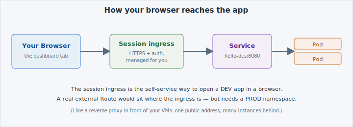

You can reach the app from the terminal, but you can't *see* it — the `curl` worked only
because your terminal runs inside the cluster. To open `hello-dcs` in a browser, you expose
it through the workshop **session ingress**: a managed proxy that gives an in-cluster
Service a browser-reachable address, with HTTPS and authentication handled for you.



The session ingress for `hello-dcs` is already wired to your Service on port 8080. Open it
as a new dashboard tab:

```dashboard:create-dashboard
name: hello-dcs
url: "://hello-dcs-/"
```

Switch to the **hello-dcs** tab and you should see the app's page render in the browser —
the same content the `curl` returned, now served to you through the ingress.

```examiner:execute-test
name: verify-svc-reachable
title: Verify the app responds through its Service
args:
- hello-dcs
- "8080"
timeout: 10
retries: 3
delay: 2
```

The check confirms the app is answering HTTP 200 on the Service that backs the tab — if the
page loads, this passes.

## This Is the *Session* Proxy — Not a Real Route

What you just used is the **session ingress**: perfect for self-service, and the only way to
open a DEV app in a browser without leaving your namespace. It is scoped to your session and
disappears when the session ends.

A real, permanent external address is different. On  that means
an OpenShift **[Route](/networking/overview)**, fronted by the
cluster's load balancer with managed DNS — and a **Route requires a PROD-type namespace**,
where Kyverno admission policies enforce it. You met this in Foundations **A06**; the point
to carry forward is simply:

- **DEV namespace (here):** expose via the session ingress for iteration — self-service, no ticket.
- **PROD namespace:** a Route for a stable external address — requires promotion to PROD and platform sign-off.


You don't create a Route in this workshop — DEV namespaces don't get one, by design. Exposing
production traffic is Architect/ops territory. For your inner-loop development, the session
ingress is exactly the right tool.

