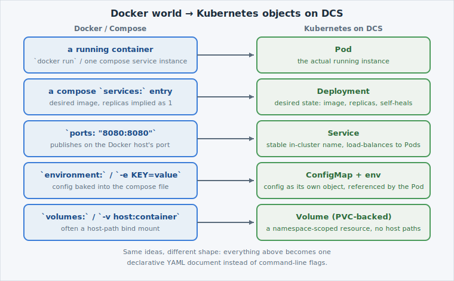

Start with the file you already know. Open it up:

```editor:open-file
file: ~/exercises/docker-compose.yml
```

This is the `hello-dcs` app as a docker-compose service — an image, a port mapping, an
environment variable, and (deliberately) a couple of lines that only make sense in a
Docker-on-one-host world. Everything in it has a Kubernetes equivalent; this page names
them before you touch any YAML.

## Same ideas, different shape

The single biggest shift isn't *what* the objects do — it's *how* you describe them.
`docker run` and `docker compose up` are **imperative**: you tell the Docker daemon what
to do right now, in order. Kubernetes is **declarative**: you write down the state you
want, and the platform continuously works to make reality match it. That's why a
[Pod](https://kubernetes.io/docs/concepts/workloads/pods/) that dies gets replaced without
you running anything — nobody re-ran a command, the platform just re-converged on the
declared state.


If you've used Docker Swarm or Compose's `restart: always`, the self-healing idea isn't
new — Kubernetes just applies it universally, to every object, not just container restarts.


## The mapping

|  | Docker / Compose | Kubernetes on DCS |
|---|---|---|
| **Runs your image** | a container (`docker run`, or one compose service) | a [Pod](https://kubernetes.io/docs/concepts/workloads/pods/), managed by a [Deployment](https://kubernetes.io/docs/concepts/workloads/controllers/deployment/) |
| **Publishes a port** | `ports: "8080:8080"` (binds the Docker host's port) | a [Service](https://kubernetes.io/docs/concepts/services-networking/service/) (a stable in-cluster name, not a host port) |
| **Sets config** | `environment:` / `-e KEY=value` | a [ConfigMap](https://kubernetes.io/docs/concepts/configuration/configmap/), referenced as env vars |
| **Persists data** | `volumes:` / `-v host:container` | a [Volume](https://kubernetes.io/docs/concepts/storage/volumes/) backed by a PersistentVolumeClaim — no host paths |



You already know what a Deployment, a Service and a ConfigMap *are* from A01/A02 — this
lab is about recognising the compose line that becomes each one, then dealing with the
lines that have no clean equivalent at all (page 05).

## Next

Page by page, you'll fill in and apply the three manifests already sitting in
`~/exercises`: `deployment.yaml`, `service.yaml`, `configmap.yaml` — one per row of the
table above, in the same order the compose file lists them.
