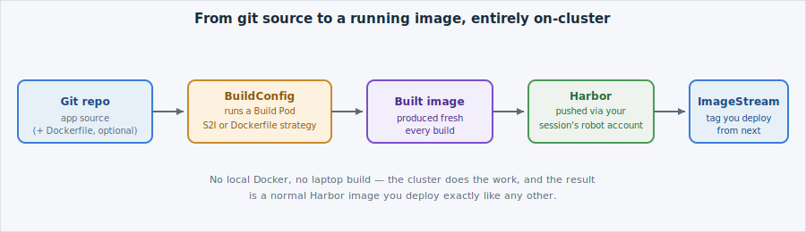

Every earlier lab started from an image that already existed in Harbor. Somewhere,
someone turned source code into that image — and on , that
"somewhere" is the cluster itself, not a developer's laptop.

## Why not just `docker build` on my laptop?

 is **air-gapped** — sessions and real workloads have no route to
the public internet, and a laptop building an image would still need to push it in over some
approved path (see Harbor, below). Building **on-cluster** solves both problems at once: the
build runs inside the platform's own network (so it can reach Harbor and any
Harbor-mirrored builder images directly), and the result lands in Harbor without ever leaving
the platform.

## BuildConfig → Build Pod → image → Harbor

A [**BuildConfig**](https://docs.openshift.com/container-platform/latest/cicd/builds/understanding-image-builds.html)
is a desired-state object, the same idea as a Deployment — except what it describes isn't
"keep this Pod running," it's "turn this source into that image." Three things a BuildConfig
declares:

- **`source`** — where the code comes from. Almost always a git repository.
- **`strategy`** — *how* to turn that source into an image (more below).
- **`output`** — where the finished image goes: an [**ImageStream**](https://docs.openshift.com/container-platform/latest/openshift_images/image-streams-manage.html),
  OpenShift's tracking object for the tagged versions of one image over time.

When you trigger a build,  schedules a **Build Pod** — a
short-lived Pod whose only job is to run that one build, push the result, and exit. You'll
watch one run on the next few pages.

## S2I vs Dockerfile — two strategies, same shape

The `strategy` is the one meaningful choice you make:

| | **S2I (Source-to-Image)** | **Dockerfile** |
|---|---|---|
| Needs a Dockerfile? | No | Yes |
| How it works | A pre-built **builder image** knows how to "assemble" your source (e.g. install dependencies, compile) into a runnable image | The Build Pod runs a normal image build from your repo's Dockerfile |
| When to use | You just have source code and want an image, fast | Your team already maintains a Dockerfile and wants full control over the build steps |


If you've packaged software before: think of an S2I builder image like a build template —
you supply the source, it supplies the recipe. A Dockerfile build is you writing the recipe
yourself. Neither is "better"; S2I is DCS's recommended default because most teams don't need
Dockerfile-level control, but the Dockerfile strategy is there the moment you do.


This lab runs the **S2I** BuildConfig and gives you the **Dockerfile** one to read for
contrast — pick whichever fits a given app in your own work.

## Where the pieces come from (air-gapped)

Two things this BuildConfig touches must themselves come from
[Harbor](/registry/overview) — DCS's air-gapped image
registry, reached through catalogs of pre-approved images with automation credentials
called robot accounts:

- The **S2I builder image** — Harbor-mirrored, referenced via ``,
  exactly like any other image on this platform.
- The **git source repository** — for this lab, a small repository already
  mirrored/reachable from inside your session, so the build source is reachable without any
  external egress.

And the **output** — the image the build produces — is pushed to Harbor too, using a
push-capable robot account already provisioned to your session. You'll see that push happen
on the next pages.

No command on this page — next, you'll read the actual BuildConfig and apply it.
