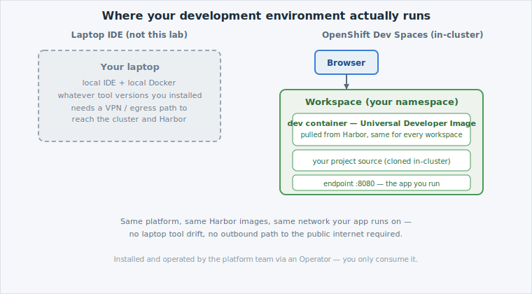

Every lab so far has run your `oc` commands from the **Educates terminal** — a
convenient shell, but not a development environment. [OpenShift Dev
Spaces](https://developers.redhat.com/products/openshift-dev-spaces/overview) (built
on the upstream [Eclipse Che](https://eclipse.dev/che/docs/stable/overview/introduction-to-eclipse-che/)
project) is different: it's a full browser-based IDE — editor, terminal, debugger,
extensions — running as a workspace **inside the cluster**, next to the code it edits.

## Why an in-cluster IDE

Think of it as the difference between carrying your toolbox to every job site and
having a fully equipped workshop already standing at the site, identical every time.
A laptop IDE means every developer's environment is whatever they happened to
install — different tool versions, different OS quirks, and (on an air-gapped,
regulated platform like DCS) a laptop that can't reach Harbor or the cluster network
the way a workspace running *inside* the platform can. Dev Spaces removes all of
that variance: every workspace starts from the same image, has direct access to
the cluster it develops for, and never needs an outbound connection to the public
internet to fetch a plugin or a dependency.

This matters even more once you notice *who* provides it. Dev Spaces is
[operator](https://kubernetes.io/docs/concepts/extend-kubernetes/operator/)-installed
and run by the DCS platform team — you don't install it, upgrade it, or manage its
lifecycle, the same way you don't manage the OpenShift cluster it runs on. You just
consume it: open the tab, launch a workspace, develop. See the
[ Dev Spaces service](/services/dev-spaces)
for how your tenant gets access.

## What a workspace actually is

A **workspace** is a set of containers running in your namespace — one of them is
your dev environment (a full toolchain image), with your project's source code
cloned into a shared volume so every container in the workspace can see it. You
reach it entirely through the browser: no SSH key, no VPN, no local `git clone`.
When you close the tab, the workspace keeps running (or stops, depending on
configuration) — the code lives in the cluster, not on your machine.

## What defines a workspace

A workspace doesn't appear from nothing — it's built from a **devfile**: a YAML
file that says which container image to develop in, what source to check out, and
what commands are available (build, run, debug). That's the next page.
