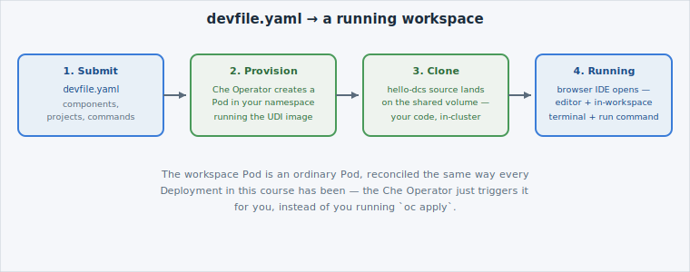

You've read the devfile; now hand it to Dev Spaces and let it build the workspace
the file describes. First, add the Dev Spaces dashboard to your session:

```dashboard:create-dashboard
name: Dev Spaces
url: 
```


**Whether this tab shows a live Dev Spaces login screen depends on your cluster.**
Dev Spaces is installed per-cluster by the platform team (see the previous page) —
not every DCS environment has it provisioned yet. Either way, the walkthrough below
is the real flow: it's what happens the moment you click through it.


## Check for Dev Spaces on this cluster

Dev Spaces is installed by the platform team as a `CheCluster` [custom
resource](https://kubernetes.io/docs/concepts/extend-kubernetes/api-extension/custom-resources/) —
you can check for it yourself, the same way you've queried any other resource
type in this course:

```terminal:execute
command: oc get checluster -A
```

`-A` means **all namespaces** — the first time this course has needed it. Dev
Spaces is a cluster-wide platform service, not something scoped to your own
namespace, so a plain (namespace-scoped) `oc get` wouldn't find it even if it
exists.

You'll see one of two things: a `CheCluster` object (Dev Spaces is live on this
cluster), or an error that the resource type doesn't exist (it isn't provisioned
here yet). Both are a valid, honest answer to "is Dev Spaces here?" — the check
below passes either way, because *knowing how to check* is the point, not a
specific cluster's provisioning state. If a `CheCluster` exists, you can also
find it visually in the **Console** tab's search, the same way you'd look up any
other resource type.

```examiner:execute-test
name: verify-checluster
title: Check whether OpenShift Dev Spaces is installed on this cluster
timeout: 10
```

## From devfile to running workspace

Creating a workspace from `devfile.yaml` is a single action in the Dev Spaces
dashboard — point it at the devfile (by URL, or by pasting its contents) and click
**Create Workspace**. Four things happen, in order:



1. **You submit the devfile.** Dev Spaces reads its `components`, `projects`, and
   `commands` — exactly what you highlighted on the previous page.
2. **The Che Operator provisions the workspace.** It creates a Pod in your
   namespace running the `dev` container from `${DCS_REGISTRY}/devspaces/udi:latest`,
   and mounts a shared volume for the source.
3. **The project is cloned.** The `hello-dcs` source from `projects.git.remotes.origin`
   lands on that shared volume — the same source you'll edit on the next page.
4. **The workspace reaches `Running`**, and the browser IDE opens: a full editor,
   an integrated terminal *inside the workspace container*, and the `run-hello-dcs`
   command available as a one-click action — all backed by the Pod from step 2.


**A live workspace's Pod is a completely ordinary Pod** — on a cluster where Dev
Spaces is provisioned, you could watch it land with `oc get pods -w` in your own
namespace from the Educates terminal, the same way you've watched every other Pod
in this course. Nothing about steps 2–4 is magic; it's the same Deployment-like
reconciliation you already know, triggered by the Che Operator instead of by you
running `oc apply`.


## Check your understanding

Before moving on: which of the four steps above is the one where your actual
*code* becomes visible inside the workspace?


**Answer:** Step 3 — cloning the project. Steps 1 and 2 only set up the *environment*
(the devfile and the container); your source doesn't exist inside the workspace
until the project is cloned onto its shared volume.


With a workspace conceptually running, the next page is where the payoff is: making
a change and running it — inside the cluster, not on your laptop.
