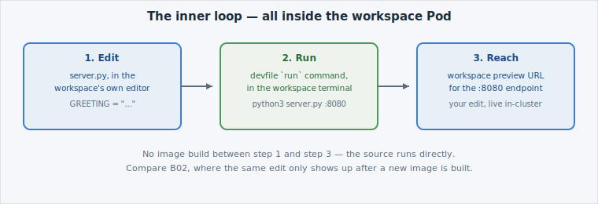

This is the payoff. Everything so far — the devfile, the workspace, the cloned
source — exists so you can do the one thing a laptop can't do on an air-gapped
platform: **edit code and run it, inside the cluster, in the same motion.**


**Two different terminals, don't mix them up.** Every other page in this course
used the **Educates terminal** (the one in this dashboard). From here on, "the
terminal" means the **workspace terminal** — a separate shell running *inside*
the Dev Spaces workspace Pod, with its own working directory (the cloned
`hello-dcs` repo). Commands typed there never touch this session's terminal, and
vice versa.


## The loop

Inside the workspace, three things happen in sequence:

1. **Edit.** Open `server.py` in the workspace's own editor and change the
   `GREETING` default — the same string A02 taught you to change with
   `oc set env`, except here you're editing the *source*, not an environment
   variable on a running Deployment.
2. **Run.** Trigger the `run-hello-dcs` command from page 02's devfile — one
   click, or `python3 server.py` typed directly into the workspace terminal. It
   starts on port 8080, **inside the workspace container**, using the exact
   `commandLine` the devfile declared.
3. **Reach it.** Dev Spaces exposes the devfile's `endpoints` entry (`targetPort:
   8080`) as a workspace preview URL — click it, and your edited greeting is
   staring back at you, served from a process running inside your namespace.

## Why this is different from B02 and A02

Compare the three ways this course has now gotten a code change running:

- **A02 (`oc apply`)** deploys an image someone already built — you never touch
  source.
- **B02 (BuildConfig)** turns your source into a *new image* on every change —
  accurate for production, but there's a build cycle between "I edited a line"
  and "I can see it run."
- **B03 (Dev Spaces, this lab)** runs your source directly, live, no image build
  in between — the fastest inner loop, and the one meant for active development,
  not for what ships.

None of these replace the others — a workspace is where you iterate; a
BuildConfig is how the iterated result becomes a deployable image (B02); `oc
apply` is how that image reaches a real namespace (A02). The next page draws
this boundary explicitly.

## Check your understanding

Why does editing `GREETING` in the workspace show up immediately when you run the
app — with no image build step, unlike B02?


**Answer:** Because the workspace runs the source directly (`python3 server.py`)
from the cloned project on disk — there's no image to build. B02's BuildConfig
exists precisely because a *deployed* Pod runs from a built image, not live
source; Dev Spaces trades that production-shaped path for the fastest possible
feedback loop while you're actively writing code.

