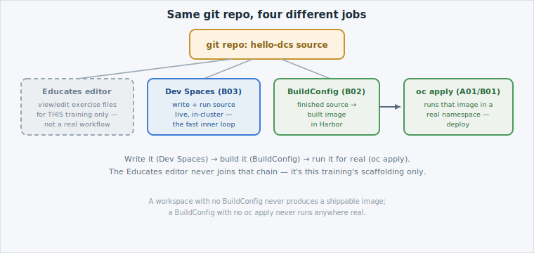

Four tools in this course all touch "your code," and learners routinely blur them
together. They're not competing with each other — each owns a different job. This
page draws the line explicitly, once, so it stays clear afterward.

## The Educates editor is not a real IDE

Every lab in this course, including this one, has given you a browser-based code
editor as part of the **workshop environment** — it's how you've viewed and edited
exercise files. It is **not** a development environment your organisation runs day
to day: it exists only for the duration of this training session, has no
connection to your tenant's real source control, and disappears when the session
ends. Don't confuse "a browser editor" (this workshop, and any lab before it) with
"a browser-based IDE that's part of the platform" (Dev Spaces, this lab's actual
subject).

## The four jobs

| Tool | Job | When you reach for it |
|---|---|---|
| **Educates editor** | View/edit exercise files *during this training* | Every lab — it's scaffolding, not a real workflow |
| **Dev Spaces** (this lab) | Write and run code, live, **inside the cluster** | Day-to-day development — the fast inner loop |
| **BuildConfig** (`lab-b02-image-buildconfigs`) | Turn finished source into a deployable **image** | Once a change is ready to become a real artifact |
| **`oc apply`** (`lab-a01-deploy-first-app`, reinforced in `lab-b01-docker-to-k8s`) | Put a built image **into a running namespace** | Deploying (or promoting) that artifact |

Read left to right and the shape becomes obvious: the **same git repository** can
feed all three real tools (Dev Spaces excluded, since it edits the repo — it
doesn't build from it), each at a different point in the same lifecycle — write
it, build it, run it. None of them substitutes for another: a workspace with no
BuildConfig never produces a shippable image; a BuildConfig with no `oc apply`
never runs anywhere real; and `oc apply` needs *something* already built to point
at.


The **operator** that runs Dev Spaces on your cluster is platform-managed, just
like every other DCS-provided service — you consume Dev Spaces, you don't install
or upgrade it. That's the same ownership split you'll see named explicitly for
every operator-based service later in this course.


## Check your understanding

A teammate says "I built my image, why do I need Dev Spaces at all?" What's the
honest answer?


**Answer:** They don't need it for *that* build — BuildConfig (B02) already turned
finished source into an image, and `oc apply` (A01/B01) already runs it. Dev
Spaces earns its keep **before** that point: while the code is still being
written, it's the fastest way to edit-and-run without waiting on an image build
for every change. Once the code is ready, the BuildConfig → `oc apply` path is
still the one that ships it.

