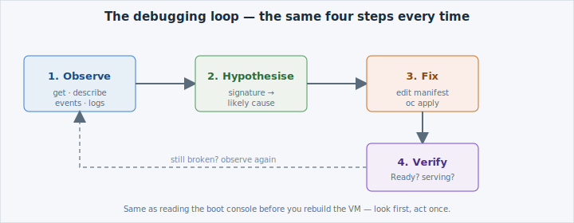

Welcome back. In this workshop, part of ****, you'll do
something every developer does sooner or later: figure out why an app *isn't* working —
and fix it — using nothing but the tools  already gives you.


**First time in one of these labs?** Take two minutes to read the
[DCS Academy environment guide](/academy/environment-guide) —
it explains the terminal, editor, console, slides and the clickable actions you'll use here.


## The Scenario

A colleague pushed a change to the `hello-dcs` app and went home. It's **down**. When you
arrive in this session the app is *already deployed and already broken* — your job is to
find out why and bring it back.

This is the real skill: not memorising commands, but running a **repeatable loop**. Every
outage you'll ever debug on  follows the same four steps.

- **Observe** — read the actual state with `oc get`, `oc describe`, `oc get events`, `oc logs`. Don't guess.
- **Hypothesise** — match what you see (a *failure signature*) to a likely cause.
- **Fix** — make the smallest change that addresses that cause.
- **Verify** — confirm the app is Ready and serving. If not, loop back and observe again.

You already met most of these commands in earlier workshops. Here you'll use them
*together, as a method*.

## What You'll Learn

By the end you will be able to:

- Read a workload's state with `oc get`, `oc describe`, `oc get events` and `oc logs`.
- Recognise common **failure signatures** — `ImagePullBackOff`, `CrashLoopBackOff`, `Pending`, readiness-failing — and map each to its cause.
- Apply a fix and **verify recovery**.
- Run the **observe → hypothesise → fix → verify** loop on any broken workload.

## Prerequisites

- **lab-b01** — you should be comfortable deploying and exposing an app with `oc`.

## Your Environment

A **split terminal**, an editor, and the web console, connected to your own
 project — with the broken `hello-dcs` app already running (badly)
inside it. The sample application image is served from the 
Harbor registry.

## Time and Difficulty

- **Estimated time:** 35 minutes
- **Difficulty:** Intermediate
