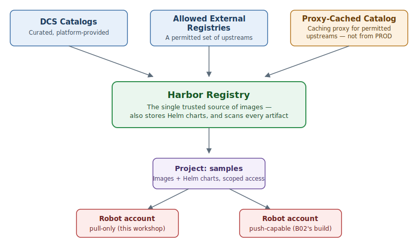

 is air-gapped: no node, build, or Pod on the platform can reach
`docker.io`, `quay.io`, or any public registry. That sounds restrictive, but it buys
something valuable — there is exactly **one** place images can come from, so there is
exactly one place to enforce "nothing unsafe runs here." That place is
[Harbor](https://goharbor.io/docs/), an open-source
[OCI image](https://kubernetes.io/docs/concepts/containers/images/) registry that stores
images (and, less obviously, [Helm](https://helm.sh/docs/) charts) behind projects, access
control, and automatic scanning. See the
[ registry documentation](/services/registry)
for how  runs it.


If you've worked with VM templates: Harbor is a walled, curated marketplace of golden
images your organisation trusts — you don't fetch a VM image from just anywhere, you fetch
from the sanctioned catalog.


## One Registry, Three Catalogs

Images don't just appear in Harbor — they arrive through one of three **catalogs**:

- **DCS Catalogs** — curated image sets the platform provides directly. This is where
  `samples/hello-dcs`, the image you'll work with today, lives.
- **Allowed External Registries** — a permitted set of upstream registries. An external
  image reaches Harbor by being **mirrored** in — an [ITSM](/support/itsm-requests)
  request, not an ad-hoc pull (more on this at the end of the workshop).
- **Proxy-Cached Catalog** — a caching proxy in front of permitted upstreams, so a team can
  pull a permitted external image without a full mirror request. It has one restriction
  worth remembering: it **cannot be used from a PROD-type namespace** — only DEV.

Which catalog an image comes from doesn't change how you consume it day to day — `skopeo`
and `oc` don't care — but it changes *how it got there* and *who's accountable for keeping
it current*.

## Projects and Robot Accounts

Inside Harbor, images are organised into **projects** (`samples` is one; your team may have
its own). Every project controls who — or what — can pull and push, and automation never
uses a personal login. Instead it uses a **robot account**: a non-human credential scoped to
one or more projects, with a fixed set of permissions.

A robot account is one of two shapes:

- **Pull-only (read-only)** — can `pull`/inspect images in its project, nothing else. Your
  session carries one of these, scoped to `samples`, for everything in this workshop up to
  the push step.
- **Push-capable** — can also `push` new tags into its project. This is what a build
  pipeline like B02's uses to land a freshly built image in Harbor.

The diagram below shows how the three catalogs feed into Harbor, and how a project's robot
accounts sit underneath it:



## Browsing Harbor Visually

 also exposes Harbor's own web console, where you can browse
projects, tags, and scan results visually instead of only through the CLI. Open it in a
dashboard tab:

```dashboard:create-dashboard
name: Harbor
url: 
```


**Best-effort embedding.** Harbor's UI is a separate platform service at a fixed address —
not something proxied through this session — so this tab opens Harbor's own sign-in rather
than reusing your session identity automatically. If it won't load at all in your
environment, don't worry: everything you need for this workshop is also available (and
verified) through the `skopeo`/`jq` commands on the pages that follow.


You'll spend the rest of this workshop in the terminal — the Harbor tab stays available if
you want to cross-check anything you see there visually.
