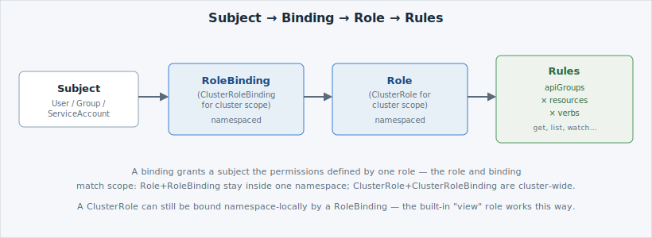

`can-i` gives you an answer instantly because [Kubernetes RBAC](https://kubernetes.io/docs/reference/access-authn-authz/rbac/)
(Role-Based Access Control) computed it from four kinds of objects, ahead of time. Read them
in order and the answer stops being a black box.

## Four object types, two scopes

- A **Role** grants permissions **inside one namespace**. A **ClusterRole** grants the same
  kind of permissions, but **cluster-wide** — and can also be reused, bound namespace-by-
  namespace, when the same permission set is needed in several places (the built-in `view`
  role you'll inspect below works this way).
- A **RoleBinding** grants a Role (or a ClusterRole) to a subject — **inside one namespace**.
  A **ClusterRoleBinding** grants a ClusterRole to a subject **cluster-wide**.
- A **rule**, inside a Role or ClusterRole, is a grant expressed as **apiGroups × resources ×
  verbs** — e.g. "on the core API group, for `pods`, allow `get`, `list`, `watch`."
- A **subject** is who the binding names: a **User**, a **Group**, or a **ServiceAccount**
  (a non-human identity used by workloads and automation, not by people).

Put together, the chain that produces every `can-i` answer looks like this:




On , tenants manage Roles and RoleBindings **within their own
namespaces**. ClusterRoles and ClusterRoleBindings are platform-managed and read-only to
tenants — you can inspect them (as below), but you won't create your own cluster-scoped
RBAC objects.


## Read a built-in ClusterRole

`view` is a built-in ClusterRole shipped with every cluster — a ready-made read-only rule
set. Read its rules:

```terminal:execute
command: oc describe clusterrole view
```

```examiner:execute-test
name: verify-clusterrole-view
title: Verify the view ClusterRole's rules are readable
timeout: 10
```

Scan the output for the `PolicyRule` table: a `Verbs` column showing `get`, `list`, `watch`
against a wide range of `Resources` — but never `create`, `update`, `delete` or `patch`.
That's the read-only pattern by name: everything you can look at, nothing you can change.

## Find the binding that grants you access

You didn't create any RBAC objects yet, but you already have `admin`-level access to your
own namespace — from a RoleBinding the platform created for you. List the RoleBindings in
your namespace:

```terminal:execute
command: oc get rolebindings -o wide
```

`-o wide` adds extra columns to the default table — here, the bound `Subjects`, so you can
see who each binding applies to without a separate `describe`.

```examiner:execute-test
name: verify-rolebindings-listed
title: Verify at least one RoleBinding is listed
timeout: 10
```

You should see at least one RoleBinding — the one connecting your own identity to a role in
this namespace. Now trace it in full:

```terminal:execute
command: oc describe rolebinding $(oc get rolebindings -o jsonpath='{.items[0].metadata.name}')
```

```examiner:execute-test
name: verify-rolebinding-described
title: Verify the RoleBinding's subject and role reference are traced
timeout: 10
```

Two sections matter: **`Role`** near the top names the Role or ClusterRole it grants, and
**`Subjects`** lists who it grants it to — by kind (`User`, `Group`, or `ServiceAccount`),
name, and namespace. That's the whole chain, concretely: this exact subject, this exact
binding, this exact role, these exact rules — which is precisely what produced every `yes`
and `no` you saw on the last page.

Now you'll build that chain yourself, from scratch, for a subject you create.

- [Kubernetes RBAC reference](https://kubernetes.io/docs/reference/access-authn-authz/rbac/)
- [OpenShift default cluster roles](https://docs.openshift.com/container-platform/latest/authentication/using-rbac.html)
