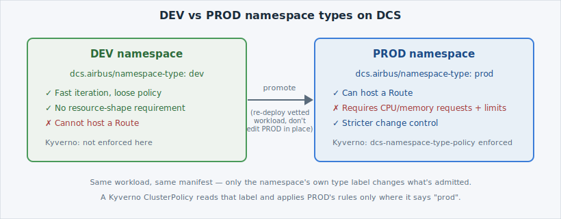

Every [namespace](https://kubernetes.io/docs/concepts/overview/working-with-objects/namespaces/)
on  is one of two **types**: **DEV** or **PROD**. It's not a
naming convention you're free to ignore — the type is a label DCS reads to decide how
strictly to police what happens inside. Think of it like the difference between a
sandbox environment and a production environment in any VM-based platform: the sandbox
lets you experiment freely, production makes you prove the change is safe *before* it's
allowed to land.

## The headline difference

- **DEV** namespaces favour speed. Loose controls, fast iteration — and **no Route**.
  A DEV namespace cannot expose anything outside the cluster.
- **PROD** namespaces enforce **stricter admission control** — checked automatically,
  on every create — **and** are the only namespace type that can host a **Route**.

| | DEV | PROD |
|---|---|---|
| Iteration speed | Fast — deploy freely | Slower — vetted workloads only |
| Resource requests/limits required | No | **Yes** |
| Can host a Route | **No** | **Yes** |
| Change model | Edit directly | **Promote** from DEV, don't edit in place |

That table is the entire lesson in miniature — the rest of this workshop just makes each
row real, one command at a time.



## How the difference is enforced: Kyverno

The mechanism behind PROD's stricter row is [**Kyverno**](https://kyverno.io/docs/), a
Kubernetes-native policy engine. Kyverno watches object creation the same way any
[admission webhook](https://kubernetes.io/docs/reference/access-authn-authz/extensible-admission-controllers/)
does, but instead of writing controller code you write policy as a `ClusterPolicy`
resource — Kubernetes YAML, not a program. DCS keys its PROD policy set off each
namespace's own **`dcs.airbus/namespace-type`** label: the same policy object watches
every namespace at once, and only acts where that label reads `prod`.


DCS's [namespace-as-a-service model](/naas/dev-prod-lifecycle)
gives every namespace one of these two lifecycles from the moment it's created. You don't
choose "how strict" independently — you choose DEV or PROD, and the policy posture comes
with it.


## Create both namespaces

You have two namespaces available in your workspace this lab: `dev` and `prod`. Create
them both — the only difference between the two manifests is the `dcs.airbus/namespace-type` label:

```editor:open-file
file: ~/exercises/dev-namespace.yaml
```

```terminal:execute
command: oc apply -f dev-namespace.yaml
```

```editor:open-file
file: ~/exercises/prod-namespace.yaml
```

```terminal:execute
command: oc apply -f prod-namespace.yaml
```

```examiner:execute-test
name: verify-namespaces-created
title: Verify both namespaces exist with their type labels
timeout: 10
retries: .INF
delay: 2
```

## See them side by side

```terminal:execute
command: oc get namespaces dev prod --show-labels
```

You should see both namespaces listed, `Active`, each carrying its own
`dcs.airbus/namespace-type` label — the only thing that will make them behave
differently from here on.

```examiner:execute-test
name: verify-namespaces-created
title: Confirm both namespaces are listed with their labels
timeout: 10
```

Next: apply the policy that reads that label, then deploy the same workload into DEV and
see what it does — and doesn't — check.
